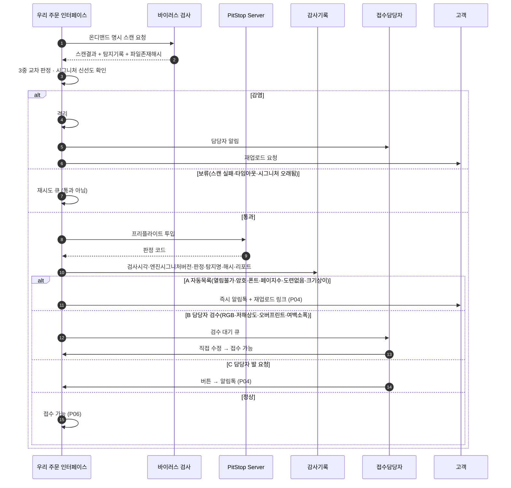
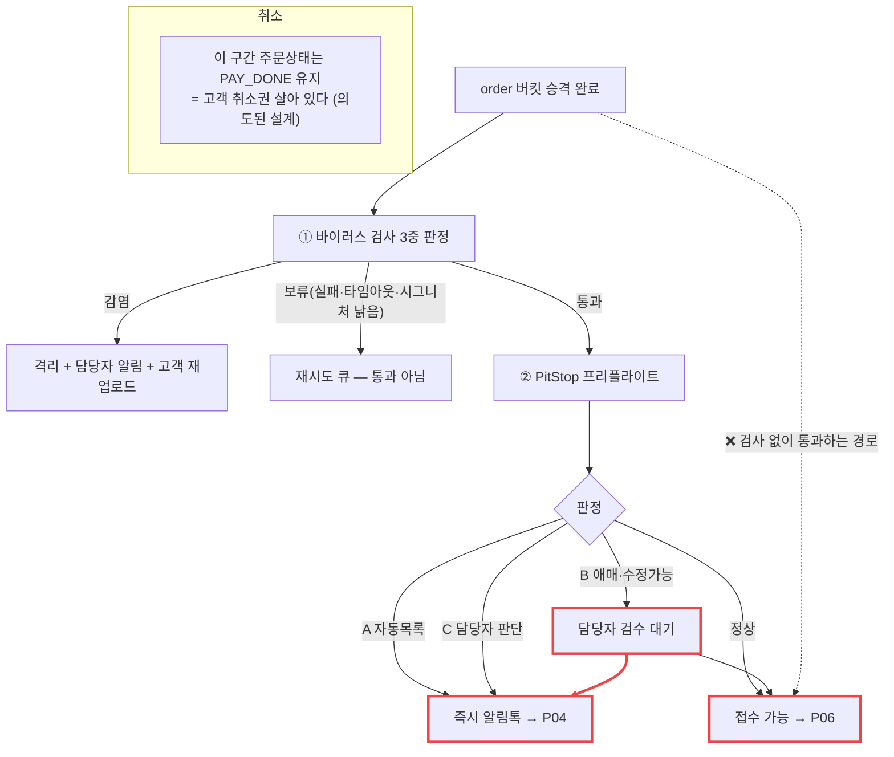

# P03 · 파일 검판 — 바이러스 검사 + PitStop 프리플라이트

> L0 후니 몰 전체 › L1 원고·파일 › L2 검판 › **L3 P03 파일검판-프리플라이트**

## 1. 한 줄 정의 · 시작/끝 · 등장인물

**한 줄 정의.** order 버킷에 선 원고를 바이러스 검사와 PitStop 프리플라이트로 걸러 **「접수해도 되는 파일」과 「고객이 다시 올려야 하는 파일」과 「담당자가 고칠 수 있는 파일」** 셋으로 가르기까지.

- **시작** — P02 승격 완료(`ord_sts=PROMOTED`).
- **끝** — 판정 3갈래 중 하나로 떨어짐. 정상이면 P06(MES 접수), 아니면 P04(재업로드) 또는 담당자 검수.

| 등장인물 | 하는 일 |
|---|---|
| 고객 | 결과를 알림톡으로만 받는다(A 분기일 때) |
| **우리** | 검사를 요청하고 판정을 받아 분기한다 |
| **PitStop Server**(미조달) | 프리플라이트 실행 |
| 바이러스 검사 엔진(미조달) | 감염·보류·통과 판정 |
| **접수담당자** | B·C 분기에서 판단한다 |
| MES | 통과한 것만 받는다 |

> **이 프로세스는 세 저장소 어디에도 코드가 0이다.** 설계 문서만 있다.

## 2. 시퀀스

## 3. 분기 — 실패 · 비회원 · 취소

> 점선이 **지금의 실제 경로**다 — 검사 장치가 없어 사람이 눈으로 보고 넘긴다(설계 정본 §11 "검사 없이 접수하는 것은 지금 운영 방식과 같다 — 중간 단계로 성립").

## 4. 단계표

| # | 단계 | 시스템 | 담당자 | 원장 row_id | 상태 | 근거 |
|---|---|---|---|---|---|---|
| 1 | 바이러스 온디맨드 명시 스캔 | 우리+엔진 | 서희항 | `STD-MFG-036` | 미착수 | 설계 `raw/webadmin/docs/artwork-scan-integration.md` · **코드 0건**(`pitstop|preflight|virus.?scan|clamav|hotfolder` 전수 grep — 매치는 전부 CORS preflight) |
| 2 | 3중 교차 판정 | 우리 | 서희항 | `STD-MFG-037` | 미착수 | `artwork-scan-integration.md` ③ · 코드 0 |
| 3 | 시그니처 신선도 확인 | 우리 | 서희항 | `STD-MFG-038` | 미착수 | 같은 문서 · 코드 0 |
| 4 | 실패·타임아웃은 보류(재시도 큐) | 우리 | 서희항 | `STD-MFG-039` | 미착수 | 같은 문서 ⚠주의 3 · 코드 0 |
| 5 | 감염 파일 격리+알림+재업로드 요청 | 우리 | 서희항 | `STD-MFG-040` | 미착수 | 같은 문서 n8n 배치 초안 · 코드 0 |
| 6 | 파일 포맷 유효성 | PitStop | 서희항 | `STD-ART-008` | 미착수 | `order-to-mes-process.md:181-201` §5.2 · 코드 0 |
| 7 | 재단선/블리드 3mm | PitStop | 서희항 | `STD-ART-009` | 미착수 | 같은 §5.2 A목록 · 코드 0 |
| 8 | 색공간(CMYK) 검사·RGB 경고 | PitStop | 서희항 | `STD-ART-010` | 미착수 | §5.2 B 목록 · 코드 0 |
| 9 | 해상도(dpi) 검사 | PitStop | 서희항 | `STD-ART-011` | 미착수 | §5.2 B 목록 · 코드 0 |
| 10 | 폰트 아웃라인 여부 | PitStop | 서희항 | `STD-ART-012` | 미착수 | §5.2 · 코드 0 |
| 10a | 폰트 미포함 검사 | PitStop | 서희항 | `STD-MFG-044` | 미착수 | §5.2 A목록 · 코드 0 |
| 11 | 주문 사양 ↔ 파일 실측 사이즈 대조 | PitStop | 서희항 | `STD-ART-013` | 미착수 | §5.2 A목록 · 코드 0 |
| 11a | 페이지 수와 주문 사양 대조 | PitStop | 서희항 | `STD-MFG-046` | 미착수 | §5.2 A목록 · 코드 0 |
| 11b | 파일 열림·손상·암호 검사 | PitStop | 서희항 | `STD-MFG-048` | 미착수 | §5.2 A목록 · 코드 0 |
| 12 | 별색 채널·오버프린트 | PitStop | 서희항 | `STD-ART-014` | 미착수 | §5.2 B 목록 · 코드 0 |
| 13 | 검판 결과 리포트 고객 노출 | 우리 | 서희항 | `STD-ART-015` | 미착수 | 원장 · 코드 0 |
| 14 | 자동검판 도구 연동(PitStop) | 우리 | 서희항 | `STD-ART-016` | 미착수 | 코드 0 |
| 15 | 판정 3갈래 분기 | 우리 | 서희항 | `STD-MFG-049` | 미착수 | §5.2 3갈래 표 · 코드 0 |
| 16 | 자동 발송 오류 목록 확정(좁게) | 운영 | 서희항 | `STD-MFG-050` | 미착수 | §5.2 · §12-6 "접수담당자와 최종 확정" — **결정 미정** |
| 17 | 검판 게이트 통과/보류 상태 관리 | 우리 | 최숙진 | `STD-ART-017` | 미착수 | **그릇 없음** — `TOrdArtworks.art_sts`(`models.py:1108`)는 승격 상태(PENDING/PROMOTED/FAILED)뿐. 검사 판정 전용 테이블 `grep "class T.*Check|Inspect|Scan"` 0건 |
| 18 | 파일 확인 처리(검판 판정) | 우리 | 서희항 | `STD-ADO-008` | 미착수 | 화면 0 |
| 19 | 검수 게이트 관리(G1·G3·G4) | 우리 | 최숙진 | `STD-ADO-010` | 미착수 | 화면 0 (G3 가공→P07 · G4 출고→P10) |
| 20 | FR-6 프리플라이트 재실행 요청 수신 | 우리 | 서희항 | `STD-MFG-051` | 미착수 | §8.4 FR-6 · 코드 0 |
| 21 | 검사 감사기록 보관 | 우리 | 서희항 | `STD-MFG-052` | 미착수 | `artwork-scan-integration.md` 감사기록 절 · **그릇 없음** |
| 22 | 검사 없이 PitStop 투입 경로 차단 | 우리 | 서희항 | `STD-MFG-053` | 미착수 | 같은 문서 작업 폴더 정책 · 코드 0 |
| 23 | 검수 경로 결정·구축(D-P1·D-P2) | — | 서희항+신우진 | `T4-3` | 없음 | `07_rebaseline/S/S2-pipeline/pipeline-status.csv:17` |
| 24 | PitStop 구매 진행 상태 | — | 대표(구매) | `BLK-S2-4` | 미착수 | 선행 입력 · 원장 |
| 25 | 연동 소요 시간 미팅 상정 | — | 미정 | `STD-ART-033` | 미착수 | 원장 |
| 26 | 연동 방식 결정(핫폴더 vs CLI) | — | 미정 | `STD-ART-034` | 미착수 | 원장 · **결정 미정** |
| 27 | 작업 범위 산정(프로파일·파일이동·결과표시·대용량) | — | 미정 | `STD-ART-035` | 미착수 | 원장 |

## 5. 빠진 곳

### 가. 원장에 행이 없다
| 무엇 | 왜 필요한가 |
|---|---|
| **PitStop 판정 코드 → 3분기 매핑표** | 설계 §11 4단계에 `[ ]` 로 있는데 원장 행이 없다. 목록(`STD-MFG-050`)과 별개로 **코드↔분기 사전**이 필요하다 |
| **검사 결과 보관 스키마(DDL)** | `STD-MFG-052`·`STD-ART-017` 은 "보관한다"·"상태 관리한다"고만 하고, 어떤 테이블을 새로 파는지는 행이 없다 |
| **바이러스 검사 엔진 선정** | `docs/artwork-scan-clamav-vs-eset.md` 로 비교는 돼 있는데 선정·조달 행이 없다(PitStop 은 `BLK-S2-4` 가 있다) |

### 나. 행은 있는데 코드가 0이다
**이 프로세스의 원장 행 26개 전부.** 세 저장소 전수 검색에서 PitStop·프리플라이트·바이러스 검사 구현 0건.

### 다. 코드는 있는데 연결이 안 됐다
- **없음.** 연결할 코드 자체가 없다.

### 라. 결정이 안 됐다
| 항목 | 원장 | 누가 |
|---|---|---|
| 검수 경로(PitStop 조달 vs 사람 검수) | `T4-3` | 서희항+신우진 |
| PitStop 구매 | `BLK-S2-4` | 대표 |
| 연동 방식(핫폴더 vs CLI) | `STD-ART-034` | 미정 |
| 자동 발송 오류 목록 | `STD-MFG-050` | 접수담당자 |
| 연동 일정 | `STD-ART-033` | 미정 |

## 6. 채우는 방법

| 순 | 누가 | 무엇을 | 선행 |
|---|---|---|---|
| 1 | 대표 | PitStop 구매 여부·라이선스 결정 | 없음 — **이 프로세스 전체의 뿌리** |
| 2 | 서희항+신우진 | 1차 런칭에 검판을 넣을지, 사람 검수로 갈지 결정(`T4-3`) | 없음 |
| 3 | 접수담당자+서희항 | 자동 발송 오류 목록 확정(좁게) | 2 |
| 4 | 서희항 | 판정 결과 보관 DDL + 3분기 매핑표 작성 | 1·3 |
| 5 | 서희항 | 바이러스 검사 엔진 선정·연결 | 1 |
| 6 | 서희항 | PitStop 연동(핫폴더 또는 CLI) | 1·4 |

> **2 가 「사람 검수」로 결정되면** 이 프로세스의 26행 대부분이 1차 런칭 범위에서 빠지고, 대신 P14(운영자 주문운영)에 **「파일 눈으로 확인」 단계**가 생긴다. 그 갈림길을 먼저 넘어야 나머지가 의미를 갖는다.

## 7. 확인 못 한 것

- PitStop 제품 자체의 기능 범위는 제품 문서를 보지 않았다 — 원장·설계 문서의 기술만 옮겼다.
- n8n 이 실제로 어디에 구축될 예정인지(인스턴스·호스팅)는 확인하지 못했다.
- `docs/artwork-scan-clamav-vs-eset.md` 의 결론(어느 엔진을 골랐는지)은 열어 보지 않았다.
