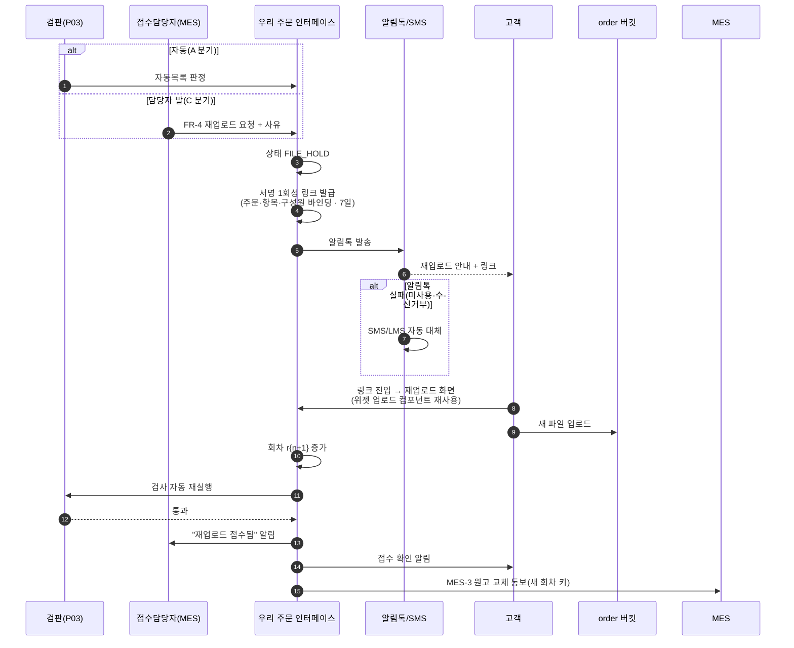
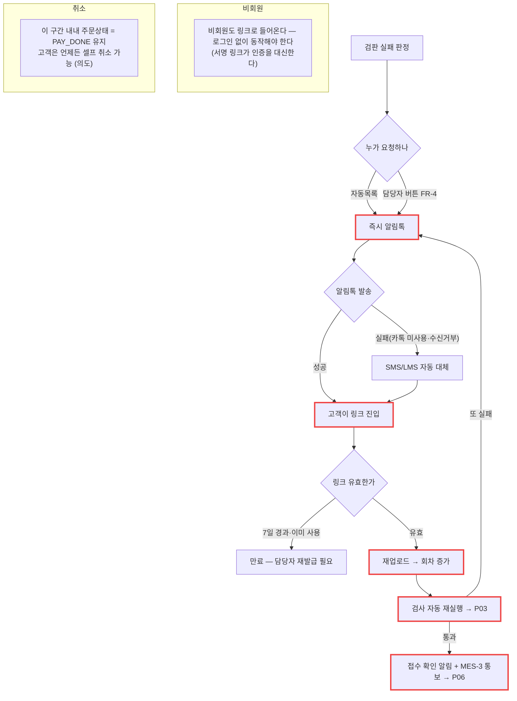

# P04 · 원고 보완 — 재업로드 요청과 회차 증가

> L0 후니 몰 전체 › L1 원고·파일 › L2 검판 › **L3 P04 원고보완-재업로드**

## 1. 한 줄 정의 · 시작/끝 · 등장인물

**한 줄 정의.** 검판에서 걸린 원고를 **고객이 다시 올려** 회차가 올라가고 재검사를 통과해 접수 가능 상태로 돌아오기까지.

- **시작** — P03 의 A 분기(자동) 또는 C 분기(담당자 발), 또는 MES 담당자의 FR-4 요청.
- **끝** — 새 회차(`r2`, `r3`…)가 통과 → P06 으로 넘어감.

| 등장인물 | 하는 일 |
|---|---|
| **고객** | 알림톡 링크로 들어와 지정된 파일만 다시 올린다 |
| **우리** | 서명 1회성 링크를 발급하고 회차를 올리고 재검사를 건다 |
| **접수담당자(MES)** | "이건 고객이 다시 올려야 한다" 판단 후 버튼(FR-4) |
| 샵바이 | **관여하지 않는다** — 주문상태는 `PAY_DONE` 그대로 둔다 |
| MES | 회차가 올라가면 새 키를 통보받는다(MES-3) |

**핵심 원칙.** 이 구간 동안 주문상태를 상품준비중으로 올리지 않는다. 파일이 잘못돼 못 만들고 있는 상황이라 **고객의 취소권을 막을 이유가 없다**(설계 정본 §5.3 마지막 문단).

## 2. 시퀀스

## 3. 분기 — 실패 · 비회원 · 취소

## 4. 단계표

| # | 단계 | 시스템 | 담당자 | 원장 row_id | 상태 | 근거 |
|---|---|---|---|---|---|---|
| 1 | FR-4 재업로드 요청 수신 → 서명 1회성 링크 발급(7일) | 우리 | 서희항 | `STD-MFG-054` | 미착수 | `raw/webadmin/docs/order-to-mes-process.md:202-214` §5.3 · `:487` §8.4 FR-4 · **코드 0건** |
| 2 | 재업로드 요청 발송(담당자) | 우리 | 서희항 | `STD-ADO-009` | 미착수 | 화면 0 |
| 3 | 재업로드 요청 발송(문자/알림) | 우리 | 서희항 | `STD-ART-018` | 미착수 | 코드 0 |
| 4 | 재업로드 화면(위젯 업로드 컴포넌트 재사용) | 우리 | 서희항 | `STD-MFG-055` | 미착수 | §5.3 · 코드 0 |
| 5 | 회차 증가 + 검사 자동 재실행 | 우리 | 서희항 | `STD-MFG-056` | 미착수 | §5.3 · 회차 그릇은 있다 → `catalog/s3_artwork.py:166` · `catalog/models.py:1134` |
| 6 | 보완 대기 중 주문상태 `PAY_DONE` 유지 | 우리 | 서희항 | `STD-MFG-057` | 미착수 | §5.3 마지막 문단 · **상태머신에 `FILE_HOLD` 상수 자체가 없다** → `catalog/artwork_promote.py:50-56` 에는 REGISTERED/PROMOTING/PROMOTED/HOLD 넷뿐 |
| 7 | FR-6 프리플라이트 재실행 요청 | 우리 | 서희항 | `STD-MFG-051` *(P03 주)* | 미착수 | §8.4 FR-6 · 코드 0 |
| 8 | MES-3 원고 교체 통보 | 우리→MES | 서희항 | `STD-MFG-016` | 미착수 | §8.3 MES-3 · 코드 0 |
| 9 | 파일 오류 재업로드 알림톡 발송 | 우리 | 서희항+최숙진 | `STD-MFG-125` | 미착수 | §10 "파일 관련만 우리가" · 코드 0 → P17 |
| 10 | 재업로드 접수 확인 알림 | 우리 | 서희항+최숙진 | `STD-MFG-126` | 미착수 | §10 · 코드 0 → P17 |
| 11 | 파일 재업로드·버전 이력 보관 | 우리 | 서희항 | `STD-ART-007` *(cross t63)* | 부분 | 그릇은 있다 — `TOrdArtworks` `unique_together=('ord','rev_no','tmp_key')` `catalog/models.py:1134` |

## 5. 빠진 곳

### 가. 원장에 행이 없다
| 무엇 | 왜 필요한가 |
|---|---|
| **서명 링크 만료·재발급 경로** | 7일이 지나거나 이미 쓴 링크로 고객이 들어왔을 때 무엇을 보여 주고 누가 재발급하는지가 행으로 없다. `STD-MFG-054` 는 발급만 말한다 |
| **`FILE_HOLD` 상태를 상태머신에 추가** | `STD-MFG-022`(상태머신, P09)에 이름은 들어 있으나 **이 구간이 그 상태를 쓴다는 연결**이 행으로 없다 |
| **재업로드 화면의 비로그인 접근 정책** | 비회원·로그아웃 고객이 링크로 들어오는 경로가 행으로 없다 |

### 나. 행은 있는데 코드가 0이다
`STD-MFG-054`·`055`·`056`·`057`·`016`·`125`·`126` · `STD-ART-018` · `STD-ADO-009` — **9행 전부 코드 0.**

### 다. 코드는 있는데 연결이 안 됐다
| 무엇 | 실태 |
|---|---|
| 회차(`rev_no`) 그릇 | `build_order_key(rev=)`·`TOrdArtworks.rev_no`·`latest_artworks` 가 **이미 있다**. 회차를 올리는 쪽(재업로드)이 없을 뿐이다 |
| 위젯 업로드 컴포넌트 | 최초 업로드용으로 살아 있다(`STD-ART-001` 작동). 재사용 배선만 남았다 |

→ **이 프로세스는 밑바닥(회차 규약·업로드 컴포넌트)이 깔려 있고 그 위 배선이 통째로 비어 있다.**

### 라. 결정이 안 됐다
| 항목 | 무엇을 |
|---|---|
| 알림톡 채널 | 샵바이 알림톡 vs 자체 비즈메시지(설계 §12-7) → P17 |
| 링크 유효기간 | 7일은 **권장치**이지 확정이 아니다(§5.3 "유효기간 7일 권장") |
| 검판 자체 | P03 `T4-3` 이 「사람 검수」로 결정되면 이 프로세스의 자동 분기(1·3·5·7)가 통째로 빠진다 |

## 6. 채우는 방법

| 순 | 누가 | 무엇을 | 선행 |
|---|---|---|---|
| 1 | 서희항+신우진 | 검수 경로 결정(`T4-3`) — 자동이냐 사람이냐 | 없음 |
| 2 | 최숙진+신우진 | 알림톡 채널·템플릿 확정 + 카카오 심사 신청 | 없음 — **심사 리드타임 때문에 가장 먼저 걸어야 한다** |
| 3 | 서희항 | `FILE_HOLD` 를 상태머신에 추가 | P09 상태머신 |
| 4 | 서희항 | 서명 링크 발급·검증·만료 처리 | 3 |
| 5 | 서희항 | 재업로드 화면(위젯 컴포넌트 재사용) + 회차 증가 배선 | 4 |
| 6 | 서희항 | 검사 자동 재실행 + MES-3 통보 | 5 · P03 · P06 |

## 7. 확인 못 한 것

- 위젯 업로드 컴포넌트의 재사용 가능 범위(`raw/widget_ui` 쪽)는 이번 조사에서 열지 않았다.
- 알림톡 템플릿이 이미 신청돼 있는지(카카오 채널 상태)는 **외부 콘솔 확인이 필요**해 보지 않았다.
- `T5-2`(알림톡 33건 개별 판단)가 이 구간의 몇 건을 덮는지는 t65 범위라 대조하지 않았다.
