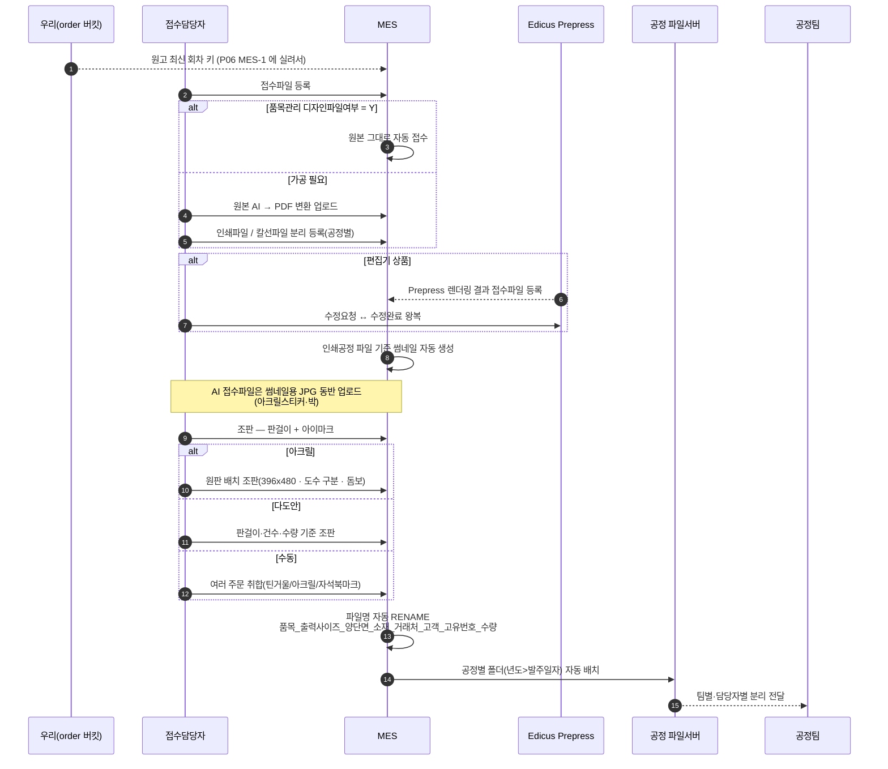
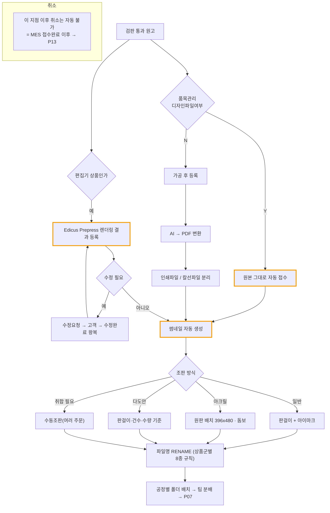

# P05 · 접수파일 등록 — 변환 · 조판 · 파일명 · 폴더 배치

> L0 후니 몰 전체 › L1 운영자·주문운영 › L2 생산 › **L3 P05 접수파일등록-조판**

## 1. 한 줄 정의 · 시작/끝 · 등장인물

**한 줄 정의.** 고객이 준 원고를 **인쇄기에 걸 수 있는 파일**로 만들어(원본 그대로 쓸지 가공할지 → AI→PDF 변환 → 인쇄/칼선 분리 → 조판 → 파일명 → 폴더) 공정팀이 집어갈 자리에 두기까지.

- **시작** — 검판 통과(P03) 또는 접수담당자가 주문을 연 시점.
- **끝** — 공정별 파일서버 폴더에 규약대로 이름 붙은 파일이 놓이고 팀별로 분배됨.

| 등장인물 | 하는 일 |
|---|---|
| **접수담당자** | 원본 그대로 쓸지 가공할지 판단하고, 수동조판을 한다 |
| **MES** | 접수파일을 등록·보관하고 썸네일을 만든다 |
| **Edicus** | 편집기 상품의 Prepress 렌더링 결과를 준다 |
| 우리(webadmin) | 판걸이/임포지션 정보를 계산해 준다 |
| 파일서버 | 공정별 `년도>발주일자` 폴더 |

> **이 프로세스의 대부분은 MES 쪽 작업이다.** MES 저장소(`TS.BackOffice.Huni`)에 생산계획·공정 모듈은 있으나 **HuniWeb 연동 코드는 0건**이다(`grep -rniE "huniweb|webadmin"` 저장소 전체 0건).

## 2. 시퀀스

## 3. 분기 — 실패 · 비회원 · 취소

> 주황색 = **미실측(상대측 회신 대기)** 행 — MES 담당의 답을 받아야 실태가 확정된다.

## 4. 단계표

| # | 단계 | 시스템 | 담당자 | 원장 row_id | 상태 | 근거 |
|---|---|---|---|---|---|---|
| 1 | 접수파일 등록(원본 vs 가공 2경로) | MES | 최숙진 | `STD-MFG-058` | 미착수 | 원장 · MES 저장소에 HuniWeb 연동 0건 |
| 2 | 품목관리 디자인파일여부 Y/N 자동 접수 | MES | 외부(회신 대기) | `STD-MFG-059` | **미실측** | 원장 · 「찾지 못했다」 — MES 내부 설정이라 우리 코드에 없다 |
| 3 | Edicus Prepress 렌더링 결과 등록 | Edicus→MES | 외부(회신 대기) | `STD-MFG-060` | **미실측** | 원장 |
| 4 | 인쇄공정 파일 기준 썸네일 자동 생성 | MES | 외부(회신 대기) | `STD-MFG-061` | **미실측** | 원장 |
| 5 | AI 접수파일에 썸네일용 JPG 동반 업로드 | MES | 최숙진 | `STD-MFG-062` | 미착수 | 원장(아크릴스티커·박) |
| 6 | 편집기 상품 수정요청·수정완료 왕복 | Edicus | 서희항 | `STD-MFG-064` | 미착수 | 원장 · 알림은 P17 `STD-MFG-127` |
| 7 | 원본 AI → PDF 변환 업로드 | MES | 최숙진 | `STD-MFG-072` | 미착수 | 원장 |
| 8 | 인쇄파일·칼선파일 분리 공정별 등록 | MES | 최숙진 | `STD-MFG-073` | 미착수 | 원장 |
| 9 | 조판(판걸이 + 아이마크) 파일 생성 | MES | 최숙진 | `STD-MFG-074` | 미착수 | 원장 |
| 10 | 아크릴 원판 배치 조판(396x480·도수·돔보) | MES | 최숙진 | `STD-MFG-075` | 미착수 | 원장 |
| 11 | 다도안 판걸이·건수·수량 기준 조판 | MES | 최숙진 | `STD-MFG-076` | 미착수 | 원장 |
| 12 | 수동조판(여러 주문 취합) | MES | 최숙진 | `STD-MFG-077` | 미착수 | 원장 |
| 13 | 파일명 자동 RENAME 규약 | MES | 최숙진 | `STD-MFG-078` | 미착수 | 원장 · **선행 = `STD-MFG-010`**(MES 품목코드 매핑 — 파일명 첫 토큰이 품목이다) |
| 14 | 상품군별 파일명 조합 규칙 8종 | MES | 최숙진 | `STD-MFG-079` | 미착수 | 원장(디지털/캘린더/스티커/실사/배너/패브릭/시트커팅/레이저커팅) |
| 15 | 공정별 폴더 구조(년도>발주일자) 자동 배치 | MES | 최숙진 | `STD-MFG-080` | 미착수 | 원장 |
| 16 | 팀별·담당자 파일 분리 전달 | MES | 최숙진 | `STD-MFG-081` | 미착수 | 원장 |
| 17 | 인쇄타입별 접수파일 포맷 규약(PDF/AI/JPG) | MES | 최숙진 | `STD-MFG-092` | 미착수 | 원장 — **정의하는 일**(t59 ㉯ 계열) |
| 18 | 판걸이/임포지션 정보 산출 | 우리 | 서희항 | `STD-ADO-014` | **작동** | webadmin 가격엔진의 판걸이수 계산이 이미 있다(`fn_calc_pansu` 계열) — 조판에 쓸 수 있는 값 |
| 19 | 에디터 산출물 인쇄용 변환·주문 연결 | Edicus | 서희항 | `STD-ART-024` *(cross t63)* | 부분 | 원장 |

## 5. 빠진 곳

### 가. 원장에 행이 없다
| 무엇 | 왜 필요한가 |
|---|---|
| **우리 판걸이 값 → MES 조판 전달 경로** | `STD-ADO-014` 는 "산출"까지만 말한다. 그 값이 MES-1 payload 에 실리는지, MES 가 다시 계산하는지가 행으로 없다. **같은 수를 두 곳에서 계산하면 반드시 어긋난다** |
| **파일명 규약 ↔ 상품마스터 품목명 정합** | `STD-MFG-078`/`079` 의 첫 토큰이 「품목」인데, 그 품목명이 우리 `prd_nm` 인지 MES `MES_ITEM_CD` 인지가 행으로 없다 |
| **조판 실패·재조판 경로** | 조판이 안 되는 원고(크기 초과·도수 불일치)가 나왔을 때 어디로 가는지 행이 없다 |

### 나. 행은 있는데 코드가 0이다
`STD-MFG-058`·`062`·`064`·`072`~`081`·`092` — **13행.** MES 쪽 개발 범위이며 MES 저장소에 HuniWeb 관련 코드가 0건이다.

### 다. 코드는 있는데 연결이 안 됐다
| 무엇 | 실태 |
|---|---|
| 판걸이 계산(`STD-ADO-014` 작동) | webadmin 가격엔진 안에서만 쓰인다. 생산 쪽으로 나가는 통로가 없다 |
| MES 생산계획·공정 모듈 | `BackOffice.Server/CRT.EasyMES.V2.IF/IManufactureService.cs` 에 생산계획·작업순서(`UManufactPlanPrintWorkSeq:64`)·공정 테이블(`T_MNF_MANUFACT_PLAN_PRCS`)이 **이미 있다**. 후니 주문이 들어오는 입구가 없을 뿐이다 |

### 라. 결정이 안 됐다
| 항목 | 누가 |
|---|---|
| 접수파일 포맷 규약(PDF/AI/JPG 어디에 무엇) | 최숙진 — `STD-MFG-092` 는 **정의하는 일**이다 |
| 디자인파일여부 Y/N 운영 기준 | 최숙진 + MES 담당 |
| 판걸이 값의 단일 출처(우리 vs MES) | 서희항+최숙진 — **원장에 행이 없는 결정** |

## 6. 채우는 방법

| 순 | 누가 | 무엇을 | 선행 |
|---|---|---|---|
| 1 | 최숙진 | 접수파일 포맷 규약·파일명 8종 규칙을 **문서로 먼저 확정** | 없음 — 이게 MES 개발의 입력이다 |
| 2 | 서희항+최숙진 | 판걸이 값 단일 출처 결정 + 원장 행 신설 | 없음 |
| 3 | 최숙진 | MES 담당에게 2·3·4번 행(미실측 3건) 회신 요청 | 없음 |
| 4 | MES 담당 | 접수파일 등록·변환·조판·RENAME·폴더 배치 구현 | 1·3 · P06 |
| 5 | 서희항 | MES-1 payload 에 품목코드·판걸이 포함 | 2 · P06 |

## 7. 확인 못 한 것

- MES 의 접수파일 등록 화면이 실제로 어떻게 생겼는지 — **MES WinForms 실행·실화면 확인을 하지 않았다**(읽기전용 코드 조사만).
- `IManufactureService.cs` 의 구현체(`Data/Biz`·`Data/Dac`) 내부는 열지 않았다 — 인터페이스 시그니처만 봤다.
- Edicus Prepress 렌더링 결과의 실제 산출 포맷은 확인하지 못했다.
- 「미실측(상대측 회신 대기)」 3행은 **우리 저장소에서 확인 가능한 대상이 아니다** — MES 내부 설정이라 회신이 없으면 영원히 미실측이다.
