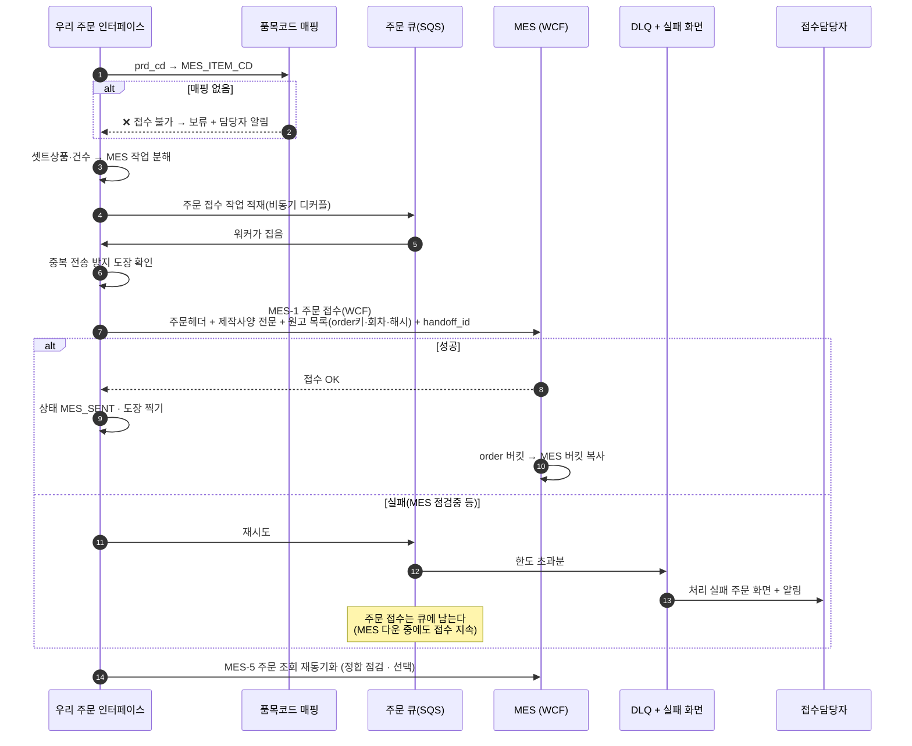
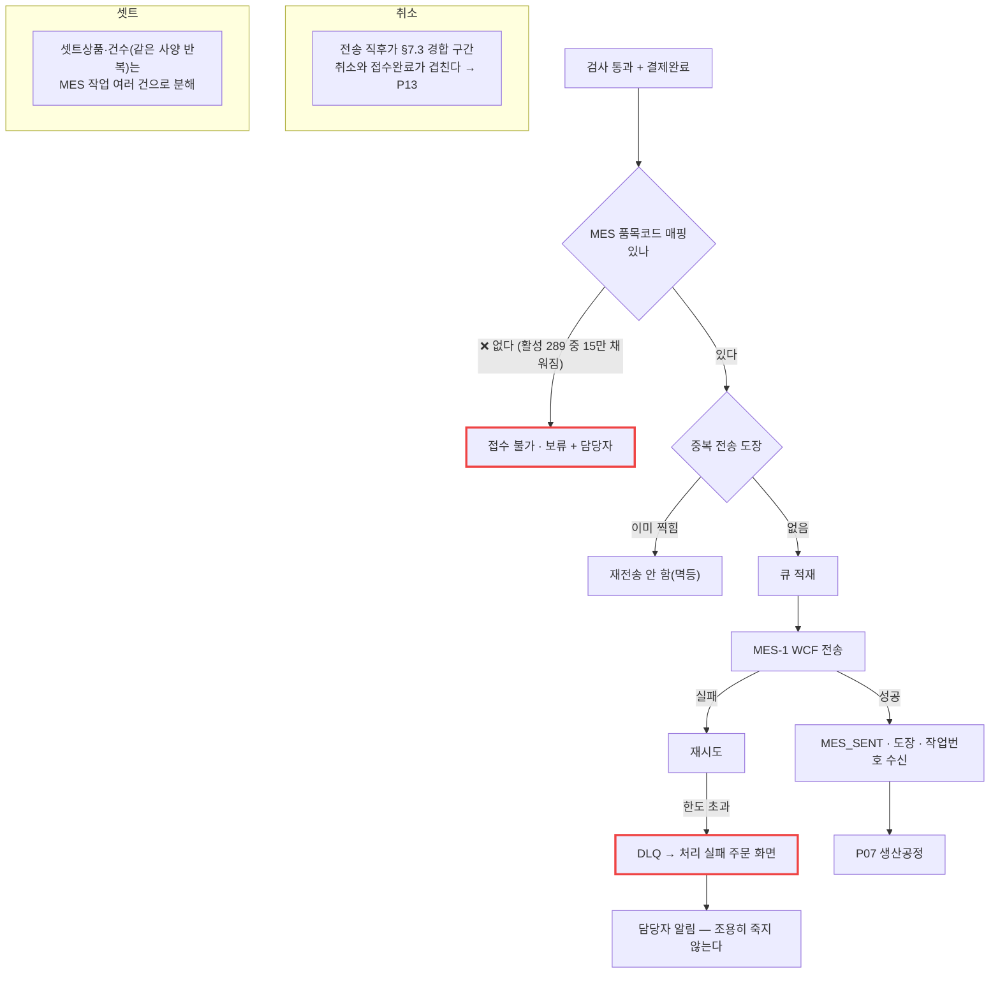

# P06 · MES 주문 접수 전송

> L0 후니 몰 전체 › L1 원고·파일 › L2 생산연계 › **L3 P06 MES주문접수전송**

## 1. 한 줄 정의 · 시작/끝 · 등장인물

**한 줄 정의.** 검사를 통과한 주문을 **우리 상품코드에서 MES 품목코드로 번역해** 제작사양 전문·원고 목록과 함께 MES 에 접수 전송하고, 전송이 실패해도 주문이 조용히 죽지 않게 관리하기까지.

- **시작** — 결제완료 + 검사 통과(`PROMOTED` + P03 정상).
- **끝** — MES 가 접수하고 작업번호를 채번. 우리 상태는 `MES_SENT`.

| 등장인물 | 하는 일 |
|---|---|
| **우리** | 품목코드로 번역해 WCF 로 보낸다. 중복 전송을 막고 실패를 큐에 남긴다 |
| **MES** | 주문을 받아 생산계획·작업번호를 만든다 |
| 접수담당자 | 실패 주문 목록을 본다 |
| 샵바이 | 여기 없다. MES 는 **절대 샵바이를 직접 부르지 않는다** |

**이 프로세스가 전체의 병목이다.** t60 ④축 판정 그대로 — 선행 없는 행이 3행뿐이고 외부 선행 토큰이 55개다.

## 2. 시퀀스

## 3. 분기 — 실패 · 비회원 · 취소

## 4. 단계표

| # | 단계 | 시스템 | 담당자 | 원장 row_id | 상태 | 근거 |
|---|---|---|---|---|---|---|
| 1 | 상품↔MES 품목코드 일괄 적재 | 우리 | 서희항 | `STD-MFG-010` | 부분 | 컬럼 `raw/webadmin/webadmin/catalog/models.py:558` `mes_item_cd`(db_column `MES_ITEM_CD`) · 라이브 실측 260902 **활성 289 중 15** |
| 2 | 품목코드 중복 검증 | 우리 | 서희항 | `STD-MFG-011` | 부분 | `catalog/admin.py:2710-2723` `clean_mes_item_cd` — **상품 편집 화면에 실재** |
| 3 | 매핑 현황 목록 노출 | 우리 | 서희항 | `STD-MFG-012` | 미착수 | 목록 화면 없음 — 입력은 되는데 **현황을 볼 수가 없다** |
| 4 | MES 넘길 파일 목록(최신 회차) | 우리 | 서희항 | `STD-MFG-009` *(P02 주)* | 부분 | `catalog/artwork_promote.py:319-329` `latest_artworks` |
| 5 | 셋트·건수 MES 작업 분해 | 우리 | 서희항 | `STD-MFG-099` | 부분 | 정보는 있다 — `catalog/widget_api.py:1912`·`:1938` `case_cnt`. 분해 규칙은 §12-11 미결 |
| 6 | MES-1 주문 접수 전송(WCF) | 우리→MES | 서희항 | `STD-MFG-013` | 미착수 | 설계 `docs/order-to-mes-process.md:468-476` §8.3 · **코드 0건**(`zeep|suds|wcf|soap` grep 0건) |
| 7 | 중복 전송 방지 도장 | 우리 | 서희항 | `STD-MFG-014` | 미착수 | §11 2단계 · 코드 0 |
| 8 | MES-5 주문 조회 재동기화 | 우리→MES | 서희항 | `STD-MFG-018` | 미착수 | §8.3 MES-5 · 코드 0 |
| 9 | MES→우리 API 인증(VPC 사설+API 키) | 우리 | 서희항 | `STD-MFG-019` | 미착수 | §8.4 인증·경로 · `docs/aws-architecture-huni.pdf` p.11 §6 · 코드 0 |
| 10 | 주문 큐 비동기 처리(SQS 디커플) | 우리 | 서희항 | `STD-MFG-020` | 미착수 | **환경변수만 있다** — `raw/webadmin/tools/aws_deploy_assemble.py:45` `SQS_ORDER_QUEUE_URL`. `boto3 sqs` 클라이언트 코드 0건 |
| 11 | 실패 재시도·DLQ·실패 주문 화면 | 우리 | 서희항 | `STD-MFG-021` | 미착수 | §9.4 · 코드 0 |
| 12 | 3시스템 매핑 테이블 | 우리 | 서희항 | `STD-MFG-024` | 부분 | `handoff_id` 그릇은 있다 — `catalog/models.py:934` `TWgtHandoffLogs.handoff_id`(PK). **MES 작업번호 칸이 없다** |
| 13 | 단계별 체류·DLQ 대시보드 | 우리 | 서희항 | `STD-MFG-131` | 미착수 | §11 5단계 · 코드 0 → P15 |
| 14 | 생산용 원고 자동 다운로드/전달 | 우리→MES | 서희항 | `STD-ART-028` | 부분 | order 버킷 키는 준비됨(P02). 전달은 MES-1 에 실린다 |
| 15 | 생산 지시 데이터 연계(JDF/XJDF) | 우리 | 서희항 | `STD-ADO-015` | 미착수 | `print-kb/wiki/base/prepress-file.md#BPF-004` — **설계 대안**(WCF 대신 표준 포맷). 지금 설계는 WCF 다 |
| 16 | 접수 화면·상태머신·MES 접수 전송 | — | 미정+최숙진 | `T4-4` | 없음 | 원장 |
| 17 | MES WCF 스펙(WSDL·상태코드·품목마스터) 보유 여부 | — | 외부(MES 담당) | `BLK-S2-3` | **대기** | 원장 — **이 프로세스의 뿌리** |
| 18 | DLQ 관리 화면(공통 인프라) | 우리 | — | `STD-SYS-016` *(cross t65)* | — | 원장 |

## 5. 빠진 곳

### 가. 원장에 행이 없다
| 무엇 | 왜 필요한가 |
|---|---|
| **MES 작업번호를 받아 적는 칸** | `STD-MFG-024`(3시스템 매핑)는 "테이블을 둔다"까지만 말한다. MES 가 채번한 작업번호를 **어디에 어떻게 받아 적는지** DDL 행이 없다 |
| **품목코드 미매핑 주문의 처리** | 289 중 15만 채워진 상태에서 나머지 주문이 들어오면 무엇을 하는지(보류? 거부? 기본값?)가 행으로 없다. `STD-MFG-010` 은 적재만 말한다 |
| **MES-1 payload 스키마 정의서** | 설계 §11 2단계에 `[ ] 우리가 제공할 API 4종 정의서` 는 있는데 **MES-1(우리→MES) 쪽 payload 정의서** 행이 없다 |

### 나. 행은 있는데 코드가 0이다
`STD-MFG-013`·`014`·`018`·`019`·`020`·`021`·`012`·`131` · `STD-ADO-015` — **9행.**
그중 `STD-MFG-020`(SQS)은 **환경변수까지만** 준비돼 있다.

### 다. 코드는 있는데 연결이 안 됐다
| 무엇 | 실태 |
|---|---|
| `MES_ITEM_CD` 컬럼 + 중복검증 폼 | **입력 UI 는 상품 편집 화면에 실재한다**(`admin.py:2710`). 값이 289 중 15 뿐이고, 목록 화면이 없어 현황이 안 보인다 |
| `handoff_id` | 발급·로그·정리까지 살아 있다(`widget_api.py:3932`·`3959`·`3996`·`4726`·`5268`). MES 로 나가는 자리가 없다 |
| MES 쪽 주문 수신부 | `BackOffice.Server/CRT.EasyMES.V2.IF/IOrderService.cs:58` `COrderByExcel` 등 **기존 채널(Cafe24·엑셀) 주문 수신은 있다**. 후니 전용 입구만 없다 |
| MES 쪽 SQS | `Framework/CRT.Framework.AWS/SqsClient.cs` 가 **실제로 구현돼 있다**(로그·ECount 연동용). 후니 큐와 연결돼 있지 않을 뿐 |

→ **양쪽 다 부품은 있고 가운데 다리가 없다.**

### 라. 결정이 안 됐다
| 항목 | 원장 | 왜 막혔나 |
|---|---|---|
| MES WCF 스펙 | `BLK-S2-3` | **외부(MES 담당) 회신 대기.** 이게 없으면 6·7·8·9 를 시작할 수 없다 |
| MES 실제 상태 코드·명칭 | 설계 §12-1 | §6 매핑표의 MES 열이 **추정**이다 |
| 셋트·건수 작업 분해 규칙 | 설계 §12-11 | MES 담당과 협의 |
| 접수 화면 주체 | `T4-4` owner = **미정** | 담당자가 안 정해졌다 |
| 웹훅 인프라(API GW+SQS vs 직접 수신) | 설계 §12-12 | 1차는 직접 수신 제안 |

## 6. 채우는 방법

| 순 | 누가 | 무엇을 | 선행 |
|---|---|---|---|
| 1 | 최숙진 | MES 담당에게 WCF 스펙(WSDL·상태코드·품목마스터) 요청(`BLK-S2-3`) | 없음 — **최우선** |
| 2 | 서희항 | 품목코드 원천 엑셀 재추출 → 중복 7건 판정 → 289건 일괄 적재 | 없음 — **스펙과 무관하게 지금 가능** |
| 3 | 서희항 | 매핑 현황 목록 화면 1개 | 2 |
| 4 | 지니 | `T4-4` 담당자 확정 | 없음 |
| 5 | 서희항 | 우리 제공 API 4종 정의서 + MES-1 payload 정의서 | 1 |
| 6 | 서희항 | 상태머신 + 중복 도장 + 큐/DLQ | 5 · P09 |
| 7 | 서희항 | MES-1 WCF 클라이언트 | 5·6 |
| 8 | MES 담당 | 후니 주문 수신부 + 작업번호 채번 | 5 |

> **2·3 은 오늘 착수 가능하다.** 나머지는 전부 1 에 묶여 있다.

## 7. 확인 못 한 것

- MES WCF `.svc` 16개의 실제 계약(파라미터·리턴 타입)은 인터페이스 파일만 훑었고 **WSDL 을 뽑지 않았다**.
- MES 작업번호 채번 로직(`Data/Biz`·`Data/Dac` 구현체)은 열지 않았다.
- 라이브 `t_prd_products.mes_item_cd` 의 **현재** 채움 건수는 재실측하지 않았다 — 260902 실측치(289 중 15)를 인용했다. 라이브는 움직이므로 판정 시점에 다시 세야 한다.
- `SQS_ORDER_QUEUE_URL` 이 가리키는 큐가 AWS 에 실제로 존재하는지는 콘솔 확인이 필요해 보지 않았다.
