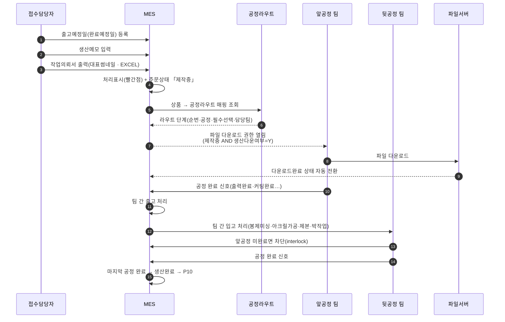
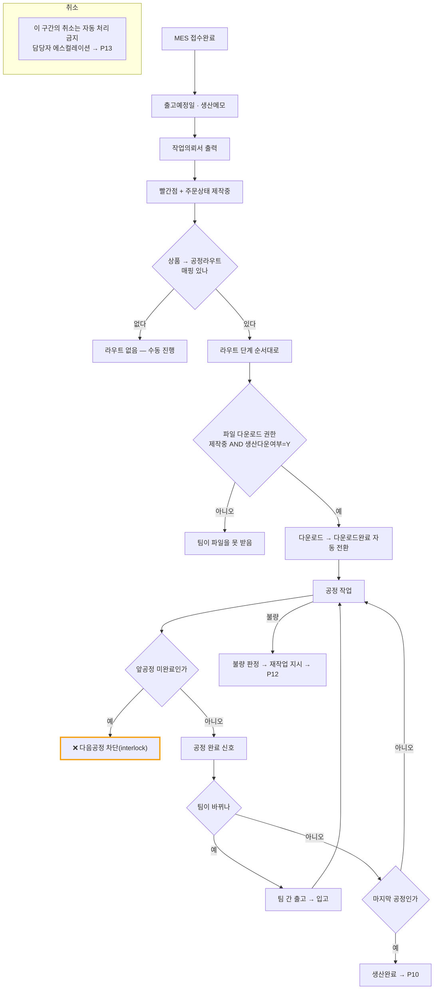

# P07 · 생산 공정 진행

> L0 후니 몰 전체 › L1 운영자·주문운영 › L2 생산 › **L3 P07 생산공정진행**

## 1. 한 줄 정의 · 시작/끝 · 등장인물

**한 줄 정의.** MES 가 접수한 작업이 **공정 라우트를 따라 팀을 옮겨 다니며** 완료 신호를 쌓아 생산완료가 되기까지.

- **시작** — MES 접수완료 → 작업의뢰서 출력(주문상태 「제작중」 전환).
- **끝** — 마지막 공정 완료 → 제작완료 → P10(포장·출고).

| 등장인물 | 하는 일 |
|---|---|
| **접수담당자** | 출고예정일·생산메모를 넣고 작업의뢰서를 뽑는다 |
| **공정팀**(디지털인쇄/스티커가공/인쇄후가공/제본/특수인쇄가공/봉재가공/굿즈가공) | 파일을 내려받아 만들고 완료 신호를 넣는다 |
| **MES** | 라우트·팀·진행상태를 관리한다 |
| **우리**(webadmin) | 공정 마스터(무엇이 어떤 공정을 쓰는가)를 **이미 갖고 있다** |

## 2. 시퀀스

## 3. 분기 — 실패 · 비회원 · 취소

## 4. 단계표

| # | 단계 | 시스템 | 담당자 | 원장 row_id | 상태 | 근거 |
|---|---|---|---|---|---|---|
| 1 | 출고예정일(완료예정일) 등록 | MES | 최숙진 | `STD-MFG-065` | 미착수 | 원장 · MES 에 HuniWeb 연동 0건 |
| 2 | 생산메모 입력 | MES | 최숙진 | `STD-MFG-066` | 미착수 | 원장 |
| 3 | 작업의뢰서 출력(대표썸네일·EXCEL) | MES | 최숙진 | `STD-MFG-067` | 미착수 | 원장 |
| 4 | 의뢰서 출력 시 처리표시+「제작중」 전환 | MES | 최숙진 | `STD-MFG-068` | 미착수 | 원장 |
| 5 | **공정 마스터 관리**(계층·상세옵션·면별선택·작업여백·고객노출설명) | 우리 | 서희항 | `STD-MFG-082` | **작동** | `raw/webadmin/webadmin/catalog/models.py:589` `TProcProcesses`(PK `proc_cd`, 상위공정 `upr_proc_cd`, `prcs_dtl_opt`, `side_sel_yn`, `usr_def_nm`) · db_table `t_proc_processes` `:627` · 편집 화면 `catalog/admin.py:2732-2760` · 사용처 조회 `catalog/proc_usage.py:86` + `config/urls.py:343` |
| 6 | **상품별 공정 연결·필수공정·상세옵션 허용범위** | 우리 | 서희항 | `STD-MFG-083` | **작동** | `catalog/models.py:495` `TPrdProductProcesses`(복합PK `prd_cd`+`proc_cd`) · `mand_proc_yn` `:500` · `dtl_opt_rng` `:501` · 범위 UI `catalog/views.py:1690` `_proc_range_spec` · `:3186` `_collect_proc_range` |
| 7 | 공정라우트 마스터(18케이스·재채번) | MES | 최숙진 | `STD-MFG-084` | 미착수 | **찾지 못했다** — webadmin 에 라우트 모델 0건, MES 에 후니 라우트 0건 |
| 8 | 라우트 단계 정의(순번·공정·필수선택·담당팀) | MES | 최숙진 | `STD-MFG-085` | 미착수 | 같음 |
| 9 | 상품→공정라우트 매핑 | MES | 최숙진 | `STD-MFG-086` | 미착수 | 같음 |
| 10 | 팀·파트 마스터(7팀) | MES | 최숙진 | `STD-MFG-087` | 미착수 | **찾지 못했다** — `class T.*Team|T.*Part` grep 0건 |
| 11 | 공정 완료 신호 입력 | MES | 최숙진 | `STD-MFG-088` | 미착수 | MES 쪽 **부품은 있다** — `BackOffice.Server/CRT.EasyMES.V2.IF/IManufactureService.cs:173` `GetMnfPlanProcessStateBarcode` · `:179` `UMnfPlanProcessStateBarcode` · 공정상태 `:49`·`:60`·`:74`·`:86`·`:96`·`:100` |
| 12 | 팀 간 출고·입고 처리 | MES | 최숙진 | `STD-MFG-089` | 미착수 | 원장 |
| 13 | 앞공정 미완료 시 차단(interlock) | MES | 외부(회신 대기) | `STD-MFG-090` | **미실측** | **찾지 못했다** — `interlock|선후 관계` grep 0건. MES 에 작업순서(`UManufactPlanPrintWorkSeq:64`)·공정별 테이블(`T_MNF_MANUFACT_PLAN_PRCS`)은 있으나 차단 로직 확인 불가 |
| 14 | 팀별 파일 다운로드 권한 | MES | 최숙진 | `STD-MFG-091` | 미착수 | 원장(제작중 AND 생산다운여부=Y) |
| 15 | 파일 다운로드 시 다운로드완료 자동 전환 | MES | 최숙진 | `STD-MFG-093` | 미착수 | 원장 |
| 16 | 인쇄 공정 상태 트래킹 | 우리/MES | 최숙진 | `STD-ADO-012` | 미착수 | 화면 0 |
| 17 | 작업 큐/일정 배정 | MES | 최숙진 | `STD-ADO-013` | 미착수 | 화면 0 |
| 18 | 바코드/라벨 출력 | MES | 최숙진 | `STD-ADO-016` | 미착수 | 원장 → P10 과 공유 |
| 19 | 검수 게이트 G3(가공) | MES | 최숙진 | `STD-ADO-010` *(P03 주)* | 미착수 | 원장 |

## 5. 빠진 곳

### 가. 원장에 행이 없다
| 무엇 | 왜 필요한가 |
|---|---|
| **우리 공정 마스터 ↔ MES 라우트 정합** | webadmin 에 `t_proc_processes`·`t_prd_product_processes` 가 **살아서 돌고 있고**, MES 에 라우트를 새로 만든다. **두 개의 공정 정의가 생긴다** — 어느 쪽이 정본인지, 어떻게 동기화하는지 행이 없다. 이 프로세스에서 가장 큰 공백이다 |
| **`mand_proc_yn` NULL 교정** | 책자 5상품의 필수공정여부가 전건 NULL 이라는 별도 카드(t3)가 있으나, **그것이 생산 라우트에 미치는 영향**은 행이 없다 |
| **공정 완료 신호의 우리 쪽 반영** | 팀이 MES 에 완료를 찍으면 그게 고객 화면까지 오는가? P09(FR-1)는 접수완료/생산대기/생산중/생산완료 4개만 말한다. **공정 단위 진행은 고객에게 안 간다**는 결정인지 누락인지 행이 없다 |

### 나. 행은 있는데 코드가 0이다
`STD-MFG-084`~`091`·`093` · `STD-ADO-012`·`013`·`016` — **12행.** 전부 MES 쪽.

### 다. 코드는 있는데 연결이 안 됐다
| 무엇 | 실태 |
|---|---|
| **공정 마스터 2행(`082`·`083`)** | 이 프로세스에서 **유일하게 「작동」인 두 행**이다. 계층·상세옵션·면별선택·필수여부·허용범위가 전부 webadmin 에 있고 위젯·가격엔진이 쓴다. **생산 쪽으로 나가는 통로만 없다** |
| MES 공정 실적 등록 | 바코드 기반 공정상태 갱신 인터페이스가 MES 에 **이미 있다**. 후니 작업이 그 안에 안 들어갈 뿐 |

### 라. 결정이 안 됐다
| 항목 | 누가 |
|---|---|
| 공정 정의의 단일 출처(webadmin vs MES 라우트) | 서희항+최숙진 — **원장에 행이 없는 결정** |
| 18케이스 라우트의 실제 목록 | 최숙진 — **정의하는 일**(`STD-MFG-084`) |
| 7팀 파트 구분 확정 | 최숙진 |
| interlock 유무 | MES 담당 회신(`STD-MFG-090`) |

## 6. 채우는 방법

| 순 | 누가 | 무엇을 | 선행 |
|---|---|---|---|
| 1 | 최숙진 | 18케이스 라우트 + 7팀 파트를 **표로 먼저 확정** | 없음 — MES 개발의 입력 |
| 2 | 서희항+최숙진 | 공정 정의 단일 출처 결정 + 원장 행 신설 | 없음 |
| 3 | 최숙진 | MES 담당에게 interlock 유무 회신 요청 | 없음 |
| 4 | MES 담당 | 라우트 마스터·단계·팀 마스터·완료신호·다운로드 권한 구현 | 1·2 · P06 |
| 5 | 서희항 | 공정 마스터를 MES-1 payload 에 싣거나 조회 API 제공 | 2 · P06 |

## 7. 확인 못 한 것

- MES WinForms 의 공정 진행 화면(`BackOffice.UI/CRT.EasyMES.V2.Module.Manufacture/`)은 **실행해 보지 않았다** — 인터페이스 시그니처만 봤다.
- `T_MNF_MANUFACT_PLAN_PRCS`·`T_MNF_MANUFACT_PLAN_DTL_PRCS` 의 스키마는 region 주석으로만 확인했다.
- 라이브 `t_prd_product_processes` 의 `mand_proc_yn` NULL 건수는 재실측하지 않았다.
- 「18케이스」라는 수가 어디서 나왔는지(원 문서)는 추적하지 못했다 — 원장 제목의 기술이다.
