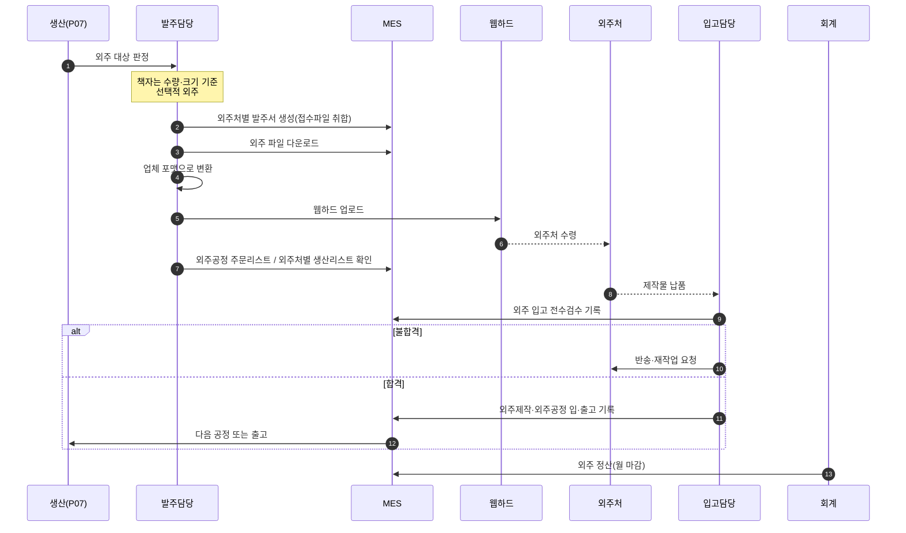
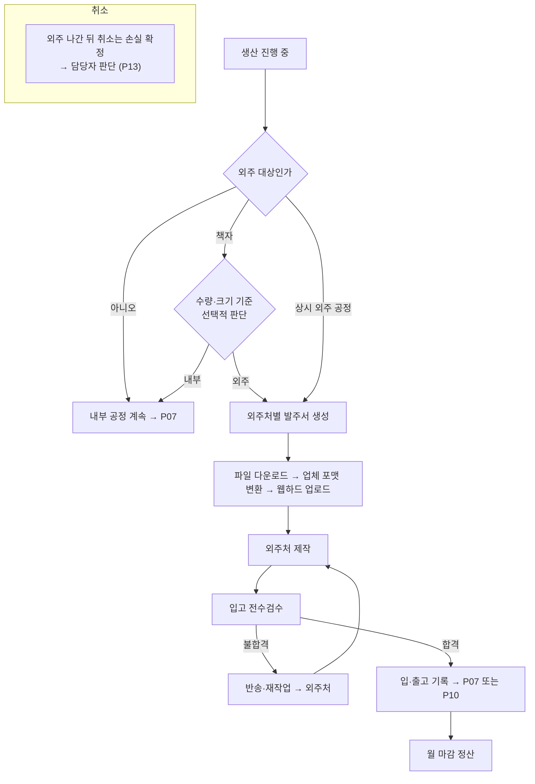

# P08 · 외주 발주 — 발주 · 입고 · 정산

> L0 후니 몰 전체 › L1 운영자·주문운영 › L2 외주 › **L3 P08 외주발주-입고**

## 1. 한 줄 정의 · 시작/끝 · 등장인물

**한 줄 정의.** 내부에서 못 만드는(또는 안 만드는 게 나은) 공정을 **외주처로 내보내고 받아** 전수검수하고 월 마감 정산까지.

- **시작** — 생산 진행 중(P07) 특정 공정이 외주 대상으로 판정.
- **끝** — 외주품 입고 검수 완료 → P07 복귀 또는 P10(포장·출고) · 월 마감 정산.

| 등장인물 | 하는 일 |
|---|---|
| **발주담당** | 외주 판단·발주서 생성·웹하드 업로드 |
| **외주처** | 만들어서 보낸다 |
| **입고담당** | 전수검수하고 입고 기록 |
| **회계/경리** | 월 마감 정산 |
| MES | 발주·입고·정산 기록을 담는다 |

## 2. 시퀀스

## 3. 분기 — 실패 · 비회원 · 취소

## 4. 단계표

| # | 단계 | 시스템 | 담당자 | 원장 row_id | 상태 | 근거 |
|---|---|---|---|---|---|---|
| 1 | 책자 수량·크기 기준 선택적 외주 판단 | MES | 최숙진 | `STD-MFG-101` | 미착수 | 원장 — **판단 기준 자체가 정의돼 있지 않다** |
| 2 | 외주처별 발주서 생성(접수파일 취합) | MES | 최숙진 | `STD-MFG-100` | 미착수 | 원장 · MES 에 HuniWeb 연동 0건 |
| 3 | 외주 발주 등록·관리 | MES | 최숙진 | `STD-ADO-017` | 미착수 | 화면 0 |
| 4 | 외주 파일 다운로드·포맷 변환·웹하드 업로드 | MES+수작업 | 최숙진 | `STD-MFG-102` | 미착수 | 원장 |
| 5 | 외주공정 주문리스트·외주처별 생산리스트 | MES | 최숙진 | `STD-MFG-103` | 미착수 | 원장 |
| 6 | 외주 입고 전수검수 기록 | MES | 최숙진 | `STD-ADO-018` | 미착수 | 화면 0 |
| 7 | 외주제작·외주공정 제작물 입·출고 기록 | MES | 최숙진 | `STD-MFG-104` | 미착수 | 원장 |
| 8 | 외주 정산(월 마감) | MES/회계 | 최숙진 | `STD-ADO-019` | 미착수 | 화면 0 |

**8행 전부 미착수 · 담당자 전원 최숙진 · 코드 0.** 이 프로세스는 우리 저장소(webadmin·huni-mall)와 **접점이 하나도 없다** — 순수 MES·운영 영역이다.

## 5. 빠진 곳

### 가. 원장에 행이 없다
| 무엇 | 왜 필요한가 |
|---|---|
| **외주처 마스터** | 8행 전부 "외주처별"이라고 하는데 **외주처를 등록·관리하는 행이 없다**. 거래처 마스터(`STD-MFG-069`·`070`, P16)는 고객 쪽이지 공급 쪽이 아니다 |
| **어떤 공정이 상시 외주인가** | `STD-MFG-101` 은 책자만 말한다. 나머지 상품군의 외주 여부가 행으로 없다 |
| **외주 단가·발주 금액** | 정산(`STD-ADO-019`)이 월 마감을 말하는데 **단가 그릇**이 행으로 없다 |
| **외주 리드타임 → 출고예정일 반영** | 외주가 끼면 출고예정일(`STD-MFG-065`)이 달라진다. 그 연결이 행으로 없다 |

### 나. 행은 있는데 코드가 0이다
**8행 전부.**

### 다. 코드는 있는데 연결이 안 됐다
- **없음.** 우리 쪽에 외주 관련 코드가 하나도 없다.

### 라. 결정이 안 됐다
| 항목 | 누가 |
|---|---|
| 외주 판단 기준(책자 수량·크기 임계값) | 최숙진 — **정의하는 일** |
| 외주처 목록·업체별 포맷 | 최숙진 |
| 웹하드를 계속 쓸지 | 최숙진 — 파일 전달이 수작업 구간이다 |
| 1차 런칭 범위에 넣을지 | 신우진 — **원장에 결정 행이 없다** |

## 6. 채우는 방법

| 순 | 누가 | 무엇을 | 선행 |
|---|---|---|---|
| 1 | 신우진+최숙진 | 외주를 1차 런칭 범위에 넣을지 결정 | 없음 |
| 2 | 최숙진 | 외주처 목록 + 상시 외주 공정 + 책자 판단 기준을 표로 확정 | 1 |
| 3 | 최숙진 | 외주처 마스터·단가 그릇을 원장 신규 행으로 제안 | 2 |
| 4 | MES 담당 | 발주서·리스트·입고검수·정산 구현 | 2·3 · P07 |

> **이 프로세스는 1차 런칭에서 빠질 가능성이 가장 높은 후보다.** 8행 전부 웹 주문 흐름과 독립이고, 지금도 사람이 수작업으로 하고 있는 구간이다. 그 판단을 먼저 받아야 나머지 7행을 설계할 의미가 생긴다.

## 7. 확인 못 한 것

- 현재 외주를 실제로 어떻게 돌리고 있는지(수작업 절차)는 실무 인터뷰가 필요해 확인하지 못했다.
- MES 에 기존 외주 모듈이 있는지 — `IManufactureService.cs` 외 다른 서비스 인터페이스는 전수로 훑지 않았다.
- 웹하드가 어떤 서비스인지 확인하지 못했다.
