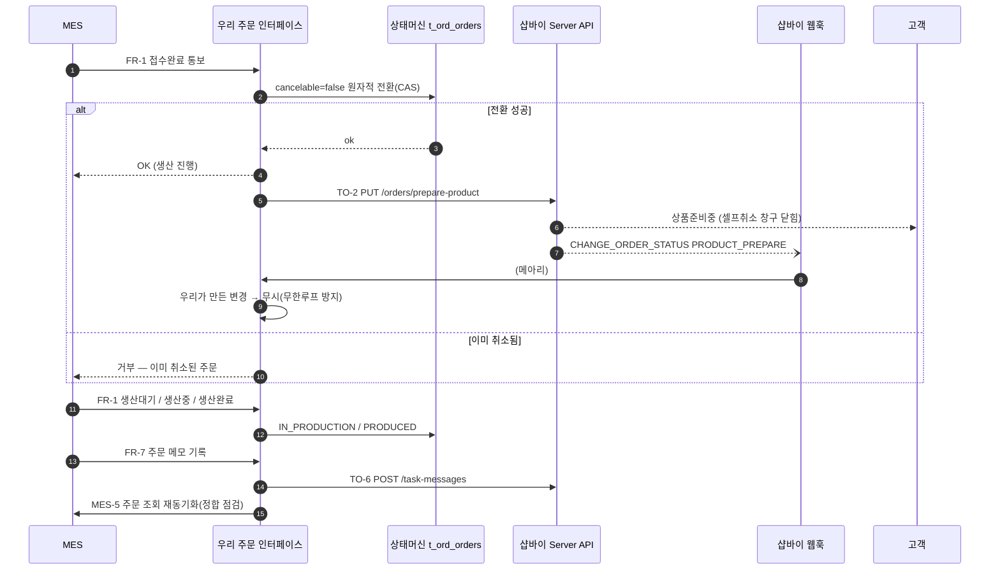
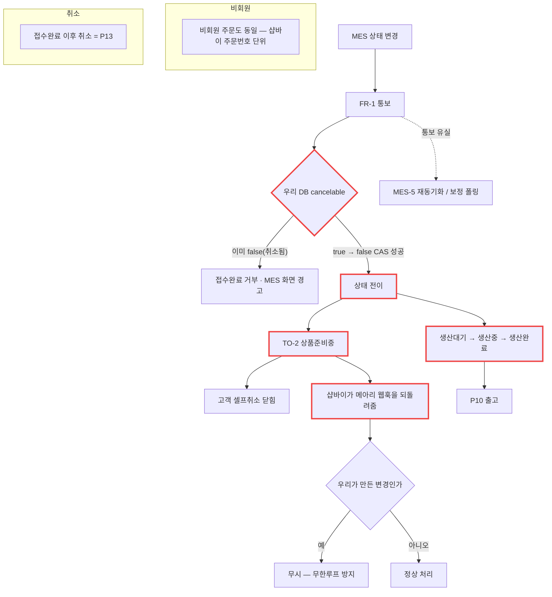

# P09 · 생산 상태 역방향 동기화 — MES → 우리 → 샵바이

> L0 후니 몰 전체 › L1 운영자·주문운영 › L2 주문 › **L3 P09 생산상태-역방향동기화** · cross **t65**

## 1. 한 줄 정의 · 시작/끝 · 등장인물

**한 줄 정의.** MES 에서 일어난 일(접수완료·생산중·생산완료·메모)이 **우리 상태머신을 거쳐** 고객이 보는 샵바이 주문 화면에 반영되기까지.

- **시작** — MES 담당자가 접수완료를 누른 순간.
- **끝** — 고객 마이페이지의 주문상태가 바뀜(상품준비중 → 배송준비중).

| 등장인물 | 하는 일 |
|---|---|
| **MES** | 상태가 바뀔 때마다 우리에게 통보한다(FR-1) |
| **우리 주문 인터페이스** | **유일한 심판.** 잠그고, 번역하고, 샵바이에 올린다 |
| **샵바이** | 고객이 보는 공식 상태. 우리가 써넣는다 |
| 고객 | 결과만 본다 |

**핵심.** 샵바이 주문상태 10개 중 **결제완료까지는 고객·PG 가 만들고, 그 이후는 우리가 써넣는 칸**이다(설계 정본 §6.1). 그래서 이 프로세스가 없으면 고객 화면은 결제완료에서 멈춘다.

## 2. 시퀀스

## 3. 분기 — 실패 · 비회원 · 취소

## 4. 단계표

| # | 단계 | 시스템 | 담당자 | 원장 row_id | 상태 | 근거 |
|---|---|---|---|---|---|---|
| 1 | 주문 상태머신(13상태) | 우리 | 서희항 | `STD-MFG-022` | 부분 | **넷만 있다** — `raw/webadmin/webadmin/catalog/artwork_promote.py:50-56` `REGISTERED`·`PROMOTING`·`PROMOTED`·`HOLD`(+`ORD_OWNED`). 등록 시 리터럴 `catalog/widget_api.py:5712` `ord_sts="REGISTERED"`. `FILE_CHECK`·`FILE_HOLD`·`MES_SENT`·`IN_PRODUCTION`·`PRODUCED`·`SHIPPED`·`DONE`·`CANCELED` 는 `docs/order-to-mes-process.md:238-241`·`:487` **문서에만** |
| 2 | 상태 단위 = 주문상품옵션 | 우리 | 서희항 | `STD-MFG-023` | 부분 | **불일치** — `ord_sts` 는 **주문 단위**다. `orderProductOptionNo` 는 `catalog/shopby_hook.py:116` 에서 `shop_line_no` 로 저장만 된다. 원고는 별도로 행 단위 `art_sts`(`catalog/models.py:1108`) |
| 3 | 3시스템 매핑 테이블 | 우리 | 서희항 | `STD-MFG-024` *(P06 주)* | 부분 | `catalog/models.py:934` `handoff_id` · MES 작업번호 칸 없음 |
| 4 | FR-1 MES 상태 변경 통보 수신 | 우리 | 서희항 | `STD-MFG-025` | 미착수 | `docs/order-to-mes-process.md:478-490` §8.4 FR-1 · **코드 0건**(`FR-[1-7]` grep 문서 표 외 0건) |
| 5 | TO-2 샵바이 상품준비중 전환 | 우리→샵바이 | 서희항 | `STD-MFG-027` | 미착수 | 명세 `docs/shopby/shopby-api-docs-complete/04_server-api/order.mdx:292` `PUT /orders/prepare-product`. **호출 코드 0건** — webadmin 이 실제로 부르는 샵바이 엔드포인트는 `catalog/shopby_sync.py:86`·`:202`·`:357`(상품 계열)뿐 |
| 6 | 우리가 올린 변경의 메아리 필터 | 우리 | 서희항 | `STD-MFG-030` | 미착수 | §8.1 SB-2 분기표 마지막 줄 · 코드 0 |
| 7 | FR-7 주문 메모 → TO-6 업무 메시지 | 우리 | 서희항 | `STD-MFG-034` | 미착수 | 명세 `order.mdx:648`(GET)·`:670`(POST `/task-messages`)·`:689`·`:709`·`:729`. 「주문메모 대신 업무메시지」는 `docs/shopby/shopby_enterprise_docs/user-guide.mdx:25-26`. 호출 코드 0건 |
| 8 | MES 화면 신규 버튼(취소·재업로드·승인거부) | MES | 외부(회신 대기) | `STD-MFG-035` | **미실측** | §8.4 "MES WinForms 에 버튼과 사유 입력이 새로 생겨야" — MES 담당 범위 |
| 9 | MES-5 주문 조회 재동기화 | 우리→MES | 서희항 | `STD-MFG-018` *(P06 주)* | 미착수 | §8.3 MES-5 · 코드 0 |
| 10 | 샵바이 웹훅 이벤트 수신 후 소비 | 우리 | 서희항 | `STD-MFG-136` *(P01 주)* | 미착수 | 수신·저장 `catalog/shopby_hook.py:81`·`:124` · **소비자 0** |
| 11 | 샵바이 어드민 웹훅 등록 현황(URL·구독 이벤트) | — | 최숙진+신우진 | `BLK-S2-2` | 미착수 | 구독 가능 이벤트 전체 enum = `docs/shopby/shopby-api/workspace-server-public.yml:624-637`·`:782-796` (`CREATE_ORDER`·`CHANGE_ORDER_STATUS`·`UPDATE_RECEIVER`·`ADD/UPDATE_TASK_MESSAGE` 등). **무엇을 구독했는지 확인하는 코드도 0건** |

## 5. 빠진 곳

### 가. 원장에 행이 없다
| 무엇 | 왜 필요한가 |
|---|---|
| **상태 단위 전환(주문 → 주문상품옵션)** | `STD-MFG-023` 은 "단위는 주문상품옵션"이라고 선언만 한다. **지금 `ord_sts` 가 주문 단위라는 사실**과 그 마이그레이션이 행으로 없다. 한 주문에 명함+스티커가 담기면 지금 구조로는 상태가 하나다 |
| **보정 폴링(대사)** | 설계 §9.1 3중 방어의 ③ — 30분 주기로 최근 N일 주문을 훑는 것. `STD-MFG-021`(DLQ)과 별개인데 행이 없다 |
| **TO-1 주문 조회 재확인(fail-closed)** | 설계 §9.2 의 핵심 원칙("웹훅을 믿지 않고 조회로 재확인")인데 행이 없다 |
| **TO-7 실패 웹훅 조회** | `GET /webhooks/failed`(명세 `workspace.mdx:352-384`) 정기 호출. 샵바이 웹훅은 재전송이 없으므로 이게 없으면 유실분이 영영 안 온다. 행이 없다 |

### 나. 행은 있는데 코드가 0이다
`STD-MFG-025`·`027`·`030`·`034`·`018`·`136` — **6행.**

### 다. 코드는 있는데 연결이 안 됐다
| 무엇 | 실태 |
|---|---|
| 상태 상수 | 넷(`REGISTERED`/`PROMOTING`/`PROMOTED`/`HOLD`)이 **실제로 돌고 있다**. 그 뒤 아홉 칸이 비어 있다 |
| `ORD_OWNED` 가드 | 승격이 자기 범위 밖 상태를 덮어쓰지 않게 막는 장치가 **이미 있다**(`artwork_promote.py:56`). 뒤 상태가 생기면 그대로 쓰인다 |
| 샵바이 API 클라이언트 | `catalog/shopby_client.py` 가 있고 상품 계열 호출이 돈다. 주문·배송·클레임 계열만 안 쓰인다 |
| 웹훅 수신함 | `shopby_hook.py` 가 원문 저장 후 즉시 200 을 준다(설계대로). 읽는 쪽이 없다 |

→ **뼈대는 설계대로 놓여 있고, 상태 칸 아홉 개와 소비자·호출자가 비어 있다.**

### 라. 결정이 안 됐다
| 항목 | 원장/설계 |
|---|---|
| MES 실제 상태 코드 | 설계 §12-1 — 매핑표 MES 열이 **추정** |
| 고객 셀프취소가 막히는 정확한 상태 | 설계 §12-8 — 상품준비중부터인지 배송준비중부터인지 실측 필요 |
| 웹훅 호출 IP 제한 | 설계 §12-5 — 샵바이가 대역을 주는지 미확인 |
| 어떤 웹훅 이벤트를 구독할지 | `BLK-S2-2` |

## 6. 채우는 방법

| 순 | 누가 | 무엇을 | 선행 |
|---|---|---|---|
| 1 | 최숙진+신우진 | 샵바이 콘솔에서 웹훅 등록 현황 확인(`BLK-S2-2`) | 없음 |
| 2 | 서희항 | 상태머신 13칸 + 단위(주문상품옵션) 마이그레이션 | 없음 — **MES 스펙 없이도 우리 쪽 설계는 확정돼 있다** |
| 3 | 서희항 | 웹훅 소비자 + 메아리 필터 + TO-1 재확인 | 1·2 |
| 4 | 서희항 | TO-7 실패 웹훅 조회 + 보정 폴링(원장 행 신설 필요) | 3 |
| 5 | 최숙진 | MES 담당에게 실제 상태 코드 요청 | 없음 |
| 6 | 서희항 | FR-1 수신 + CAS 잠금 + TO-2 호출 | 2·5 |
| 7 | MES 담당 | FR-1 송신 + 신규 버튼 3종 | 6 |

> **2 는 MES 를 기다리지 않아도 된다.** 우리 상태머신은 설계 §6.2 에 13칸이 다 적혀 있다. MES 코드값은 **매핑표의 MES 열**에만 들어가므로, 우리 칸을 먼저 만들어 두면 회신이 왔을 때 번역표만 채우면 된다.

## 7. 확인 못 한 것

- 샵바이 콘솔의 실제 웹훅 구독 설정 — **콘솔 접속이 필요**해 확인하지 않았다.
- `catalog/shopby_client.py` 의 인증 처리(헤더 3종·토큰 갱신)는 열지 않았다.
- 샵바이 `PUT /orders/prepare-product` 의 요청 스키마(필수 필드)는 명세 위치만 확인하고 본문을 읽지 않았다.
- 고객 셀프취소가 실제로 어느 상태에서 막히는지는 **샵바이 어드민 실측**이 필요해 확인하지 않았다.
