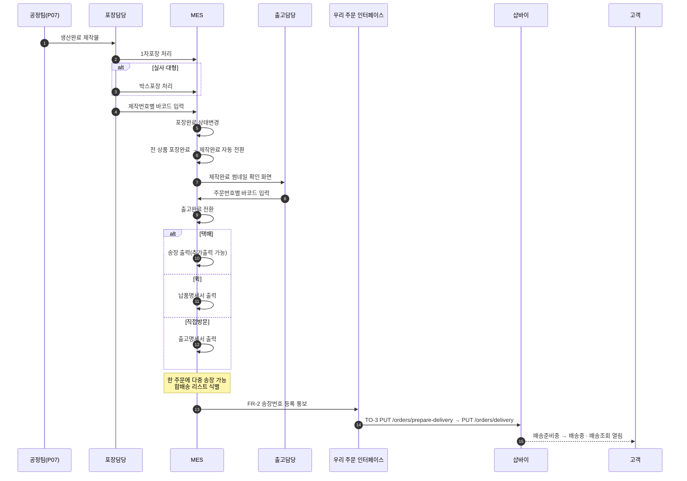
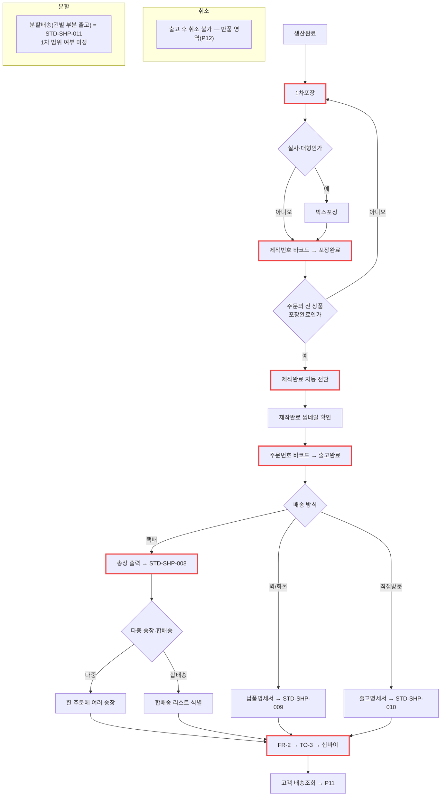

# P10 · 포장 · 출고 · 송장

> L0 후니 몰 전체 › L1 운영자·주문운영 › L2 배송 › **L3 P10 포장-출고-송장** · cross **t63**(배송 대분류)

## 1. 한 줄 정의 · 시작/끝 · 등장인물

**한 줄 정의.** 생산완료된 물건을 **포장하고 바코드로 출고 처리해** 송장을 붙이고, 그 송장을 샵바이에 올려 고객에게 배송조회가 열리기까지.

- **시작** — 전 상품 포장완료 → 제작완료 자동 전환.
- **끝** — 샵바이 주문상태가 배송준비중/배송중으로 바뀌고 고객이 송장을 본다(P11).

| 등장인물 | 하는 일 |
|---|---|
| **포장담당** | 1차포장·박스포장, 바코드 스캔 |
| **출고담당** | 주문번호 바코드 → 출고완료, 송장 출력 |
| **MES** | 상태 전환·송장 발행·명세서 출력 |
| **우리** | FR-2 로 송장을 받아 TO-3 로 샵바이에 올린다 |
| **샵바이** | 고객에게 배송조회를 연다 |

## 2. 시퀀스

## 3. 분기 — 실패 · 비회원 · 취소

## 4. 단계표

| # | 단계 | 시스템 | 담당자 | 원장 row_id | 상태 | 근거 |
|---|---|---|---|---|---|---|
| 1 | 1차포장 처리 | MES | 최숙진 | `STD-MFG-106` | 미착수 | **찾지 못했다** — `바코드\|barcode\|납품명세서\|합배송\|출고완료\|송장출력\|packing` webadmin 전수 grep 0건 |
| 2 | 박스포장 처리(실사·대형) | MES | 최숙진 | `STD-MFG-107` | 미착수 | 같음 |
| 3 | 제작번호별 바코드 → 포장완료 | MES | 최숙진 | `STD-MFG-108` | 미착수 | 같음. MES 쪽 바코드 인터페이스는 있다 → `BackOffice.Server/CRT.EasyMES.V2.IF/IManufactureService.cs:173`·`:179` |
| 4 | 전 상품 포장완료 → 제작완료 자동 전환 | MES | 최숙진 | `STD-MFG-109` | 미착수 | 원장 |
| 5 | 제작완료 썸네일 확인 화면 | MES | 최숙진 | `STD-MFG-118` | 미착수 | 원장 |
| 6 | 주문번호별 바코드 → 출고완료 | MES | 최숙진 | `STD-MFG-110` | 미착수 | 원장. huni-mall 에 `"출고완료"` 문자열이 있으나 **상태 배지 라벨**일 뿐 → `huni-mall/src/components/mypage/mypage-shared.tsx:161` |
| 7 | 송장 출력·추가출력(택배) | MES | 최숙진 | `STD-MFG-111` | 미착수 | 원장 |
| 8 | 납품명세서 출력(퀵) | MES | 최숙진 | `STD-MFG-112` | 미착수 | 원장 |
| 9 | 출고명세서 출력(직접방문) | MES | 최숙진 | `STD-MFG-113` | 미착수 | 원장 |
| 10 | 한 주문에 다중 송장 부여 | 우리+MES | 서희항 | `STD-MFG-114` | 미착수 | 명세 `docs/shopby/shopby-api-docs-complete/04_server-api/order.mdx:190` `GET /orders/deliveries`(배송번호 단위) · 호출 0건 |
| 11 | 합배송 리스트 식별 | MES | 최숙진 | `STD-MFG-115` | 미착수 | 원장 |
| 12 | 전 상품 출고지 단일화 | MES | 최숙진 | `STD-MFG-116` | 미착수 | 원장(오프라인 주문 외) |
| 13 | 재고상품(액세서리) 관리 | MES | 최숙진 | `STD-MFG-117` | 미착수 | 원장 |
| 14 | FR-2 송장번호 등록 수신 | 우리 | 서희항 | `STD-MFG-028` | 미착수 | `raw/webadmin/docs/order-to-mes-process.md:478-490` §8.4 FR-2 · 코드 0 |
| 15 | TO-3 샵바이 배송처리(등록·정정) | 우리→샵바이 | 서희항 | `STD-MFG-029` | 미착수 | 명세 `order.mdx:275` `PUT /orders/prepare-delivery` · `:224` `PUT /orders/delivery` · `:241` `/delivery-ing` · 정정 `:363` `PUT /orders/update-invoices` · `:400` `/change-status/by-shipping-no`. **호출 코드 0건** |
| 16 | 송장 등록·일괄 업로드 | 우리 | 서희항 | `STD-ADO-020` | **작동**(원장 판정) | 원장은 작동인데 **우리 저장소에서 호출 코드를 찾지 못했다** → §7 참조 |
| 17 | 출고 처리·배송중 전이 | 우리 | 서희항 | `STD-ADO-021` | **작동**(원장 판정) | 같음 |
| 18 | 바코드/라벨 출력 | MES | 최숙진 | `STD-ADO-016` *(P07 주)* | 미착수 | 원장 |
| 19 | 검수 게이트 G4(출고) | 우리/MES | 최숙진 | `STD-ADO-010` *(P03 주)* | 미착수 | 원장 |
| 20 | 출고·송장 경로 결정 | — | 최숙진+신우진 | `T4-5` | 없음 | 원장 — 셀러어드민 수동 등록 경로 확인 + 생산 상태의 고객 반영 방식 결정 |
| 21 | 택배 배송 | 샵바이 | 최숙진 | `STD-SHP-008` *(cross t63)* | 작동 | 원장 |
| 22 | 퀵/화물 배송(대형) | 샵바이 | 최숙진 | `STD-SHP-009` *(cross t63)* | 미착수 | 원장 |
| 23 | 매장 방문수령 | 샵바이 | 최숙진 | `STD-SHP-010` *(cross t63)* | 미착수 | 원장 |
| 24 | 분할배송(건별 부분 출고) | 샵바이 | 최숙진 | `STD-SHP-011` *(cross t63)* | 미착수 | 원장 |
| 25 | 송장번호 등록(판매자) | 샵바이/우리 | 서희항 | `STD-SHP-012` *(cross t63 **P23**)* | 부분 | 원장 — **t63 이 행을 갖는다.** 여기서 같은 행을 다시 만들지 않고 t63 P23 을 가리킨다(t63 전달 260919) |

## 5. 빠진 곳

### 가. 원장에 행이 없다
| 무엇 | 왜 필요한가 |
|---|---|
| **택배사 코드 매핑(MES ↔ 샵바이 `deliveryCompanyType`)** | TO-3 은 `invoiceNo` + `deliveryCompanyType` 을 요구한다. MES 가 쓰는 택배사 코드와 샵바이 enum 이 다르면 그 자리에서 막힌다. 행이 없다 |
| **분할 출고 시 샵바이 반영 규칙** | `STD-SHP-011`(분할배송)과 `STD-MFG-114`(다중 송장)가 만나는 지점 — 주문 일부만 나갔을 때 샵바이 주문상태를 어떻게 쓰는지 행이 없다 |
| **송장 정정 경로** | 명세에 `PUT /orders/update-invoices` 가 있는데 **잘못 찍은 송장을 고치는 업무 흐름**이 행으로 없다 |

### 나. 행은 있는데 코드가 0이다
`STD-MFG-106`~`118`(13행) · `028`·`029`·`114` · `STD-ADO-016` — **17행.**

### 다. 코드는 있는데 연결이 안 됐다
| 무엇 | 실태 |
|---|---|
| 샵바이 배송 API 명세 | **전부 확인됐다**(위 15번). 부르는 코드만 없다 |
| MES 바코드 실적 등록 | `IManufactureService.cs:173`·`:179` 가 있다. 후니 작업이 안 들어갈 뿐 |
| huni-mall 출고완료 배지 | 라벨 매핑만 있다(`mypage-shared.tsx:161`). 그 상태를 만드는 쪽이 없다 |

### 라. 결정이 안 됐다
| 항목 | 원장 |
|---|---|
| 출고·송장을 셀러어드민 수동 등록으로 갈지 API 로 갈지 | `T4-5` |
| 생산 상태를 고객에게 어디까지 보여 줄지 | `T4-5` |
| 퀵/방문수령/분할배송을 1차 범위에 넣을지 | `STD-SHP-009`·`010`·`011`(t63) |

## 6. 채우는 방법

| 순 | 누가 | 무엇을 | 선행 |
|---|---|---|---|
| 1 | 최숙진+신우진 | `T4-5` 결정 — **수동 등록으로 런칭하면 14·15번이 1차 범위에서 빠진다** | 없음 |
| 2 | 최숙진 | 셀러어드민에서 송장 수동 등록 경로를 실화면으로 확인 | 없음 |
| 3 | 서희항 | 택배사 코드 매핑표 작성 + 원장 행 신설 | 1 |
| 4 | 최숙진 | 포장·출고 바코드 절차를 표로 확정 | 없음 |
| 5 | MES 담당 | 포장·출고·송장·명세서 구현 | 4 · P06·P07 |
| 6 | 서희항 | FR-2 수신 + TO-3 호출 | 1·3 · P09 |

> **1 이 「수동」으로 결정되면** 이 프로세스의 우리 쪽 몫(14·15)이 사라지고 최숙진의 운영 절차만 남는다. 1차 런칭 범위를 가장 크게 줄일 수 있는 결정이다.

## 7. 확인 못 한 것

- **`STD-ADO-020`·`021` 이 원장에서 「작동」인 근거를 재현하지 못했다.** webadmin·huni-mall 어디에서도 샵바이 배송 API 호출 코드를 찾지 못했다. 원장의 「작동」이 **셀러어드민(샵바이 관리자 화면) 기본 기능**을 가리킨 것이라면 모순이 아니다 — 그 해석이 맞는지는 확인하지 못했다. **판정하지 않고 남긴다.**
- 샵바이 셀러어드민 실화면은 접속하지 않았다.
- `deliveryCompanyType` enum 의 실제 값 목록은 명세 본문을 읽지 않았다.
- MES 의 송장 발행 모듈이 있는지는 `IManufactureService.cs` 외 인터페이스를 전수로 보지 않아 확인하지 못했다.
