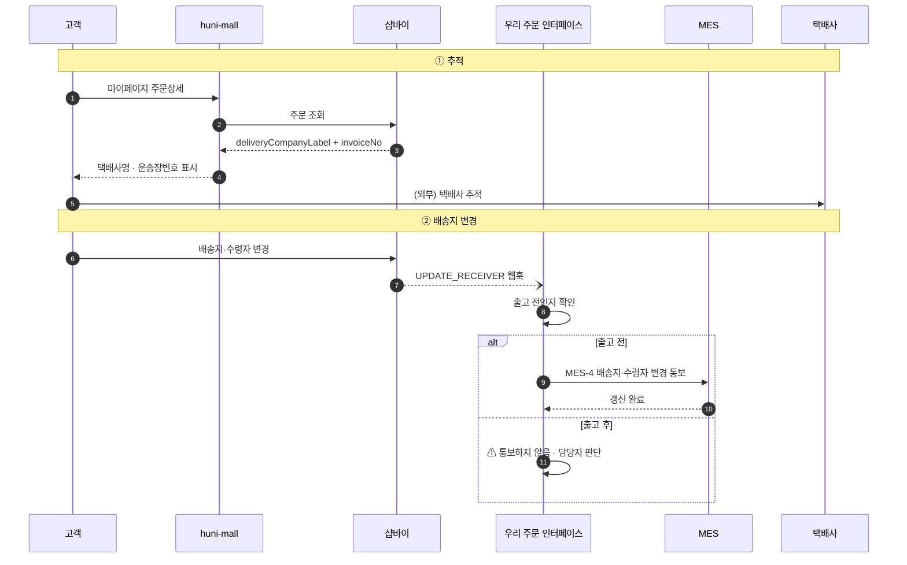
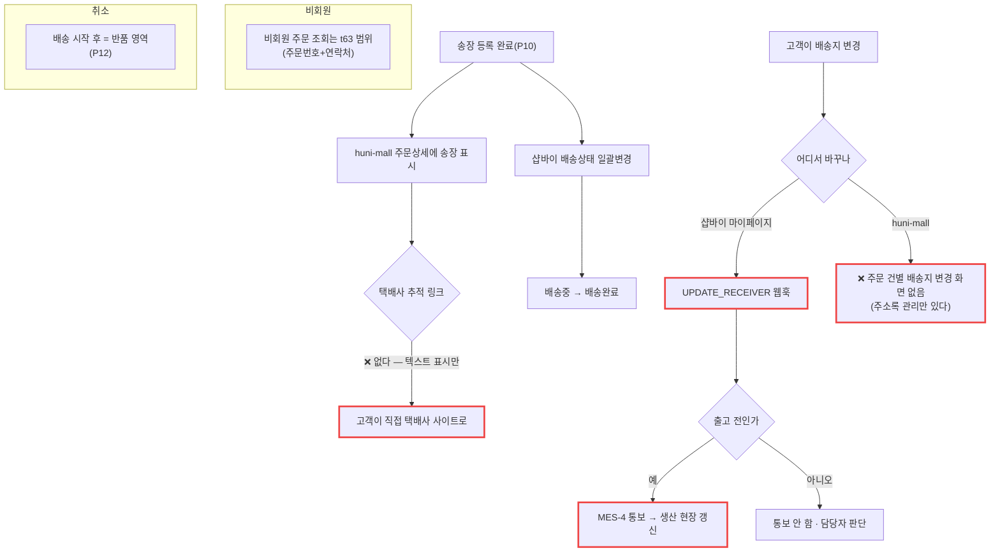

# P11 · 배송 추적 · 배송지 변경

> L0 후니 몰 전체 › L1 배송 › L2 추적 › **L3 P11 배송추적-배송지변경** · cross **t63**(배송 대분류는 t63 소유)

## 1. 한 줄 정의 · 시작/끝 · 등장인물

**한 줄 정의.** 출고된 주문을 고객이 **택배사까지 따라가 볼 수 있게** 하고, 출고 전에 배송지가 바뀌면 그 변경이 **생산 현장까지 내려가기까지**.

- **시작** — 송장이 샵바이에 등록됨(P10) 또는 고객이 배송지를 바꿈.
- **끝** — 고객이 배송완료를 확인 · 또는 MES 가 새 배송지로 출고.

| 등장인물 | 하는 일 |
|---|---|
| **고객** | 마이페이지에서 송장을 보고 추적한다 · 배송지를 바꾼다 |
| **샵바이** | 배송조회 화면과 `UPDATE_RECEIVER` 웹훅의 주인 |
| **huni-mall** | 주문상세에 송장을 보여 준다 |
| **우리** | 배송지 변경 웹훅을 받아 MES-4 로 내려보낸다 |
| **MES** | 출고 전이면 배송지를 갱신한다 |

> **이 프로세스는 t64 담당 행이 `STD-MFG-017` 하나뿐이다.** 나머지는 전부 t63(배송 대분류) 소유이며 여기서는 **단계로만** 등장한다.

## 2. 시퀀스

## 3. 분기 — 실패 · 비회원 · 취소

## 4. 단계표

| # | 단계 | 시스템 | 담당자 | 원장 row_id | 상태 | 근거 |
|---|---|---|---|---|---|---|
| 1 | **MES-4 배송지·수령자 변경 통보(출고 전 한정)** | 우리→MES | 서희항 | **`STD-MFG-017`** | 미착수 | `raw/webadmin/docs/order-to-mes-process.md:468-476` §8.3 MES-4 · **코드 0건**. 선행 = `STD-SHP-015` |
| 2 | `UPDATE_RECEIVER` 웹훅 수신 | 우리 | 서희항 | `STD-MFG-136` *(P01 주)* | 미착수 | 이벤트 enum `docs/shopby/shopby-api/workspace-server-public.yml:624-637` 에 `UPDATE_RECEIVER` 존재 · 수신함 `catalog/shopby_hook.py:81` 는 저장만. `config/urls.py:269` 주석이 "결제완료·취소·**배송지변경**이 우리에게 오는 유일한 통로"라고 적고 있으나 **처리 로직은 없다** |
| 3 | 송장 기반 배송상태 일괄변경 | 샵바이/우리 | 서희항 | `STD-SHP-013` *(cross t63)* | 부분 | 명세 `docs/shopby/shopby-api-docs-complete/04_server-api/order.mdx:400` `PUT /orders/change-status/by-shipping-no` · 호출 0건 |
| 4 | 고객 배송 조회(택배사 추적) | huni-mall | 김동학 | `STD-SHP-014` *(cross t63)* | 부분 | `huni-mall/src/components/mypage/order-detail-section.tsx:66-70` — `deliveryCompanyLabel`·`invoiceNo` **텍스트 표시만**. 추적 링크·외부 조회 연동은 찾지 못했다 |
| 5 | 배송지 변경/추가 | huni-mall | 김동학 | `STD-SHP-015` *(cross t63)* | 부분 | `huni-mall/src/app/(main)/mypage/address/page.tsx` · `src/components/mypage/address-section.tsx` — **회원 주소록 관리**다. 체크아웃 선택용 `use-shipping-address.ts`. **주문 건별 배송지 변경 화면은 찾지 못했다** |
| 6 | 송장번호 등록(판매자) | 샵바이/우리 | 서희항 | `STD-SHP-012` *(cross t63)* | 부분 | → P10 |

## 5. 빠진 곳

### 가. 원장에 행이 없다
| 무엇 | 왜 필요한가 |
|---|---|
| **택배사 추적 링크** | `STD-SHP-014` 는 "고객 배송 조회(택배사 추적)"라고 하는데 huni-mall 은 번호를 **글자로만** 보여 준다. 클릭해서 택배사로 가는 것이 별도 행으로 없다 — 「부분」 판정 안에 묻혀 있다 |
| **주문 건별 배송지 변경 화면** | `STD-SHP-015` 는 "배송지 변경/추가"인데 실제로 있는 것은 **주소록**이다. 이미 낸 주문의 배송지를 바꾸는 화면이 행으로 구분돼 있지 않다 |
| **출고 전/후 판정 기준** | `STD-MFG-017` 은 "출고 전 한정"이라고만 한다. 어느 상태까지가 출고 전인지(`MES_SENT`? `IN_PRODUCTION`? `PRODUCED`?)가 행으로 없다 |

### 나. 행은 있는데 코드가 0이다
| row_id | 무엇이 0인가 |
|---|---|
| `STD-MFG-017` | MES-4 통보. **이 프로세스의 t64 담당 행 전부**(1행) |

### 다. 코드는 있는데 연결이 안 됐다
| 무엇 | 실태 |
|---|---|
| 송장 표시 | huni-mall 이 이미 보여 준다. **그 값을 채우는 쪽(P10 TO-3)이 없어서 늘 빈칸**이다 |
| 웹훅 수신함 | `UPDATE_RECEIVER` 가 들어오면 저장은 된다. 읽는 쪽이 없다 |
| 주소록 | 살아 있다. 주문 건별 변경과 이어져 있지 않다 |

### 라. 결정이 안 됐다
| 항목 | 누가 |
|---|---|
| 배송지 변경을 huni-mall 에서 받을지 샵바이 마이페이지로 보낼지 | 김동학+신우진 (t63) |
| 출고 전/후 경계 상태 | 서희항 — **원장에 행이 없는 결정** |
| 택배사 추적을 링크로 열지 임베드할지 | 김동학 (t63) |

## 6. 채우는 방법

| 순 | 누가 | 무엇을 | 선행 |
|---|---|---|---|
| 1 | 서희항 | 출고 전/후 경계 상태 확정 + 원장 행 신설 | P09 상태머신 |
| 2 | 서희항 | `UPDATE_RECEIVER` 웹훅 소비자 + MES-4 통보 | 1 · P06·P09 |
| 3 | 김동학 | 택배사 추적 링크(별도 행 신설 제안) | 없음 — 작은 일 |
| 4 | 김동학+신우진 | 주문 건별 배송지 변경 경로 결정 | 없음 |
| 5 | MES 담당 | MES-4 수신 | 2 |

> **t64 몫은 1·2 뿐이다.** 3·4 는 t63 에 넘긴다.

## 7. 확인 못 한 것

- huni-mall 의 주문상세 화면을 **실제로 열어 보지 않았다** — 코드만 읽었다. 송장이 어떻게 보이는지는 확인하지 못했다.
- 샵바이 마이페이지에 주문 건별 배송지 변경 기능이 있는지는 **샵바이 실화면 확인이 필요**해 보지 않았다.
- `UPDATE_RECEIVER` 웹훅 payload 의 필드 구성은 명세 본문을 읽지 않았다.
