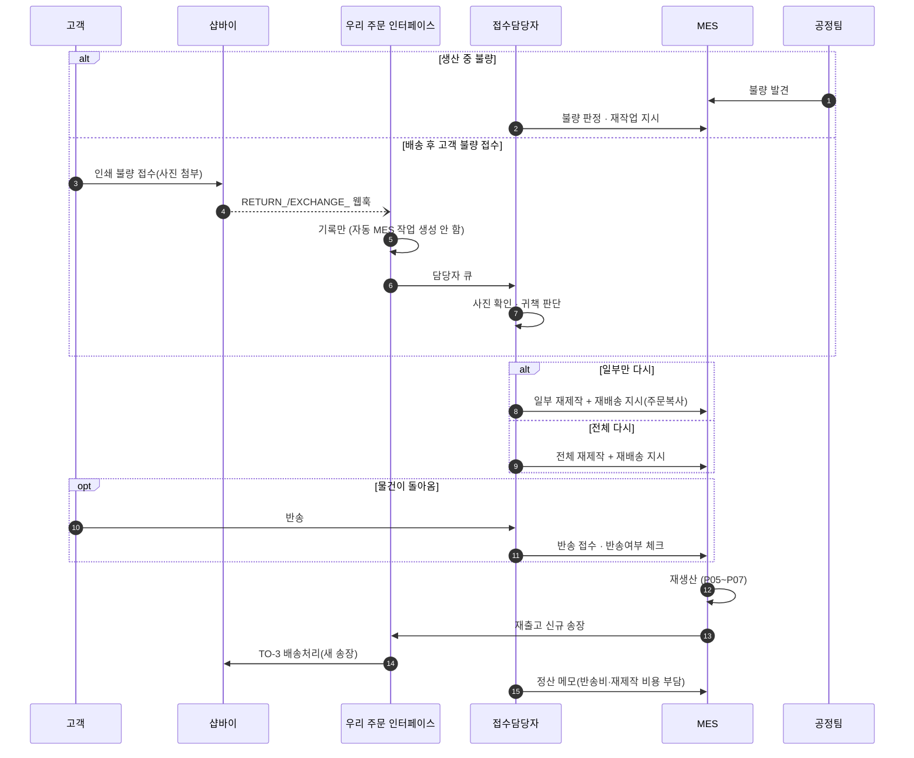
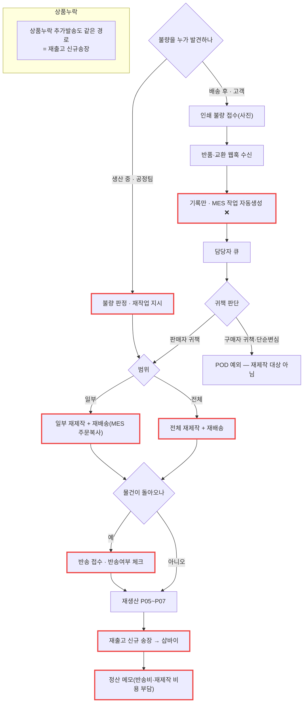

# P12 · 재제작 · 반송 · 재출고

> L0 후니 몰 전체 › L1 운영자·주문운영 › L2 클레임 › **L3 P12 재제작-반송-재출고** · cross **t65**(클레임·CS)

## 1. 한 줄 정의 · 시작/끝 · 등장인물

**한 줄 정의.** 잘못 만들었거나 되돌아온 물건을 **다시 만들어 새 송장으로 내보내고**, 그 비용을 누가 무는지 기록하기까지.

- **시작** — 불량 판정(생산 중) 또는 고객 불량 접수(배송 후) 또는 반송 도착.
- **끝** — 재제작품 재출고(신규 송장) · 정산 메모 기록.

| 등장인물 | 하는 일 |
|---|---|
| **고객** | 불량을 접수한다(사진 첨부) |
| **접수담당자** | 재제작 지시(일부/전체)·반송 접수·비용 부담 판단 |
| **MES** | 주문 복사로 재작업을 만든다 |
| **우리** | 재출고 신규 송장을 샵바이에 올린다. **반품·교환 웹훅은 기록만 한다** |
| 샵바이 | 클레임 원장 |

**핵심 원칙.** 주문제작(POD)은 단순변심 청약철회 예외다. **파일 오류·인쇄 불량만** 재제작/환불 대상이고, `RETURN_DONE`/`EXCHANGE_DONE` 웹훅은 **수신은 하되 자동으로 MES 작업을 만들지 않는다**(설계 정본 §7.4).

## 2. 시퀀스

## 3. 분기 — 실패 · 비회원 · 취소

## 4. 단계표

| # | 단계 | 시스템 | 담당자 | 원장 row_id | 상태 | 근거 |
|---|---|---|---|---|---|---|
| 1 | 불량 판정 · 재작업 지시 | 우리/MES | 최숙진 | `STD-ADO-011` | 미착수 | 화면 0 — webadmin `config/urls.py` 154경로에 주문·클레임 계열 0건 |
| 2 | 반품·교환 웹훅 기록만(MES 자동생성 금지) | 우리 | 서희항 | `STD-MFG-124` | 미착수 | 설계 `raw/webadmin/docs/order-to-mes-process.md:402-406` §7.4 · 수신함은 `catalog/shopby_hook.py:81` 저장만 · **분기 소비자 0** |
| 3 | 일부 재제작 + 재배송 지시(MES 주문복사) | MES | 최숙진 | `STD-MFG-119` | 미착수 | 원장 |
| 4 | 전체 재제작 + 재배송 지시 | MES | 최숙진 | `STD-MFG-120` | 미착수 | 원장 |
| 5 | 반송 접수 · 반송여부 체크 | MES | 최숙진 | `STD-MFG-121` | 미착수 | 원장 |
| 6 | 주문 내 정산 메모필드(반송비·재제작 비용 부담) | MES | 최숙진 | `STD-MFG-122` | 미착수 | 원장 |
| 7 | 재출고 신규송장 부여(누락 추가발송·교환 재발송) | 우리+MES | 서희항 | `STD-MFG-123` | 미착수 | 명세는 있다 — `docs/shopby/shopby-api-docs-complete/04_server-api/claim.mdx:216` `PUT /claims/{claimNo}/assign-return-invoice` · 호출 0건 |
| 8 | 인쇄 불량 접수(사진 첨부) | huni-mall | 김동학 | `STD-CLM-014` *(cross t65)* | 미착수 | 원장 |
| 9 | 재제작(재작업) 처리 경로 | — | 신우진+최숙진 | `STD-CLM-015` *(cross t65)* | 미착수 | 원장 — **경로 자체가 미정** |

## 5. 빠진 곳

### 가. 원장에 행이 없다
| 무엇 | 왜 필요한가 |
|---|---|
| **재제작 주문의 식별** | 재제작품은 새 MES 작업인데 **원 주문과 어떻게 이어 두는지** 행이 없다. 이게 없으면 매출이 두 번 잡히거나 원인 분석이 끊긴다 |
| **재제작 시 원고 회차** | 파일 오류로 재제작하면 새 회차인가 같은 회차인가? `STD-MFG-008`(회차 규약)과 이 프로세스가 연결된 행이 없다 |
| **귀책 판단 기준** | `STD-CLM-011`(귀책 구분)은 t65 에 있으나, **생산 쪽에서 불량을 판정하는 기준**(어디까지가 불량인가)이 행으로 없다 |
| **재출고 배송비 부담** | `STD-MFG-122` 는 메모필드만 말한다. 실제 금액 정산이 행으로 없다 |

### 나. 행은 있는데 코드가 0이다
`STD-ADO-011` · `STD-MFG-119`~`124` — **7행 전부.**

### 다. 코드는 있는데 연결이 안 됐다
| 무엇 | 실태 |
|---|---|
| 클레임 API 명세 | `claim.mdx` 에 취소·반품·교환·수거·승인·철회가 **전부 문서화돼 있다**(`:32`·`:72`·`:171`·`:216`·`:239`·`:292`·`:362`·`:381`·`:439`). 호출 코드 0건 |
| huni-mall 클레임 표시 | `src/lib/api/hooks/use-my-orders.ts:26`·`:335-340` 에서 `claimStatusTypeLabel`·`cancelDoneCnt`·`returnDoneCnt`·`exchangeDoneCnt` 를 **표시용으로 다룬다**. 신청·승인 호출은 0건 |
| 웹훅 수신함 | 반품·교환 이벤트가 오면 저장은 된다 |

### 라. 결정이 안 됐다
| 항목 | 원장 |
|---|---|
| 재제작 처리 경로 | `STD-CLM-015` — 신우진+최숙진 |
| 클레임·문의 범위(Shopby API / 외부 채널 / 미제공) | `BLK-S1-6`(t65) — **이게 정해져야 7번이 산다** |
| 부분취소·수량변경 지원 | 설계 §12-10 — 1차 미지원 제안 |
| 반품/교환 안내 문구를 샵바이 상품 설정에 반영 | 설계 §12-11 |

## 6. 채우는 방법

| 순 | 누가 | 무엇을 | 선행 |
|---|---|---|---|
| 1 | 신우진 | 클레임 범위 결정(`BLK-S1-6`) | 없음 |
| 2 | 신우진+최숙진 | 재제작 처리 경로 확정(`STD-CLM-015`) | 1 |
| 3 | 최숙진 | 불량 판정 기준 + 귀책 기준을 표로 확정 | 2 |
| 4 | 서희항 | 반품·교환 웹훅 기록 분기(자동생성 금지 가드 포함) | P09 |
| 5 | 서희항 | 재제작 주문 식별·원 주문 연결 그릇 제안(원장 신규 행) | 2 |
| 6 | MES 담당 | 주문복사 재제작·반송 접수·정산 메모 | 2·3 · P06·P07 |

> **1 차 런칭에서 이 프로세스가 통째로 「사람이 전화로 처리」로 갈 가능성이 크다.** 그 경우에도 **4번(웹훅 기록)만은 남아야 한다** — 기록이 없으면 나중에 무슨 일이 있었는지 복원할 수 없다.

## 7. 확인 못 한 것

- 현재 불량·재제작을 실무에서 어떻게 처리하는지는 인터뷰가 필요해 확인하지 못했다.
- MES 의 「주문복사」 기능이 실재하는지 — 인터페이스 전수 조사를 하지 않았다.
- 샵바이 클레임 API 의 요청 스키마는 위치만 확인하고 본문을 읽지 않았다.
- t65(클레임·CS) 범위의 `STD-CLM-*` 26행과 이 프로세스의 경계는 **t65 카드와 맞춰야 한다** — 여기서는 3행만 cross 로 표시했다.
