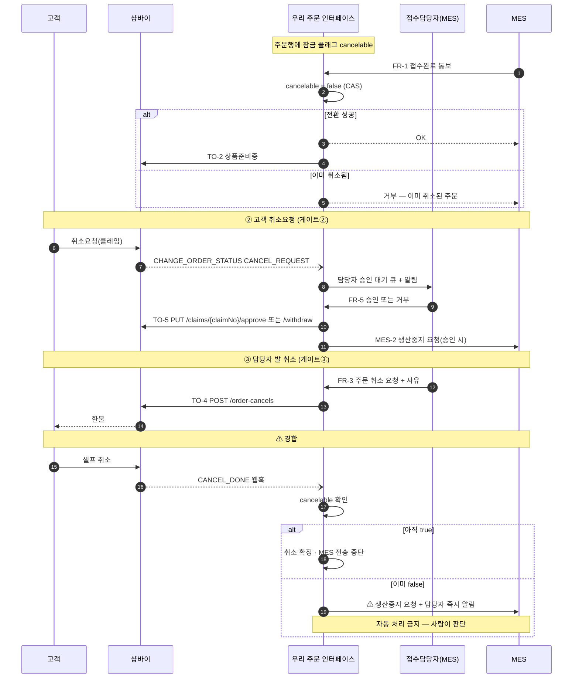
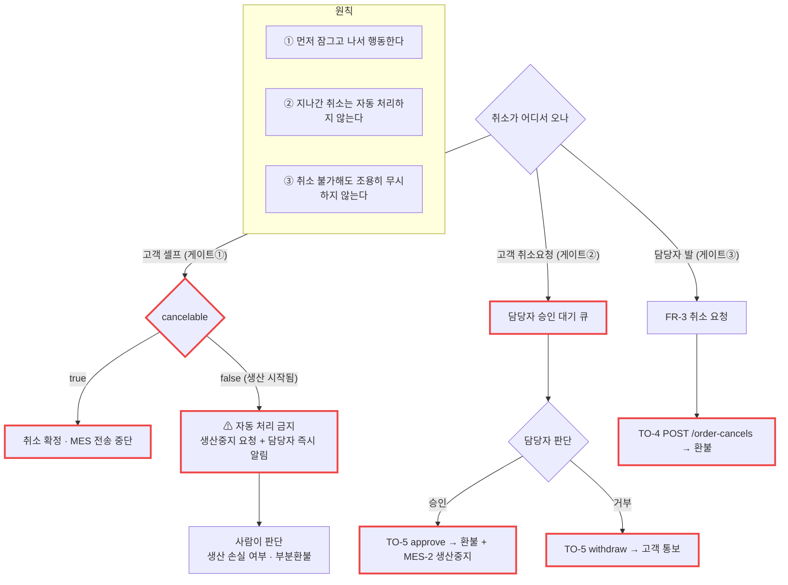

# P13 · 생산 구간 주문 취소

> L0 후니 몰 전체 › L1 운영자·주문운영 › L2 클레임 › **L3 P13 생산구간-주문취소** · cross **t65**

## 1. 한 줄 정의 · 시작/끝 · 등장인물

**한 줄 정의.** **생산이 이미 시작된** 주문의 취소가 들어왔을 때, 환불했는데 생산되는 사고가 나지 않도록 잠그고·사람에게 넘기고·환불로 정리하기까지.

- **시작** — MES 접수완료(취소 잠금 시작점) 이후에 도착한 취소.
- **끝** — 샵바이 취소·환불 완료 또는 거부 회신.

| 등장인물 | 하는 일 |
|---|---|
| **고객** | 취소요청을 낸다(셀프 취소는 이미 막혔다) |
| **접수담당자(MES)** | 고객과 통화하고 취소를 **요청**한다 · 취소요청을 승인/거부한다 |
| **우리 주문 인터페이스** | **유일한 심판.** `cancelable` CAS 로 잠그고 샵바이에 실행시킨다 |
| **샵바이** | 돈을 돌려주는 유일한 주체 |

**경계 한 줄.** MES 가 「접수완료」가 되는 순간부터 고객 셀프 취소는 불가능하다. 그 순간 우리가 샵바이를 **상품준비중**으로 올려 창구를 닫는다(설계 정본 §7.1).

## 2. 시퀀스

## 3. 분기 — 실패 · 비회원 · 취소

## 4. 단계표

| # | 단계 | 시스템 | 담당자 | 원장 row_id | 상태 | 근거 |
|---|---|---|---|---|---|---|
| 1 | 접수완료 시 취소 잠금 원자적 전환(CAS) | 우리 | 서희항 | `STD-MFG-026` | 미착수 | `raw/webadmin/docs/order-to-mes-process.md:364-401` §7.3 · **코드 0건**. `cancelable` 컬럼 자체가 없다 |
| 2 | FR-3 MES 발 취소 요청 → TO-4 샵바이 취소·환불 | 우리 | 서희항 | `STD-MFG-031` | 미착수 | 설계 §8.4 FR-3 · §8.2 TO-4. 명세 `docs/shopby/shopby-api-docs-complete/04_server-api/claim.mdx:362` `POST /order-cancels` · 호출 0건 |
| 3 | FR-5 취소요청 승인·거부 → TO-5 클레임 처리 | 우리 | 서희항 | `STD-MFG-032` | 미착수 | 명세 `claim.mdx:171` `PUT /claims/{claimNo}/approve` · `:239` `/withdraw` · 호출 0건 |
| 4 | 생산 시작 후 취소는 자동 처리 금지 · 에스컬레이션 | 우리 | 서희항 | `STD-MFG-033` | 미착수 | 설계 §7.3 원칙 2·3 · 코드 0 |
| 5 | MES-2 주문 취소 통보(생산중지 요청) | 우리→MES | 서희항 | `STD-MFG-015` | 미착수 | 설계 §8.3 MES-2 · 코드 0 |
| 6 | MES 화면 신규 버튼(취소·승인거부)+사유 입력 | MES | 외부(회신 대기) | `STD-MFG-035` *(P09 주)* | **미실측** | 설계 §8.4 하단 — MES WinForms 작업 |
| 7 | 클레임 접수 목록·처리 | 우리 | 최숙진 | `STD-ADO-022` | **작동**(원장 판정) | webadmin 에 클레임 화면 0건 → §7 참조 |
| 8 | 환불 실행·정산 반영 | 우리/샵바이 | 최숙진 | `STD-ADO-023` | 부분 | 명세 `claim.mdx` 전반 · 호출 0건 |
| 9 | 판매자 클레임 승인·거부 처리 | 샵바이 | 최숙진 | `STD-CLM-013` *(cross t65)* | 미착수 | 원장 |

## 5. 빠진 곳

### 가. 원장에 행이 없다
| 무엇 | 왜 필요한가 |
|---|---|
| **`cancelable` 컬럼 DDL** | `STD-MFG-026` 은 "원자적 전환"을 말하는데 **그 플래그를 만드는 행이 없다**. 지금 `t_ord_orders` 에 없다 |
| **게이트① 셀프 취소 웹훅 소비** | 설계 §7.2 게이트① — `CANCEL_DONE` 웹훅을 받아 MES 전송을 중단하는 것. `STD-MFG-031`(FR-3, MES 발)과 **방향이 반대**인데 행이 없다 |
| **부분 취소·수량 변경** | 설계 §12-10 이 "1차 미지원 제안"이라 했다. **미지원을 명시적으로 결정한 행**이 없다 |
| **취소 경합 알림 채널** | `STD-MFG-033` 은 "에스컬레이션"이라고만 한다. 누구에게 어떻게 알리는지가 행으로 없다 |

### 나. 행은 있는데 코드가 0이다
`STD-MFG-026`·`031`·`032`·`033`·`015` · `STD-ADO-023`(호출부) — **6행.**

### 다. 코드는 있는데 연결이 안 됐다
| 무엇 | 실태 |
|---|---|
| 클레임 API 명세 | 9개 엔드포인트가 전부 문서화돼 있다(P12 §5 다 참조) |
| 웹훅 수신함 | `CHANGE_ORDER_STATUS` 가 오면 `claimStatusType` 까지 파싱해 저장한다 → `catalog/shopby_hook.py:112-119`. **분기하는 쪽이 없다** |
| `ORD_OWNED` 가드 | 승격이 취소된 주문을 되돌리지 않게 막는 장치가 있다(`artwork_promote.py:56`) — 경합 방어의 **선례**가 이미 코드에 있다 |

### 라. 결정이 안 됐다
| 항목 | 설계/원장 |
|---|---|
| 고객 셀프취소가 막히는 정확한 상태 | 설계 §12-8 — **샵바이 어드민 실측 필요** |
| 부분취소 지원 여부 | 설계 §12-10 |
| 클레임 범위 | `BLK-S1-6`(t65) |
| 취소 경합 시 부분환불 정책 | 미정 — 원장에 행 없음 |

## 6. 채우는 방법

| 순 | 누가 | 무엇을 | 선행 |
|---|---|---|---|
| 1 | 서희항 | `cancelable` 컬럼 + CAS 전이 구현(원장 DDL 행 신설) | P09 상태머신 |
| 2 | 서희항 | `CANCEL_DONE`·`CANCEL_REQUEST` 웹훅 분기 소비자 | 1 · P09 |
| 3 | 최숙진 | 샵바이 어드민에서 셀프취소 차단 상태 실측(설계 §12-8) | 없음 |
| 4 | 신우진 | 부분취소 미지원·클레임 범위 결정 | 없음 |
| 5 | 서희항 | TO-4·TO-5 호출 + FR-3·FR-5 수신 | 1·2·4 · P06 |
| 6 | MES 담당 | 취소·승인거부 버튼 + 사유 입력 | 5 |

> **설계는 이 프로세스가 가장 촘촘하다**(§7 전체가 이 이야기다). 뼈대가 문서로 완성돼 있어 **코드로 옮기는 일만 남았고, 그 일은 MES 스펙을 기다리지 않는다** — 1·2 는 지금 가능하다.

## 7. 확인 못 한 것

- **`STD-ADO-022`(클레임 접수 목록·처리)가 원장에서 「작동」인 근거를 재현하지 못했다.** webadmin 에 클레임 화면이 없다. **셀러어드민 기본 기능**을 가리킨 것이라면 모순이 아니다 — 확인하지 못했다. **판정하지 않고 남긴다.**
- 샵바이 어드민의 취소 정책 설정 화면은 접속하지 않았다.
- `claim.mdx` 의 각 엔드포인트 요청 스키마는 위치만 확인했다.
- MES 의 취소 관련 기존 기능(`IOrderService.cs` 의 `UOrderState` 등)이 후니 취소에 재사용 가능한지는 확인하지 못했다.
