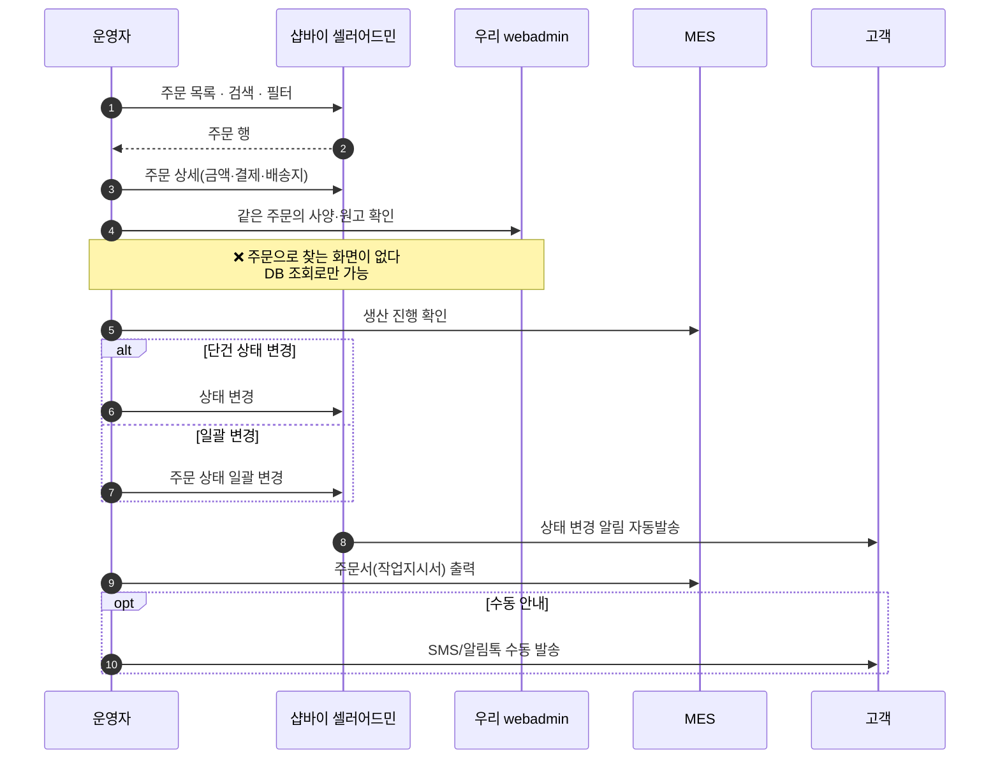
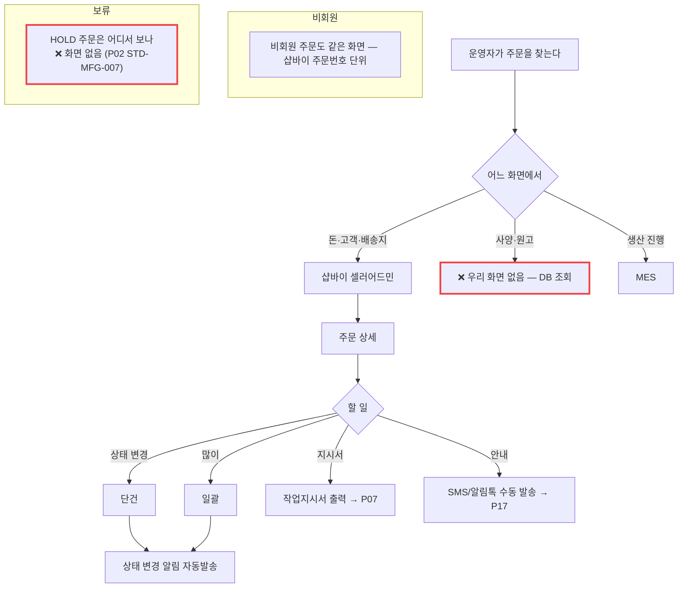

# P14 · 운영자 주문 운영

> L0 후니 몰 전체 › L1 운영자·주문운영 › L2 주문 › **L3 P14 운영자-주문운영**

## 1. 한 줄 정의 · 시작/끝 · 등장인물

**한 줄 정의.** 운영자가 **주문을 찾아 열어** 사양·파일·금액을 확인하고 상태를 바꾸고 작업지시서를 뽑기까지.

- **시작** — 운영자가 주문을 찾는다(검색·필터).
- **끝** — 상태 변경 또는 지시서 출력.

| 등장인물 | 하는 일 |
|---|---|
| **운영자**(최숙진·접수담당) | 찾고·열고·바꾸고·뽑는다 |
| **샵바이 셀러어드민** | 주문 원장 화면(기본 제공) |
| **우리 webadmin** | 사양·원고의 진실을 갖고 있다 |
| **MES** | 생산의 진실을 갖고 있다 |

**이 프로세스의 성격.** 운영자는 **세 화면을 오간다** — 돈은 샵바이, 사양·파일은 우리, 생산은 MES. 하나로 묶는 화면이 없는 것이 이 프로세스의 실태다.

## 2. 시퀀스

## 3. 분기 — 실패 · 비회원 · 취소

## 4. 단계표

| # | 단계 | 시스템 | 담당자 | 원장 row_id | 상태 | 근거 |
|---|---|---|---|---|---|---|
| 1 | 주문 목록·검색·필터 | 샵바이 | 최숙진 | `STD-ADO-001` | **작동** | 셀러어드민 기본 기능(원장 판정). **webadmin 에는 없다** — `raw/webadmin/webadmin/config/urls.py` 154경로 중 주문 목록 0건 |
| 2 | 주문 상세 조회(사양·파일·금액) | 샵바이+우리 | 서희항 | `STD-ADO-002` | 부분 | 금액·배송지는 샵바이. **사양·파일을 주문으로 찾는 우리 화면이 없다** — `catalog/admin.py` 에 `TOrdOrders` 등록 0건 |
| 3 | 주문 상태 변경(단건) | 샵바이 | 서희항 | `STD-ADO-003` | 부분 | 셀러어드민. 우리 상태머신과 연동 0 |
| 4 | 주문 상태 일괄 변경 | 샵바이 | 최숙진 | `STD-ADO-004` | **작동** | 셀러어드민 기본 · 명세 `docs/shopby/shopby-api-docs-complete/04_server-api/order.mdx:400` `PUT /orders/change-status/by-shipping-no` |
| 5 | 주문서(작업지시서) 출력 | MES | 최숙진 | `STD-ADO-006` | 미착수 | → P07 `STD-MFG-067` 과 같은 일. 원장에 두 행이 있다 |
| 6 | [구IA#86] 주문관리-인쇄/제본/굿즈(상세) | 구 사이트 | 최숙진 | `STD-ADO-025` | **미실측** | 구 사이트 IA 승계 행 — 구 사이트 접속이 필요 |
| 7 | [구IA#93] 주문상태변경(일괄) | 구 사이트 | 최숙진 | `STD-ADO-026` | **미실측** | 같음 |
| 8 | 스모크 주문 3건·취소 1건으로 A-1/A-2/A-4 관측 | — | 최숙진 | `STD-ADO-028` | 미착수 | 원장 — **검증 행** |
| 9 | 보류(HOLD) 주문 목록 화면 | 우리 | 서희항 | `STD-MFG-007` *(P02 주)* | 미착수 | 화면 0 |

## 5. 빠진 곳

### 가. 원장에 행이 없다
| 무엇 | 왜 필요한가 |
|---|---|
| **주문번호로 사양·원고를 여는 우리 화면** | `STD-ADO-002` 는 "주문 상세 조회(사양·파일·금액)"라고 **하나로 묶어** 말한다. 실제로는 금액(샵바이)과 사양·파일(우리)이 다른 화면이고, **우리 쪽 화면이 통째로 없다**. 별도 행으로 서야 한다 |
| **세 시스템을 잇는 운영자 진입점** | 운영자가 주문번호 하나로 샵바이·우리·MES 를 오가는 방법이 행으로 없다. `STD-MFG-024`(3시스템 매핑)는 데이터 얘기지 화면 얘기가 아니다 |
| **구 사이트 화면과의 대응표** | `STD-ADO-025`·`026` 이 「미실측」인 채로 남아 있다. **새 몰에서 그 기능이 어디로 갔는지** 대응 행이 없다 |

### 나. 행은 있는데 코드가 0이다
| row_id | 무엇이 0인가 |
|---|---|
| `STD-ADO-006` | 작업지시서 출력(MES) |
| `STD-MFG-007` | 보류 주문 목록 화면 |
| `STD-ADO-002`(우리 몫) | 주문 단위 사양·원고 조회 화면 |

### 다. 코드는 있는데 연결이 안 됐다
| 무엇 | 실태 |
|---|---|
| `t_ord_orders`·`t_ord_artworks` | **데이터는 쌓인다**(P01·P02). 볼 화면이 없어 DB 조회로만 확인 가능하다 |
| webadmin 상품 뷰어·가격 뷰어 | 운영 화면이 **상품 축으로는 잘 돼 있다**(product-viewer·price-viewer·price-simulator). **주문 축이 없다** |
| Django admin 자동등록 | `catalog/admin.py:2626` 이 앱 모델을 전부 자동 등록하는데 `TOrd*` 계열은 등록되지 않았다 |

### 라. 결정이 안 됐다
| 항목 | 누가 |
|---|---|
| 운영자가 주문을 어느 화면에서 처리할지(샵바이 단일 vs 우리 통합 화면) | 최숙진+신우진 — **원장에 행이 없는 결정** |
| 구 사이트 주문관리 기능의 승계 범위 | 최숙진(`STD-ADO-025`·`026`) |

## 6. 채우는 방법

| 순 | 누가 | 무엇을 | 선행 |
|---|---|---|---|
| 1 | 최숙진+신우진 | 운영 동선 결정 — 셀러어드민만 쓸지, 우리 화면을 만들지 | 없음 |
| 2 | 서희항 | (1이 「우리 화면」이면) 주문 단위 조회 화면 — 사양·원고·승격상태·검판결과 한 화면 | 1 · P09 |
| 3 | 서희항 | 보류 주문 목록(작은 일 — 이건 1과 무관하게 필요하다) | 없음 |
| 4 | 최숙진 | 구 사이트 주문관리 2행 실측 + 승계 여부 판정 | 없음 |
| 5 | 최숙진 | 스모크 주문 3건·취소 1건 관측(`STD-ADO-028`) | P01 |

> **3 은 지금 당장 가능하고 값이 크다.** 승격이 실패한 주문을 아무도 못 보는 상태가 P02 의 가장 위험한 공백이다.

## 7. 확인 못 한 것

- **`STD-ADO-001`·`004` 가 「작동」인 근거는 셀러어드민 화면일 것으로 읽었으나 실화면을 확인하지 않았다.**
- 구 사이트(`STD-ADO-025`·`026`)는 접속하지 않았다.
- 셀러어드민의 주문 상세에서 위젯 사양(`optionInputs` 의 `huni_order`)이 어떻게 보이는지 확인하지 못했다.
