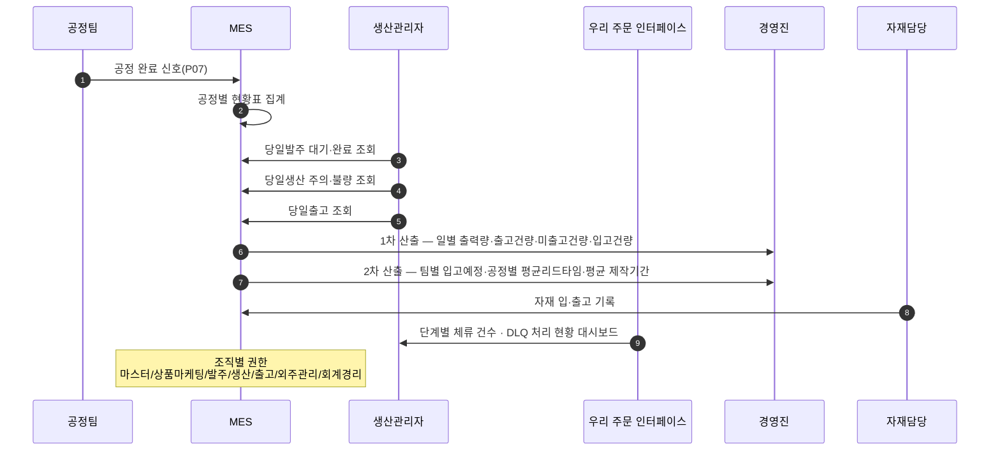
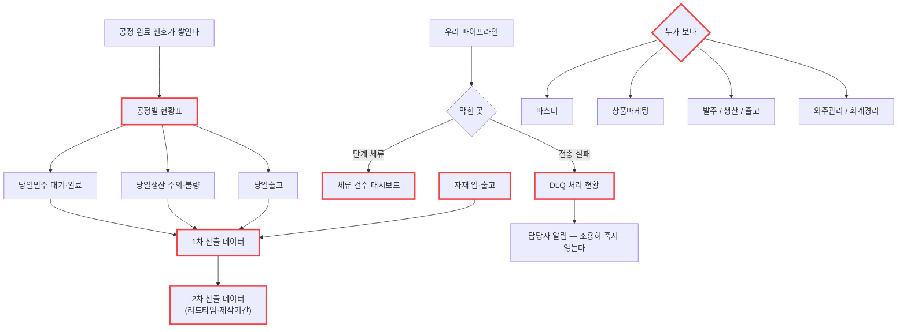

# P15 · 생산 현황 · 산출 데이터 · 권한

> L0 후니 몰 전체 › L1 운영자·주문운영 › L2 생산 › **L3 P15 생산현황-산출데이터**

## 1. 한 줄 정의 · 시작/끝 · 등장인물

**한 줄 정의.** 그날 **무엇이 밀렸고 무엇이 나갔는지**를 공정별 현황표와 산출 데이터로 보고, 볼 사람만 보게 권한을 나누기까지.

- **시작** — 하루가 시작되고 발주가 쌓인다.
- **끝** — 현황표·산출 데이터가 나오고, 막힌 곳(DLQ·체류)이 보인다.

| 등장인물 | 하는 일 |
|---|---|
| **생산관리자** | 공정별 현황표를 보고 인력·순서를 조정한다 |
| **경영진** | 1차·2차 산출 데이터를 본다 |
| **자재담당** | 자재 입·출고를 기록한다 |
| **우리** | 단계별 체류·DLQ 대시보드를 준다 |
| MES | 현황·산출의 원천 |

## 2. 시퀀스

## 3. 분기 — 실패 · 비회원 · 취소

## 4. 단계표

| # | 단계 | 시스템 | 담당자 | 원장 row_id | 상태 | 근거 |
|---|---|---|---|---|---|---|
| 1 | 공정별 현황표(당일발주·당일생산·당일출고) | MES | 최숙진 | `STD-MFG-094` | 미착수 | 원장 · MES 에 HuniWeb 연동 0건 |
| 2 | 1차 산출데이터(일별 출력량·출고건량·미출고건량·입고건량) | MES | 최숙진 | `STD-MFG-095` | 미착수 | 원장 |
| 3 | 2차 산출데이터(팀별 입고예정·공정별 평균리드타임·평균 제작기간) | MES | 최숙진 | `STD-MFG-096` | 미착수 | 원장 |
| 4 | 자재 입·출고 관리 | MES | 최숙진 | `STD-MFG-098` | 미착수 | 원장 |
| 5 | 조직별 권한 관리(7역할) | MES | 최숙진 | `STD-MFG-132` | 미착수 | 원장(마스터/상품마케팅/발주/생산/출고/외주관리/회계경리) |
| 6 | 단계별 체류 건수·DLQ 처리 현황 대시보드 | 우리 | 서희항 | `STD-MFG-131` | 미착수 | 설계 `raw/webadmin/docs/order-to-mes-process.md:641-709` §11 5단계 · **코드 0건** |
| 7 | 실패 재시도·DLQ·실패 주문 화면 | 우리 | 서희항 | `STD-MFG-021` *(P06 주)* | 미착수 | 설계 §9.4 · 코드 0 |

## 5. 빠진 곳

### 가. 원장에 행이 없다
| 무엇 | 왜 필요한가 |
|---|---|
| **현황표의 「당일」 기준** | `STD-MFG-094` 가 당일발주·당일생산·당일출고를 말하는데 **하루의 경계**(자정? 업무 시작?)가 행으로 없다. 리드타임(`096`) 계산의 전제다 |
| **산출 데이터의 원천 주문 단위** | 주문 단위인가 주문상품옵션 단위인가 작업 단위인가. `STD-MFG-023`(상태 단위)과 이어지는데 행이 없다 |
| **우리 대시보드 ↔ MES 현황표의 경계** | `STD-MFG-131`(우리)과 `094`(MES)가 **비슷한 것을 각자 만든다.** 무엇을 어디서 보는지가 행으로 없다 |
| **자재 마스터** | `STD-MFG-098` 은 입·출고만 말한다. 자재 자체는 webadmin 에 `t_mat_*` 로 **이미 있다**(자재 마스터 화면 `/admin/master/mat/`). 그 둘의 관계가 행으로 없다 |

### 나. 행은 있는데 코드가 0이다
`STD-MFG-094`·`095`·`096`·`098`·`132`·`131` — **6행 전부.**

### 다. 코드는 있는데 연결이 안 됐다
| 무엇 | 실태 |
|---|---|
| webadmin 자재 마스터 | 화면이 있다(`/admin/master/mat/`). 생산 입·출고와 이어져 있지 않다 |
| webadmin 사용자 권한 | Django 권한 체계가 깔려 있다. 7역할 구분은 없다 |
| MES 생산계획 테이블 | `T_MNF_MANUFACT_PLAN_PRCS` 등이 있다. 후니 작업이 없어 집계할 것이 없다 |

### 라. 결정이 안 됐다
| 항목 | 누가 |
|---|---|
| 7역할 권한 매트릭스 | 최숙진 — **정의하는 일** |
| 현황·산출을 MES 에서 볼지 별도 BI 로 뺄지 | 최숙진+신우진 |
| 우리 대시보드 범위 | 서희항 |

## 6. 채우는 방법

| 순 | 누가 | 무엇을 | 선행 |
|---|---|---|---|
| 1 | 최숙진 | 7역할 권한 매트릭스를 표로 확정 | 없음 |
| 2 | 최숙진 | 현황표·산출 데이터 항목 정의(당일 기준 포함) | 없음 |
| 3 | 서희항+최숙진 | 우리 대시보드 ↔ MES 현황표 경계 확정 + 원장 행 신설 | 2 |
| 4 | 서희항 | 체류·DLQ 대시보드 | 3 · P06 큐 |
| 5 | MES 담당 | 현황표·산출·자재·권한 구현 | 1·2 · P07 |

> **이 프로세스는 P07 이 돌지 않으면 볼 것이 없다.** 우선순위가 낮다 — 다만 **6번(DLQ 대시보드)만은 예외**다. 주문이 조용히 죽는 것을 막는 장치라 P06 과 함께 나와야 한다.

## 7. 확인 못 한 것

- MES 에 기존 현황·통계 모듈이 있는지 전수로 보지 않았다.
- webadmin 자재 마스터가 생산 자재와 같은 축인지(인쇄 자재 vs 부자재) 확인하지 못했다.
- 「7역할」이 현재 조직과 맞는지는 실무 확인이 필요해 보지 않았다.
