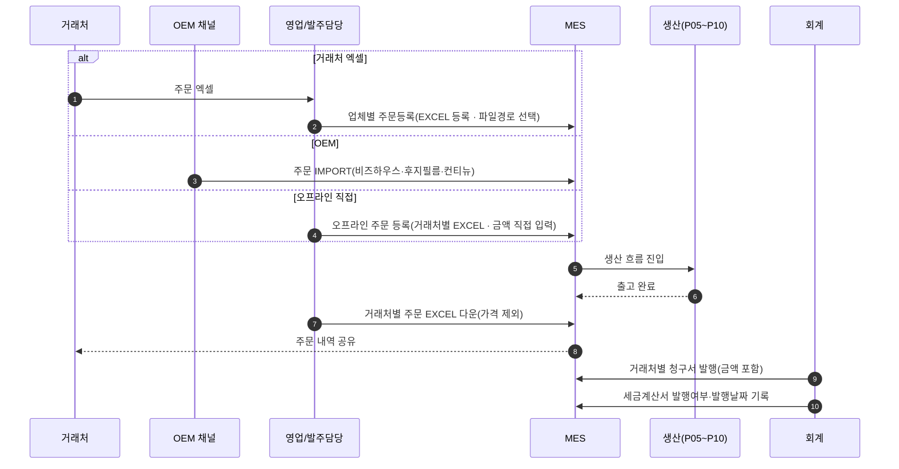
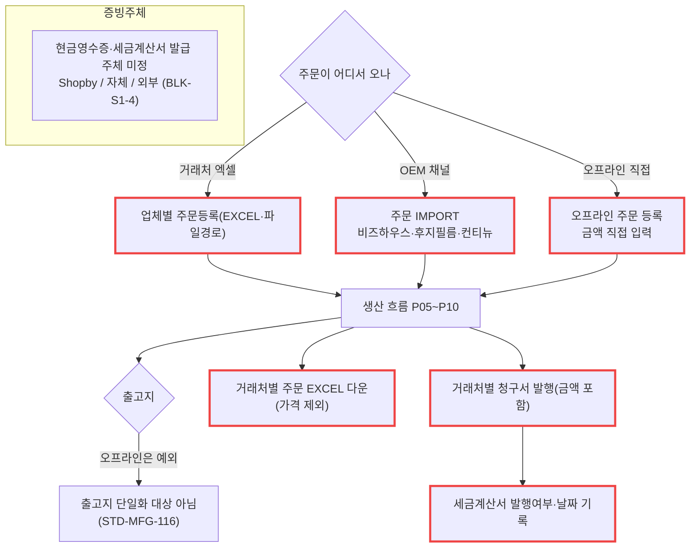

# P16 · 오프라인 · 거래처 주문 등록 · 증빙

> L0 후니 몰 전체 › L1 운영자·주문운영 › L2 증빙 › **L3 P16 오프라인주문-증빙** · cross **t65**(정산·통계)

## 1. 한 줄 정의 · 시작/끝 · 등장인물

**한 줄 정의.** 웹 주문이 아닌 **거래처·OEM 주문**을 엑셀이나 IMPORT 로 등록해 생산에 태우고, 청구서·세금계산서까지 끝내기까지.

- **시작** — 거래처가 엑셀로 주문을 보내거나 OEM 채널에서 주문이 들어온다.
- **끝** — 청구서 발행 · 세금계산서 발행 기록.

| 등장인물 | 하는 일 |
|---|---|
| **영업/발주담당** | 엑셀을 받아 등록한다 · 금액을 직접 넣는다 |
| **거래처** | 엑셀로 주문한다 · 주문 내역 엑셀을 받는다(가격 제외) |
| **OEM 채널**(비즈하우스·후지필름·컨티뉴) | 주문을 넘긴다 |
| **회계/경리** | 청구서·세금계산서 |
| MES | 오프라인 주문도 같은 생산 흐름을 탄다 |

**샵바이는 여기 없다.** 이 주문들은 샵바이를 거치지 않는다 — 그래서 P09(역방향 동기화)도, P13(취소)도 적용되지 않는다.

## 2. 시퀀스

## 3. 분기 — 실패 · 비회원 · 취소

## 4. 단계표

| # | 단계 | 시스템 | 담당자 | 원장 row_id | 상태 | 근거 |
|---|---|---|---|---|---|---|
| 1 | 오프라인 주문 등록(거래처별 EXCEL·금액 직접 입력) | MES | 최숙진 | `STD-MFG-133` | **미실측** | 원장 |
| 2 | 업체별 주문등록(EXCEL 등록·파일경로 선택) | MES | 최숙진 | `STD-MFG-070` | 미착수 | 원장. MES 에 기존 엑셀 주문 수신부가 있다 → `BackOffice.Server/CRT.EasyMES.V2.IF/IOrderService.cs:58` `COrderByExcel` |
| 3 | OEM 주문 IMPORT(비즈하우스·후지필름·컨티뉴) | MES | 최숙진 | `STD-MFG-071` | 미착수 | 원장 |
| 4 | 거래처별 주문 EXCEL 다운(가격 제외) | MES | 최숙진 | `STD-MFG-069` | 미착수 | 원장 |
| 5 | 거래처별 청구서 발행(오프라인주문·금액 포함) | MES | 최숙진 | `STD-MFG-134` | 미착수 | 원장 |
| 6 | 세금계산서 발행여부·발행날짜 보관 | MES | 최숙진 | `STD-MFG-135` | 미착수 | 원장 |
| 7 | 증빙서류 발급 관리 | 우리/외부 | 최숙진 | `STD-ADO-024` | 미착수 | 화면 0 |
| 8 | 전 상품 출고지 단일화(오프라인 제외) | MES | 최숙진 | `STD-MFG-116` *(P10 주)* | 미착수 | 원장 — **오프라인이 예외라는 것이 여기서 확정된다** |

## 5. 빠진 곳

### 가. 원장에 행이 없다
| 무엇 | 왜 필요한가 |
|---|---|
| **거래처 마스터** | 6행이 전부 "거래처별"·"업체별"인데 **거래처를 등록·관리하는 행이 없다**. B2B 대분류(t62 `STD-B2B` 15행)에 회원 축 거래처가 있을 수 있으나 **생산 축 거래처와 같은 것인지 확인되지 않았다** |
| **오프라인 주문의 가격 산출** | `STD-MFG-133` 은 "금액 직접 입력"이라고 한다. **우리 가격엔진을 쓰지 않는다**는 뜻인데, 그 결정과 그로 인한 불일치 관리가 행으로 없다 |
| **오프라인 주문의 원고 경로** | 웹 주문은 tmp→order 승격(P02)을 탄다. 오프라인은 원고가 어디서 오는지 행이 없다 |
| **OEM 3사 연동 규격** | `STD-MFG-071` 은 IMPORT 라고만 한다. 3사 각각의 포맷·주기·인증이 행으로 없다 |

### 나. 행은 있는데 코드가 0이다
`STD-MFG-069`·`070`·`071`·`133`·`134`·`135` · `STD-ADO-024` — **7행 전부.**

### 다. 코드는 있는데 연결이 안 됐다
| 무엇 | 실태 |
|---|---|
| MES 엑셀 주문 수신 | `COrderByExcel`(`IOrderService.cs:58`)이 **이미 있다** — 기존 채널(Cafe24 등)용. 후니 거래처 포맷으로 쓸 수 있는지는 미확인 |
| 우리 가격엔진 | 가격 시뮬레이터·가격 뷰어가 살아 있다. 오프라인 주문이 "금액 직접 입력"이라 **쓰이지 않는다** |

### 라. 결정이 안 됐다
| 항목 | 원장 |
|---|---|
| 현금영수증·세금계산서 발급 주체(Shopby/자체/외부) | `BLK-S1-4`·`T5-4` — 신우진 |
| 오프라인 주문을 1차 런칭 범위에 넣을지 | 미정 — **원장에 결정 행이 없다** |
| 거래처 마스터를 어디에 둘지(webadmin vs MES) | 미정 |

## 6. 채우는 방법

| 순 | 누가 | 무엇을 | 선행 |
|---|---|---|---|
| 1 | 신우진 | 증빙 발급 주체 결정(`BLK-S1-4`) | 없음 |
| 2 | 신우진+최숙진 | 오프라인·OEM 을 1차 범위에 넣을지 결정 | 없음 |
| 3 | 최숙진 | 거래처 목록 + OEM 3사 포맷을 표로 확정 | 2 |
| 4 | 최숙진 | 거래처 마스터 그릇을 원장 신규 행으로 제안 | 3 |
| 5 | MES 담당 | 엑셀 등록·IMPORT·청구서·세금계산서 구현 | 3·4 |

> **2 가 「1차 제외」로 결정되면 이 프로세스 7행 전부가 빠진다.** 웹 주문 흐름(P01~P13)과 독립이라 빼도 나머지가 깨지지 않는다 — **가장 깨끗하게 뺄 수 있는 프로세스다.**

## 7. 확인 못 한 것

- 현재 오프라인·OEM 주문을 어떻게 받고 있는지는 인터뷰가 필요해 확인하지 못했다.
- `COrderByExcel` 의 엑셀 포맷은 인터페이스 시그니처만 봤다.
- B2B 대분류(t62)의 거래처와 여기의 거래처가 같은 개념인지 **t62 카드와 맞춰야 한다.**
- 비즈하우스·후지필름·컨티뉴와의 기존 연동 유무는 확인하지 못했다.
