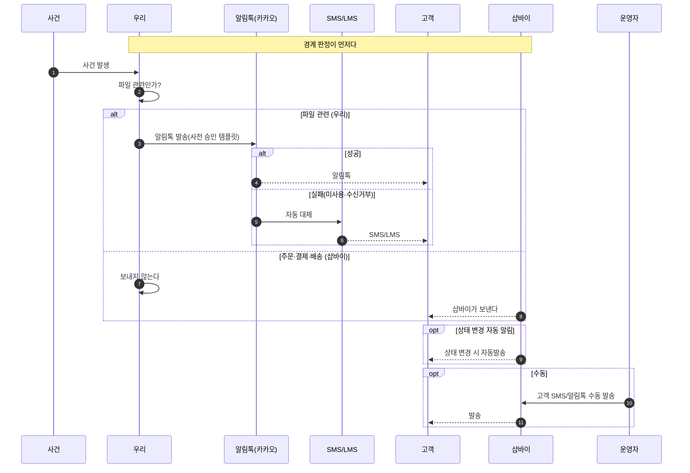
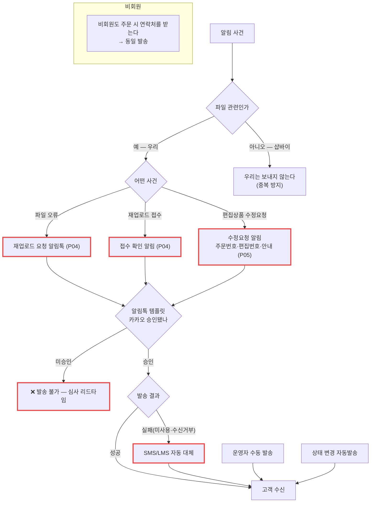

# P17 · 생산 · 파일 알림 발송

> L0 후니 몰 전체 › L1 운영자·주문운영 › L2 주문 › **L3 P17 생산-파일알림발송** · cross **t62**(회원·혜택 알림) · **t63**(배송 알림)

## 1. 한 줄 정의 · 시작/끝 · 등장인물

**한 줄 정의.** **파일 관련 알림만 우리가 보내고** 주문·결제·배송 알림은 샵바이에 맡겨, 고객이 중복으로 받지도 아무도 안 보내지도 않게 경계를 지키기까지.

- **시작** — 알림을 보낼 사건이 생긴다(파일 오류·재업로드 접수·편집상품 수정요청·상태 변경).
- **끝** — 고객이 알림톡(또는 SMS 대체)을 받는다.

| 등장인물 | 하는 일 |
|---|---|
| **우리** | **파일 관련만** 보낸다 |
| **샵바이** | 주문·입금·배송·취소·환불 알림을 보낸다(기본 기능) |
| **카카오** | 알림톡 템플릿을 사전 심사·승인한다 |
| **운영자** | 수동 발송을 한다 |
| 고객 | 받는다 |

**경계 표**(설계 정본 §10 — 이 프로세스의 정본):

| 알림 | 보내는 주체 |
|---|---|
| 주문 접수 / 입금 확인 / 배송 시작 / 배송 완료 / 취소·환불 | **샵바이** |
| 파일 오류 → 재업로드 요청(자동·담당자 발) | **우리** |
| 재업로드 접수 확인 | **우리** |
| 가상계좌 입금기한 임박 | 샵바이(설정으로) |

## 2. 시퀀스

## 3. 분기 — 실패 · 비회원 · 취소

## 4. 단계표

| # | 단계 | 시스템 | 담당자 | 원장 row_id | 상태 | 근거 |
|---|---|---|---|---|---|---|
| 1 | **알림 발송 주체 경계 준수**(주문·결제·배송=샵바이 / 파일=우리) | 우리+샵바이 | 최숙진 | `STD-MFG-130` | 미착수 | 설계 `raw/webadmin/docs/order-to-mes-process.md:625-640` §10 — **이 프로세스의 정본** |
| 2 | 알림톡 템플릿 사전 심사·승인 관리 | 우리/카카오 | 서희항 | `STD-MFG-128` | 미착수 | 설계 §10 실무 주의 — "영업일 며칠", **개발 시작 시점에 같이 신청해야 일정이 안 밀린다** |
| 3 | 파일 오류 재업로드 요청 알림톡(자동·담당자 발) | 우리 | 서희항+최숙진 | `STD-MFG-125` | 미착수 | §10 · 코드 0 → P04 |
| 4 | 재업로드 접수 확인 알림 | 우리 | 서희항+최숙진 | `STD-MFG-126` | 미착수 | §10 · 코드 0 → P04 |
| 5 | 편집상품 수정요청 알림(주문번호·편집번호·안내) | 우리 | 서희항+최숙진 | `STD-MFG-127` | 미착수 | 원장 → P05 `STD-MFG-064` |
| 6 | 알림톡 실패 시 SMS/LMS 자동 대체 | 우리 | 서희항+최숙진 | `STD-MFG-129` | 미착수 | 설계 §10 · §12-7 · 코드 0 |
| 7 | 상태 변경 시 고객 알림 자동발송 | 샵바이 | 서희항·최숙진 | `STD-ADO-005` | 미착수 | 셀러어드민 설정 |
| 8 | 고객 SMS/알림톡 수동 발송 | 샵바이 | 최숙진 | `STD-ADO-007` | **작동** | 셀러어드민 기본 기능(원장 판정) |
| 9 | [구IA#94] 고객 SMS 발송 | 구 사이트 | 최숙진 | `STD-ADO-027` | **미실측** | 구 사이트 승계 행 |
| 10 | 배송 상태 변경 알림 발송 | 샵바이 | 최숙진 | `STD-SHP-016` *(cross t63)* | 미착수 | 원장 — **샵바이 몫이다** |

## 5. 빠진 곳

### 가. 원장에 행이 없다
| 무엇 | 왜 필요한가 |
|---|---|
| **템플릿 문안 초안** | `STD-MFG-128` 은 "심사·승인 관리"라고만 한다. **무슨 문장을 심사에 넣을지**가 행으로 없다. 심사는 문안이 있어야 시작된다 |
| **발송 채널 선택** | 설계 §12-7 이 "샵바이 알림톡 vs 자체 비즈메시지"를 미결로 남겼다. **채널 결정 행이 없다** — 이게 정해져야 2번을 시작할 수 있다 |
| **발송 이력·실패 재발송** | 알림이 실패했을 때 무엇이 남고 누가 다시 보내는지 행이 없다 |
| **경계 위반 감시** | `STD-MFG-130` 은 "경계 준수"라고 선언만 한다. **샵바이가 실제로 무엇을 보내고 있는지 확인**하는 행이 없다 — 확인 없이는 중복인지 공백인지 알 수 없다 |

### 나. 행은 있는데 코드가 0이다
`STD-MFG-125`·`126`·`127`·`128`·`129`·`130` · `STD-ADO-005` — **7행.**

### 다. 코드는 있는데 연결이 안 됐다
- **없음.** 우리 쪽에 알림 발송 코드가 없다.

### 라. 결정이 안 됐다
| 항목 | 원장/설계 |
|---|---|
| 알림톡 채널(샵바이 vs 자체 비즈메시지) | 설계 §12-7 — **행 없음** |
| 알림톡 33건 개별 판단 후 켜기 | `T5-2`(최숙진+신우진) — t65 범위지만 이 프로세스와 겹친다 |
| 템플릿 문안 | 운영 |
| 구 사이트 SMS 기능 승계 | `STD-ADO-027` |

## 6. 채우는 방법

| 순 | 누가 | 무엇을 | 선행 |
|---|---|---|---|
| 1 | 최숙진+신우진 | 발송 채널 결정(샵바이 알림톡 vs 자체) + 원장 행 신설 | 없음 |
| 2 | 최숙진 | 샵바이가 현재 무엇을 자동 발송하는지 셀러어드민에서 실측(`T5-2` 33건) | 없음 |
| 3 | 최숙진 | 우리가 보낼 3종(파일 오류·접수 확인·편집 수정요청) 문안 작성 | 1·2 |
| 4 | 서희항 | 카카오 템플릿 심사 신청 | 3 — **심사 리드타임 때문에 가장 먼저 걸어야 한다** |
| 5 | 서희항 | 발송 구현 + SMS 대체 + 이력 | 4 · P04 |

> **4 가 이 프로세스의 임계경로다.** 코드가 다 돼 있어도 템플릿이 승인 안 나면 못 보낸다. 그런데 4 는 3 에, 3 은 1·2 에 묶여 있고 **1·2 는 지금 당장 할 수 있다.** 개발보다 먼저 움직여야 하는 구간이다.

## 7. 확인 못 한 것

- 샵바이 셀러어드민의 알림 설정 화면(33건 목록)은 접속하지 않았다.
- 카카오 비즈메시지 채널이 이미 개설돼 있는지 확인하지 못했다.
- 구 사이트의 SMS 발송 기능(`STD-ADO-027`)은 접속하지 않았다.
- `T5-2`(t65 범위)와 이 프로세스의 중복 범위는 t65 카드와 맞춰야 한다.
