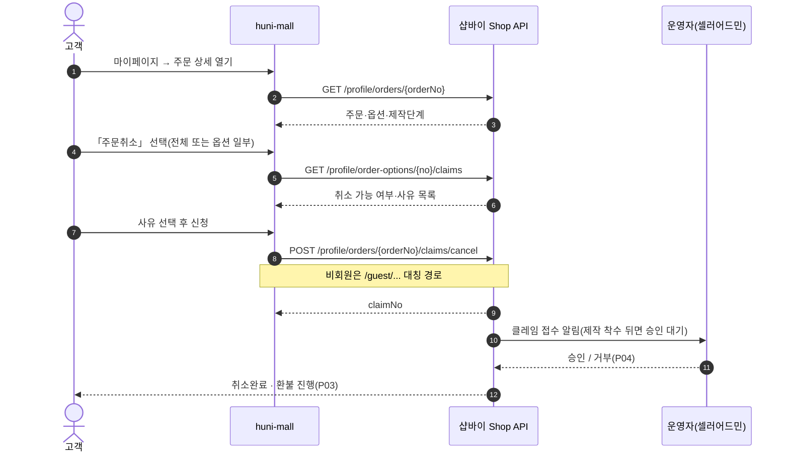
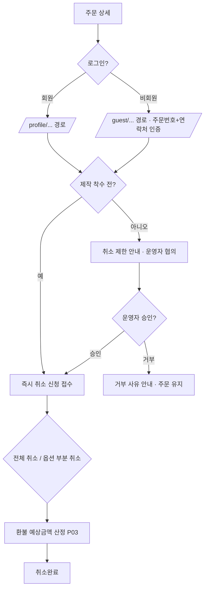

# P01 주문 취소 신청·승인

> 카드 `t65` · 대분류 **클레임·CS** · 중분류 취소 · 단계 4 · 빠진 곳 3

## 1. 한줄정의

고객이 이미 넣은 주문을 되돌린다. 제작 착수 전이면 스스로, 착수 뒤면 협의로 — 결제 수단과 제작 단계에 따라 되돌릴 수 있는 범위가 달라진다.

| | |
|---|---|
| **시작** | 고객이 마이페이지 주문 목록(또는 비회원 주문조회)에서 한 건을 연다 |
| **끝** | 주문 상태가 「취소완료」로 바뀌고 환불이 P03 으로 넘어간다 |
| **등장인물** | 고객(회원·비회원) · huni-mall · 샵바이 Shop API · 운영자(셀러어드민) |
| **가로지르는 카드** | 주문·결제(STD-ORD/PAY) 카드 — 취소 대상 주문의 생성·결제 |

## 2. 흐름 — sequenceDiagram

## 3. 분기 — flowchart

## 4. 단계표

| # | 단계 | 시스템 | 담당자 | 원장 row_id | 상태 | 근거 |
|---:|---|---|---|---|---|---|
| 1 | 1. 주문 전체 취소 신청 | huni-mall | 김동학 | `STD-CLM-001` | 미착수 | huni-shopby/01_research/order-to-delivery-contract.md §4.3 claims-* |
| 2 | 2. 옵션 단위 부분 취소 신청 | huni-mall | 김동학 | `STD-CLM-002` | 미착수 | huni-shopby/01_research/order-to-delivery-contract.md §4.3 claims-* |
| 3 | 3. 비회원 취소 신청(주문번호 인증) | huni-mall | 김동학 | `STD-CLM-003` | 미착수 | huni-shopby/01_research/order-to-delivery-contract.md §4.3 claims-* |
| 4 | 4. 제작 착수 후 취소 제한·협의 안내 | huni-mall | 김동학 | `STD-CLM-004` | 미착수 | print-kb/wiki/policy/operations.md#OPS-01 케이스별 협의 |

## 5. 빠진 곳

| id | 종류 | 내용 | 제안 담당 |
|---|---|---|---|
| `G-t65-001` | 나 — 행은 있는데 코드 0 | huni-mall 에 취소 신청 화면·호출이 없다 — `src/app/(main)` 하위 라우트는 cart·checkout·company·guest-order·guide·location·mypage·notice·order-complete·privacy·search·shop·terms 13개뿐이고 claim/cancel 라우트가 없다. 마이페이지 컴포넌트 18개에도 클레임 섹션이 없다. 샵바이 Shop API 쪽은 `POST /profile\|guest/orders/{orderNo}/claims/cancel` 과 `POST /profile\|guest/order-options/{orderOptionNo}/claims/cancel` 이 회원·비회원 대칭으로 다 있다. | 김동학 |
| `G-t65-002` | 다 — 코드는 있는데 연결 안 됨 | `mypage-shared.tsx:165-166` 의 `cancel_req`/`cancel_done` 은 「주문취소」 글자가 붙은 **상태 칩**이고, 그 카드 전체가 주문 상세를 여는 버튼이라 취소 신청 동작이 걸려 있지 않다. `use-my-orders.ts:117-123` 의 취소처리중·반품처리중·교환대기중·교환처리중·취소완료·반품완료·교환완료 매핑도 표시 전용이다 — 읽기는 되는데 쓰기가 없다. | 김동학 |
| `G-t65-003` | 라 — 결정 미정 | 제작 착수 시점의 정의가 문서에만 있고 시스템 신호가 정해지지 않았다. 「착수」를 MES 작업지시 생성으로 볼지 PitStop 검판 통과로 볼지에 따라 고객이 스스로 취소할 수 있는 구간이 달라진다. | 신우진 |

## 6. 채우는 방법

1. **김동학** — 마이페이지 주문 상세에 취소 신청 UI 를 붙이고 회원/비회원 두 경로를 배선한다.
   샵바이 Shop API 는 이미 대칭으로 열려 있어 신규 서버 작업이 없다.
2. **신우진** — 「제작 착수」의 시스템 신호를 하나로 정한다(P01·P02·P05 가 같은 정의를 쓴다).
3. **최숙진** — 셀러어드민에서 취소 승인·거부 운영 절차를 정한다(P04 와 한 화면).

## 7. 확인 못 한 것

- 셀러어드민의 클레임 승인 화면을 직접 열어보지 못했다 — 화면 이름·버튼 라벨을 적지 않았다.
- 제작 착수 뒤 취소 시 부분 환불 비율(자재비·인쇄비 공제) 규칙을 찾지 못했다.
