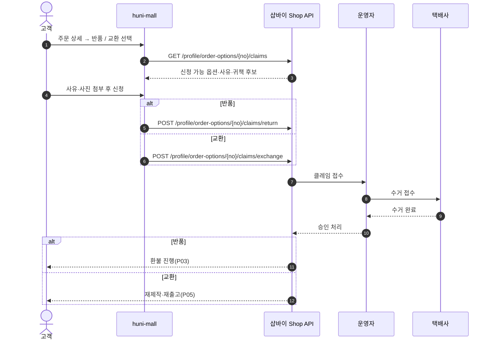
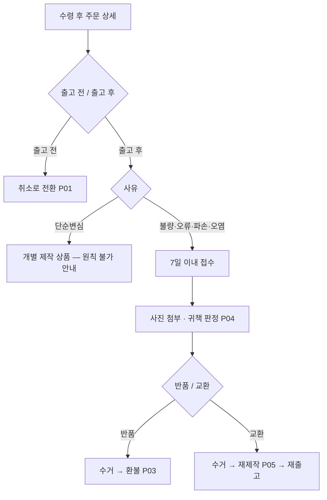

# P02 반품·교환 신청·처리

> 카드 `t65` · 대분류 **클레임·CS** · 중분류 반품·교환 · 단계 2 · 빠진 곳 3

## 1. 한줄정의

출고된 물건을 되돌리거나(반품) 다시 만들어 보낸다(교환). 인쇄물은 재판매가 안 되므로 반품은 사실상 불량 확인 뒤에만 열린다.

| | |
|---|---|
| **시작** | 고객이 수령 후 주문 상세에서 반품 또는 교환을 고른다 |
| **끝** | 수거 완료 뒤 환불(P03) 또는 재제작 출고(P05)로 넘어간다 |
| **등장인물** | 고객 · huni-mall · 샵바이 Shop API · 운영자(셀러어드민) · 택배사 |
| **가로지르는 카드** | 배송(STD-SHP) 카드 — 수거·재출고 택배 경로 |

## 2. 흐름 — sequenceDiagram

## 3. 분기 — flowchart

## 4. 단계표

| # | 단계 | 시스템 | 담당자 | 원장 row_id | 상태 | 근거 |
|---:|---|---|---|---|---|---|
| 1 | 1. 반품 신청(단일·복수 옵션) | huni-mall | 김동학 | `STD-CLM-005` | 미착수 | huni-shopby/01_research/order-to-delivery-contract.md §4.3 claims-* |
| 2 | 2. 교환 신청(출고 전/후) | huni-mall | 김동학 | `STD-CLM-006` | 미착수 | huni-shopby/01_research/order-to-delivery-contract.md §4.3 claims-* |

## 5. 빠진 곳

| id | 종류 | 내용 | 제안 담당 |
|---|---|---|---|
| `G-t65-004` | 나 — 행은 있는데 코드 0 | huni-mall 에 반품·교환 신청 화면이 없다. 샵바이 Shop API 는 `POST /profile\|guest/order-options/{orderOptionNo}/claims/return` (단일)·`POST /profile\|guest/claims/return`(복수)·`POST /profile\|guest/order-options/{orderOptionNo}/claims/exchange` 가 모두 열려 있다. | 김동학 |
| `G-t65-005` | 다 — 코드는 있는데 연결 안 됨 | 반품·교환 **정책 문구**는 이미 고객에게 보이는데(`product-sections.tsx:227-228` 의 「교환/반품」 탭 — "개별 제작 상품 특성상 제작 접수 이후 단순 변심에 의한 취소·교환·반품은 어렵습니다. 제품 불량·인쇄 오류·파손·오염 시 수령 후 7일 이내 접수해 주세요.") 그 문구가 가리키는 접수 창구가 없다. 문구는 상품 상세 컴포넌트에 하드코딩돼 있어 운영자가 고칠 수도 없다. | 김동학 |
| `G-t65-006` | 라 — 결정 미정 | 교환 시 수거한 인쇄물의 처리(폐기·보관·검증 보관기간)와 재제작 비용 부담 주체가 정해지지 않았다. | 신우진 |

## 6. 채우는 방법

1. **김동학** — 반품·교환 신청 화면 1벌(사유 선택 + 사진 첨부)을 만들고 회원/비회원 대칭 배선.
2. **최숙진** — 셀러어드민에서 수거 택배 접수 절차와 승인 기준을 운영 절차로 고정한다.
3. **신우진** — 수거물 처리·비용 부담을 P05 재제작 결정과 한 번에 정한다.

## 7. 확인 못 한 것

- 택배사 수거 접수가 셀러어드민에서 자동으로 걸리는지, 운영자가 따로 부르는지 확인하지 못했다(STD-SYS-014 와 같은 미확인).
- 「출고 전 교환」이 실무에서 쓰이는지 — 인쇄물은 출고 전이면 취소·재작업이 자연스러워 보이나 확인하지 못했다.
