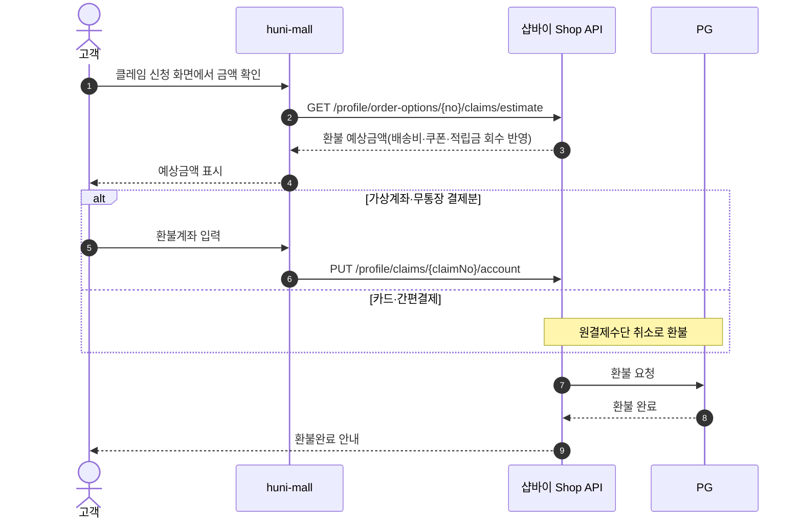
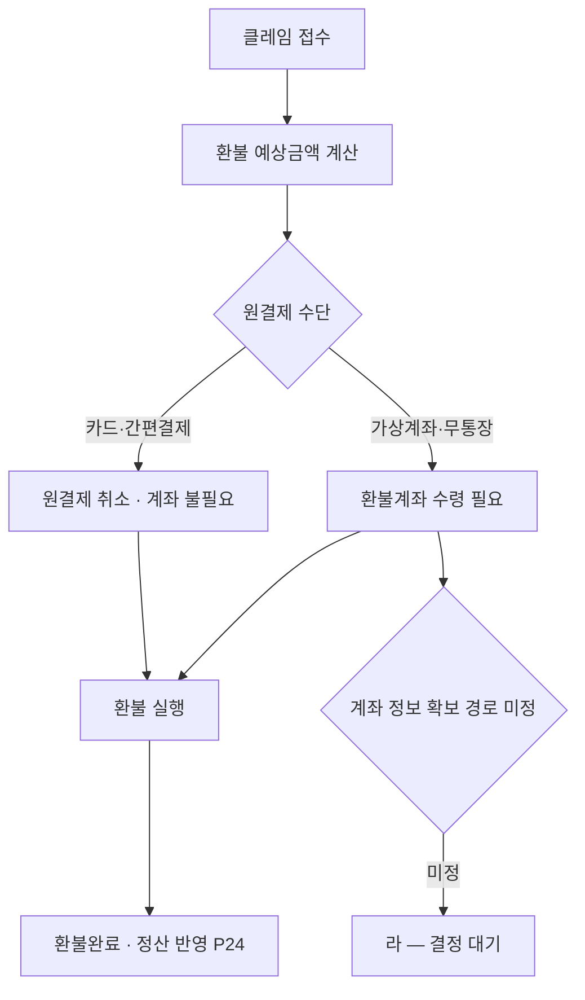

# P03 환불 예상금액 산정·환불계좌·지급

> 카드 `t65` · 대분류 **클레임·CS** · 중분류 환불 · 단계 3 · 빠진 곳 3

## 1. 한줄정의

클레임이 돈으로 정산되는 구간. 얼마를 돌려줄지 계산하고, 어디로 보낼지 받아, 실제로 보낸다.

| | |
|---|---|
| **시작** | 취소·반품 클레임이 접수돼 환불 금액 계산이 필요해진 순간 |
| **끝** | 고객 계좌 또는 결제수단으로 환불이 완료되고 정산(P24)에 잡힌다 |
| **등장인물** | 고객 · huni-mall · 샵바이 Shop API · PG(토스페이먼츠) · 운영자 |

## 2. 흐름 — sequenceDiagram

## 3. 분기 — flowchart

## 4. 단계표

| # | 단계 | 시스템 | 담당자 | 원장 row_id | 상태 | 근거 |
|---:|---|---|---|---|---|---|
| 1 | 1. 환불 예상금액 계산 | huni-mall | 김동학 | `STD-CLM-007` | 미착수 | huni-shopby/01_research/order-to-delivery-contract.md §4.3 claims-* |
| 2 | 2. 환불계좌 등록·수정 | huni-mall | 김동학 | `STD-CLM-008` | 미착수 | huni-shopby/01_research/order-to-delivery-contract.md §4.3 claims-* |
| 3 | 3. 가상계좌 입금분 환불 시 계좌 수령 절차 결정 | 결정(PM) | 미정 | `STD-CLM-026` | 미착수 | 후니정기미팅 정리260915.html §프린팅머니 · 미결 7 |

## 5. 빠진 곳

| id | 종류 | 내용 | 제안 담당 |
|---|---|---|---|
| `G-t65-007` | 나 — 행은 있는데 코드 0 | 환불 예상금액 화면과 환불계좌 입력 화면이 huni-mall 에 없다. 샵바이 Shop API 는 `GET /profile\|guest/order-options/{no}/claims/estimate`(단일)·`POST /profile\|guest/claims/estimate`(복수)·`PUT /profile\|guest/claims/{claimNo}/account` 가 다 있다. | 김동학 |
| `G-t65-008` | 라 — 결정 미정 | 가상계좌 입금분을 환불할 때 고객 환불계좌를 **어느 화면에서 어떻게 받을지**가 미정이다. 원장 판정도 담당 「미정」이다. 무통장·가상계좌가 현재 유일하게 동작하는 결제 수단이라(`checkout-form.tsx:8-9` 「PG 연동은 후속 — 현재는 무통장만 동작」) 1차 런칭에서 가장 먼저 부딪히는 환불 경로다. | 신우진 |
| `G-t65-009` | 라 — 결정 미정 | 환불 시 적립금·프린팅머니·쿠폰의 회수 규칙(부분 취소 시 안분)이 정해지지 않았다. 프린팅머니 원장 소유 결정(t62 P10·`STD-MYP-051`)이 선행이다. | 신우진 |

## 6. 채우는 방법

1. **신우진** — 가상계좌 환불계좌 수령 절차를 정한다. 지금 가장 급한 결정 하나다.
2. **김동학** — 결정 뒤 환불 예상금액·환불계좌 화면을 붙인다.
3. **최숙진** — 환불 실행분이 PG 정산 대사(P24)와 맞는지 보는 절차를 만든다.

## 7. 확인 못 한 것

- 토스페이먼츠 가상계좌 환불이 셀러어드민에서 자동인지 수기 이체인지 확인하지 못했다.
- 부분 취소 시 배송비 재계산 규칙을 샵바이가 어떻게 계산하는지 응답 예시를 보지 못했다.
