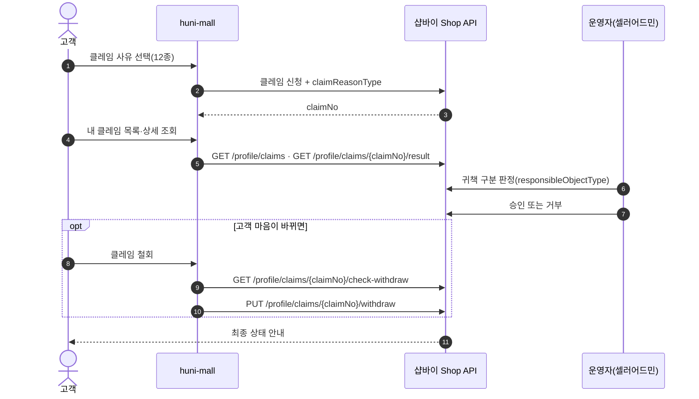
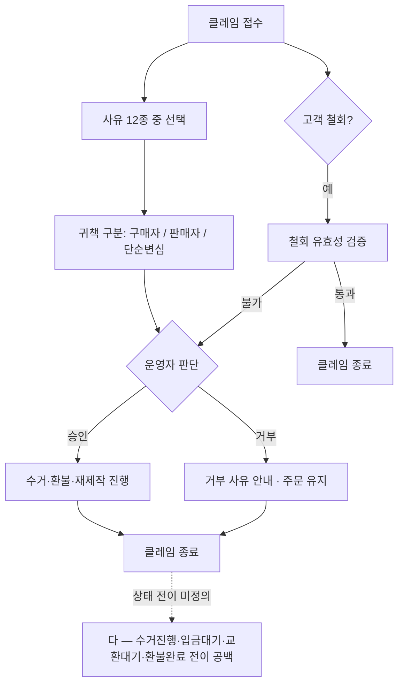

# P04 클레임 접수·사유분류·귀책판정·승인거부·철회

> 카드 `t65` · 대분류 **클레임·CS** · 중분류 클레임 · 단계 5 · 빠진 곳 3

## 1. 한줄정의

P01~P03 이 모두 지나가는 공통 관문. 클레임이 어떤 상태를 거쳐 닫히는지, 누구 잘못으로 보는지, 누가 승인하는지를 정하는 흐름이다.

| | |
|---|---|
| **시작** | 클레임이 접수돼 claimNo 가 생긴 순간 |
| **끝** | 클레임이 승인·거부·철회 중 하나로 닫힌다 |
| **등장인물** | 고객 · huni-mall · 샵바이 Shop API · 운영자(셀러어드민) |

## 2. 흐름 — sequenceDiagram

## 3. 분기 — flowchart

## 4. 단계표

| # | 단계 | 시스템 | 담당자 | 원장 row_id | 상태 | 근거 |
|---:|---|---|---|---|---|---|
| 1 | 1. 클레임 사유 분류 선택(12종) | huni-mall | 김동학 | `STD-CLM-010` | 미착수 | huni-shopby/01_research/order-to-delivery-contract.md §4.2 claimReasonType |
| 2 | 2. 귀책 구분 판정(구매자/판매자/단순변심) | 셀러어드민 | 최숙진 | `STD-CLM-011` | 미착수 | huni-shopby/01_research/order-to-delivery-contract.md §4.2 responsibleObjectType |
| 3 | 3. 클레임 목록·상세 조회 | huni-mall | 김동학 | `STD-CLM-012` | 미착수 | X-SHOPBY-CLAIM-FSM-01 클레임 상태머신 미폐합 — 수거진행 중간상태 누락·입금대기/교환대기/환불완료 전이 미정의 |
| 4 | 4. 판매자 클레임 승인·거부 처리 | 셀러어드민 | 최숙진 | `STD-CLM-013` | 미착수 | X-SHOPBY-CLAIM-FSM-01 클레임 상태머신 미폐합 |
| 5 | 5. 클레임 철회 | huni-mall | 김동학 | `STD-CLM-009` | 미착수 | huni-shopby/01_research/order-to-delivery-contract.md §4.3 claims-* |

## 5. 빠진 곳

| id | 종류 | 내용 | 제안 담당 |
|---|---|---|---|
| `G-t65-010` | 다 — 코드는 있는데 연결 안 됨 | 원장이 적어둔 `X-SHOPBY-CLAIM-FSM-01` — 클레임 상태머신이 닫혀 있지 않다. 수거진행 중간상태가 빠져 있고 입금대기·교환대기·환불완료로 가는 전이가 정의돼 있지 않다. 고객 화면의 상태 라벨(`use-my-orders.ts:117-123`)은 7종만 매핑돼 있어 정의되지 않은 상태가 오면 그대로 노출된다. | 김동학 |
| `G-t65-011` | 나 — 행은 있는데 코드 0 | 클레임 목록·상세 화면이 huni-mall 에 없다 — `GET /profile/claims`·`GET /profile/claims/{claimNo}/result`·`GET /guest/claims/{claimNo}/result` 는 열려 있다. | 김동학 |
| `G-t65-012` | 라 — 결정 미정 | 귀책 구분을 누가 어떤 기준으로 정하는지가 운영 규칙으로 없다. 귀책이 배송비 부담·환불액을 바꾸므로 P03 금액 계산의 선행이다. | 최숙진 |

## 6. 채우는 방법

1. **김동학** — 샵바이 클레임 상태 전이를 전수로 받아 적고, 고객 화면 상태 라벨을 그 집합에 맞춘다.
   미정의 상태가 와도 깨지지 않게 기본값을 둔다.
2. **최숙진** — 귀책 판정 기준표(사유 12종 × 귀책 3종)를 만들어 셀러어드민 운영에 건다.
3. **김동학** — 클레임 목록·상세 화면을 붙인다(회원·비회원 대칭).

## 7. 확인 못 한 것

- 사유 12종의 실제 코드값·한글 라벨을 샵바이 응답에서 확인하지 못했다 — 원장이 가리키는 `claimReasonType` 항목 목록을 직접 뽑지 않았다.
- 셀러어드민 클레임 관리 화면의 승인·거부 버튼 라벨을 확인하지 못했다.
