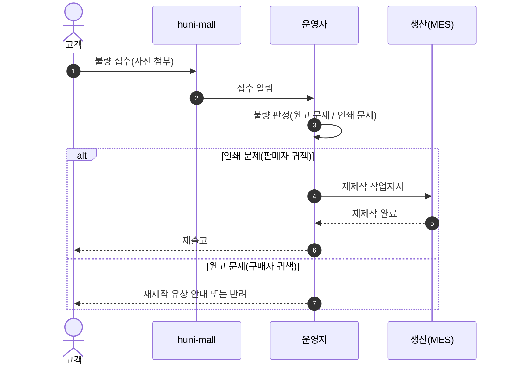
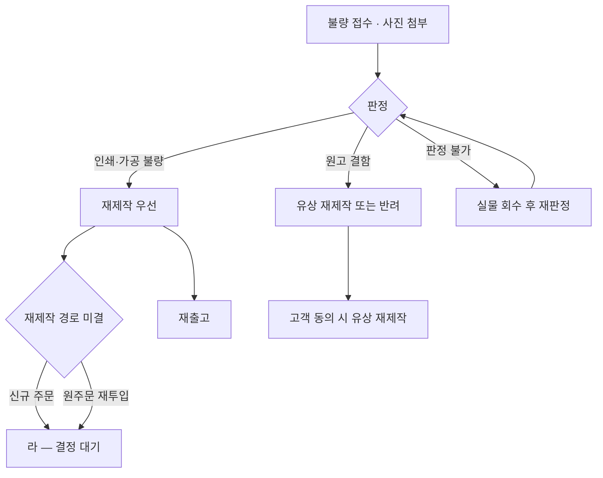

# P05 인쇄 불량 접수·재제작

> 카드 `t65` · 대분류 **클레임·CS** · 중분류 불량 · 단계 2 · 빠진 곳 3

## 1. 한줄정의

인쇄물 고유의 클레임. 색·재단·제본이 잘못 나왔을 때 돈을 돌려주기보다 **다시 만들어 주는** 길이다.

| | |
|---|---|
| **시작** | 고객이 수령물의 불량을 사진과 함께 접수한다 |
| **끝** | 재제작분이 출고되거나, 재제작 불가로 환불(P03)로 빠진다 |
| **등장인물** | 고객 · huni-mall · 운영자 · 생산(MES) · PM |
| **가로지르는 카드** | t64 생산·출고 카드 — 재제작 작업지시·공정 재투입 |

## 2. 흐름 — sequenceDiagram

## 3. 분기 — flowchart

## 4. 단계표

| # | 단계 | 시스템 | 담당자 | 원장 row_id | 상태 | 근거 |
|---:|---|---|---|---|---|---|
| 1 | 1. 인쇄 불량 접수(사진 첨부) | huni-mall | 김동학 | `STD-CLM-014` | 미착수 | print-kb/wiki/policy/operations.md#OPS-04 클레임/불량 |
| 2 | 2. 재제작(재작업) 처리 경로 결정·운영 | 결정(PM) | 신우진+최숙진 | `STD-CLM-015` | 미착수 | print-kb/wiki/policy/operations.md#OPS-04 재제작 우선 |

## 5. 빠진 곳

| id | 종류 | 내용 | 제안 담당 |
|---|---|---|---|
| `G-t65-013` | 나 — 행은 있는데 코드 0 | 불량 접수 화면이 huni-mall 에 없다. 클레임 사유에 실어 보낼 수는 있으나 사진 첨부 경로(원고 저장소 재사용 여부)가 정해져 있지 않다. | 김동학 |
| `G-t65-014` | 라 — 결정 미정 | 재제작을 **새 주문으로 만들지, 원주문에 재투입할지**가 미정이다(원장 판정 「분할」 — 경로 결정은 PM, 운영 절차는 실무운영). 이 갈래에 따라 매출 통계(P21·P22)에 재제작분이 두 번 잡히는지가 갈린다. | 신우진 |
| `G-t65-015` | 라 — 결정 미정 | 재제작 무상 기준(색 편차 허용 범위·재단 오차 허용 범위)이 수치로 없다. `print-kb/wiki/policy/operations.md#OPS-04` 는 「재제작 우선」만 말한다. | 최숙진 |

## 6. 채우는 방법

1. **신우진** — 재제작 경로(신규 주문 vs 원주문 재투입)를 결정한다. 통계·정산이 이 결정에 매달려 있다.
2. **최숙진** — 무상 재제작 허용 기준을 수치로 적는다(색 편차·재단 오차·제본 불량).
3. **김동학** — 결정 뒤 불량 접수 화면(사진 첨부)을 붙인다.

## 7. 확인 못 한 것

- 현재 실무에서 불량 접수를 어디로 받고 있는지(전화·카톡·메일) 확인하지 못했다.
- MES 쪽 재제작 작업지시 그릇이 있는지 확인하지 못했다 — t64 생산·출고 카드 범위다.
