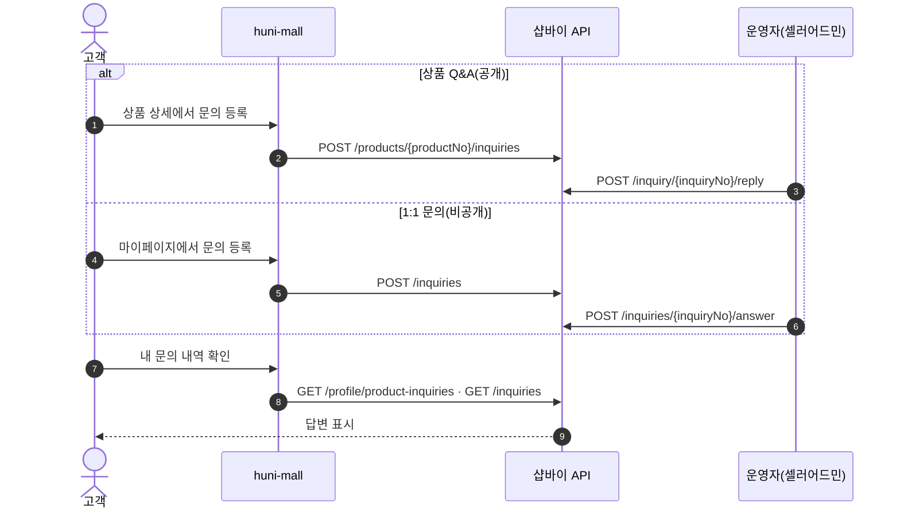
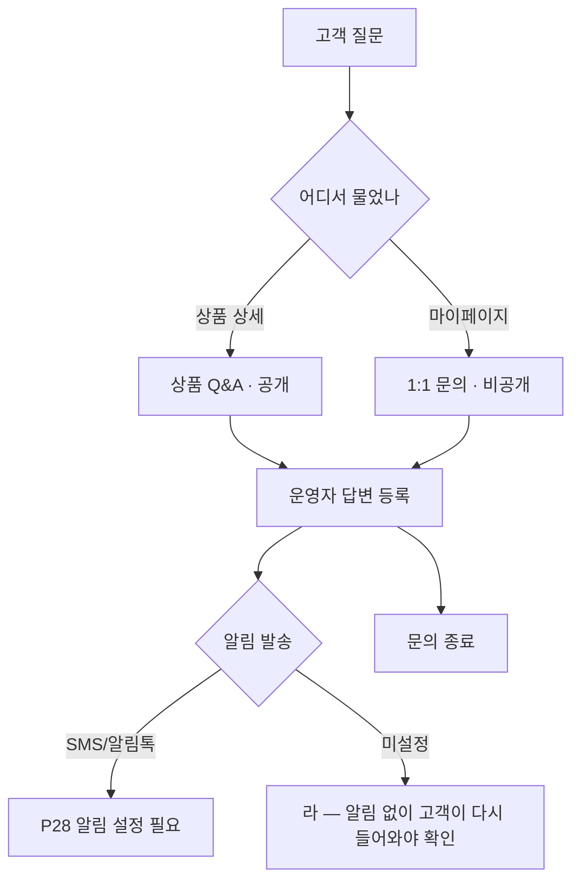

# P06 1:1 문의·상품 Q&A 응대

> 카드 `t65` · 대분류 **클레임·CS** · 중분류 문의 · 단계 4 · 빠진 곳 3

## 1. 한줄정의

고객이 묻고 운영자가 답하는 두 창구. 상품에 붙는 공개 Q&A 와 주문·계정에 붙는 비공개 1:1 문의다.

| | |
|---|---|
| **시작** | 고객이 상품 상세 또는 마이페이지에서 질문을 남긴다 |
| **끝** | 운영자 답변이 등록되고 고객에게 알림이 간다 |
| **등장인물** | 고객 · huni-mall · 샵바이 Shop/Server API · 운영자(셀러어드민) |

## 2. 흐름 — sequenceDiagram

## 3. 분기 — flowchart

## 4. 단계표

| # | 단계 | 시스템 | 담당자 | 원장 row_id | 상태 | 근거 |
|---:|---|---|---|---|---|---|
| 1 | 1. 1:1 문의 등록·답변(고객 화면) | huni-mall | 김동학 | `STD-CLM-016` | 미착수 | huni-skin-shopby/src/app/(main) 하위 inquiry/qna 라우트 부재 (SB-056 absent) |
| 2 | 2. 상품 Q&A 등록·답변(고객 화면) | huni-mall | 김동학 | `STD-CLM-017` | 미착수 | huni-skin-shopby/src/app/(main) 하위 inquiry/qna 라우트 부재 (SB-056 absent) |
| 3 | 3. [구IA#69] 상품Q&A 확인·답변(운영자) | 셀러어드민 | 최숙진 | `STD-CLM-024` | 미실측 | IA No.69 상품Q&A · 샵바이 기본 기능(R1d 미확인) |
| 4 | 4. [구IA#70] 1:1문의 확인·답변(운영자) | 셀러어드민 | 최숙진 | `STD-CLM-025` | 미실측 | IA No.70 1:1문의 · 샵바이 기본 기능(R1d 미확인) |

## 5. 빠진 곳

| id | 종류 | 내용 | 제안 담당 |
|---|---|---|---|
| `G-t65-016` | 나 — 행은 있는데 코드 0 | huni-mall 에 문의 라우트가 없다 — `src/app/(main)` 하위 13개 라우트에 inquiry·qna 가 없고 마이페이지 컴포넌트 18개에도 문의 섹션이 없다. 샵바이는 양쪽이 다 열려 있다: 상품문의 `GET/POST /products/{productNo}/inquiries`·`GET /profile/product-inquiries`, 1:1문의 `GET/POST /inquiries`·`GET /inquiries/{inquiryNo}`·`GET /inquiries/{inquiryNo}/file`, 운영자 답변 `POST /inquiry/{inquiryNo}/reply`·`POST /inquiries/{inquiryNo}/answer`. | 김동학 |
| `G-t65-017` | 라 — 결정 미정 | 1:1 문의 유형(`GET /inquiries/types`)을 무엇으로 열지 정해지지 않았다. 유형이 곧 운영자 분류·담당 배정의 기준이 된다. | 최숙진 |
| `G-t65-018` | 다 — 코드는 있는데 연결 안 됨 | 화면 오른쪽 아래 떠 있는 「카톡상담」 버튼(`floating-cs.tsx:44`)이 `href="#"` 라 아무 데도 가지 않는다 — 고객이 제일 먼저 누르는 상담 창구가 비어 있다. | 김동학 |

## 6. 채우는 방법

1. **최숙진** — 셀러어드민에서 1:1 문의 유형과 상품문의 게시판 설정을 먼저 연다(`GET /inquiries/types`·`GET /products/inquiries/configurations` 가 읽는 값).
2. **김동학** — 상품 상세의 Q&A 탭과 마이페이지 문의 섹션을 붙이고, 「카톡상담」 링크를 실제 채널로 연결한다.
3. **최숙진** — 답변 SLA(며칠 안에 답한다)를 정하고 P28 알림과 묶는다.

## 7. 확인 못 한 것

- 셀러어드민 문의 관리 화면의 실제 메뉴 이름을 확인하지 못했다.
- 상품문의 답변이 고객에게 자동 통보되는지(샵바이 기본 알림) 확인하지 못했다.
