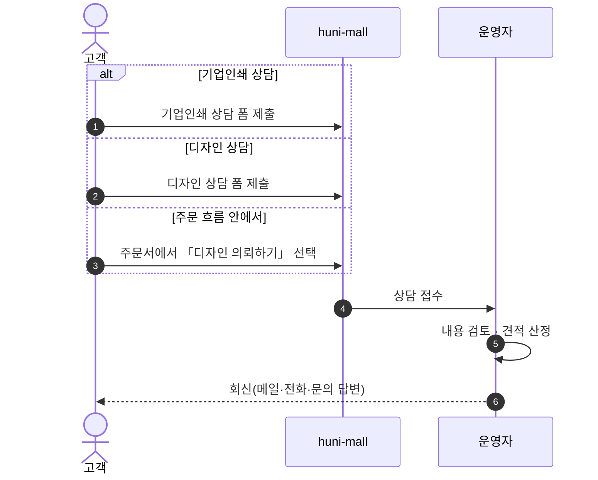
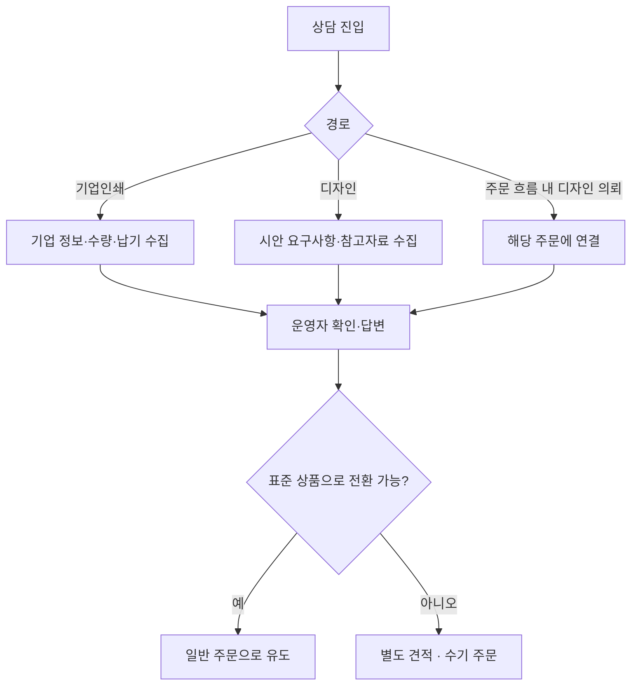

# P07 기업인쇄·디자인 상담 접수·응대

> 카드 `t65` · 대분류 **클레임·CS** · 중분류 문의 · 단계 5 · 빠진 곳 3

## 1. 한줄정의

표준 견적으로 안 떨어지는 주문을 사람이 받는 길. 기업 대량인쇄와 디자인 대행 두 갈래다.

| | |
|---|---|
| **시작** | 고객이 상담 신청 폼을 제출하거나 주문 흐름 안에서 「디자인 의뢰하기」를 고른다 |
| **끝** | 운영자가 상담 내용을 확인하고 답변·견적으로 회신한다 |
| **등장인물** | 고객 · huni-mall · 운영자(셀러어드민) · 디자인 담당 |

## 2. 흐름 — sequenceDiagram

## 3. 분기 — flowchart

## 4. 단계표

| # | 단계 | 시스템 | 담당자 | 원장 row_id | 상태 | 근거 |
|---:|---|---|---|---|---|---|
| 1 | 1. 기업인쇄 상담 접수(고객 화면) | huni-mall | 김동학 | `STD-CLM-019` | 미착수 | huni-skin-shopby src/app/(main) 하위 inquiry 라우트 부재 (SB-056 absent) |
| 2 | 2. 디자인 상담 접수(고객 화면) | huni-mall | 김동학 | `STD-CLM-020` | 미착수 | huni-skin-shopby src/app/(main) 하위 inquiry 라우트 부재 (SB-056 absent) |
| 3 | 3. 디자인 의뢰하기(주문 흐름 내) | huni-mall | 김동학 | `STD-CLM-021` | 미착수 | https://shopby.huniprinting.co.kr/checkout/202609160243938684 @ 2026-09-16 21:33 |
| 4 | 4. [구IA#67] 기업인쇄상담 확인·답변(운영자) | 셀러어드민 | 최숙진 | `STD-CLM-022` | 미실측 | IA No.67 기업인쇄상담 · webadmin 해당 없음 @ 2026-09-16 21:28 |
| 5 | 5. [구IA#68] 디자인상담 확인·답변(운영자) | 셀러어드민 | 최숙진 | `STD-CLM-023` | 미실측 | IA No.68 디자인상담 · webadmin 해당 없음 @ 2026-09-16 21:28 |

## 5. 빠진 곳

| id | 종류 | 내용 | 제안 담당 |
|---|---|---|---|
| `G-t65-019` | 나 — 행은 있는데 코드 0 | 상담 접수 화면이 huni-mall 에 없다 — inquiry 라우트 자체가 없다. 샵바이 1:1 문의 유형으로 태울지, 별도 폼을 만들지가 정해져 있지 않다. | 김동학 |
| `G-t65-020` | 라 — 결정 미정 | 기업인쇄 상담이 B2B 거래처 등록(t62 P23~P26)과 어떻게 이어지는지 미정이다. 상담으로 들어온 기업을 거래처로 승격시키는 길이 없으면 상담이 매번 처음부터 시작된다. | 신우진 |
| `G-t65-021` | 라 — 결정 미정 | 디자인 대행의 과금 방식(별도 상품 / 옵션 / 수기 견적)이 정해지지 않았다. `STD-ADP-035 디자인 상품 등록`(webadmin `admin/design-md/`)은 이미 작동하는데 상담에서 그 상품으로 넘어가는 길을 찾지 못했다. | 신우진 |

## 6. 채우는 방법

1. **신우진** — 상담 2종을 1:1 문의 유형으로 흡수할지 별도 폼으로 둘지 결정한다. 흡수하면 P06 배선 재사용으로 끝난다.
2. **김동학** — 결정에 따라 폼 또는 유형을 붙이고, 주문서의 「디자인 의뢰하기」를 그 창구에 연결한다.
3. **최숙진** — 상담 회신 템플릿과 담당 배정 규칙을 만든다.

## 7. 확인 못 한 것

- 구 사이트(huniprinting.com)의 기업인쇄상담·디자인상담 폼이 무슨 항목을 받았는지 확인하지 못했다.
- 주문서 안 「디자인 의뢰하기」의 현재 동작을 라이브에서 눌러보지 못했다 — 원장 근거는 주문서 URL 방문 기록뿐이다.
