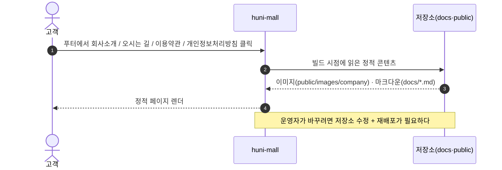
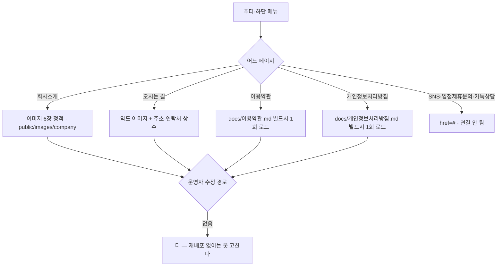

# P08 회사·정책 정보 페이지 게시

> 카드 `t65` · 대분류 **정보·콘텐츠** · 중분류 정보 · 단계 5 · 빠진 곳 3

## 1. 한줄정의

고객이 "이 회사 믿어도 되나"를 확인하는 페이지들. 회사소개·오시는 길·약관·개인정보처리방침과 푸터의 연결 고리다.

| | |
|---|---|
| **시작** | 고객이 푸터 또는 하단 메뉴에서 정보 페이지를 연다 |
| **끝** | 해당 페이지가 최신 내용으로 보인다 |
| **등장인물** | 고객 · huni-mall · 운영자 |

## 2. 흐름 — sequenceDiagram

## 3. 분기 — flowchart

## 4. 단계표

| # | 단계 | 시스템 | 담당자 | 원장 row_id | 상태 | 근거 |
|---:|---|---|---|---|---|---|
| 1 | 1. 회사소개 페이지 | huni-mall | 김동학 | `STD-INF-001` | 부분 | L3/legacy-normalized.json#IA-083,SCOPE-083 · docs/huni/후니프린팅_통합IA_일정_역할분담_260616.xlsx#02_IA마스터!A84:K84 · L2/as-is-inventory.csv#SB-058 huni-skin-shopby/src/app/(main)/company/page.tsx:1 |
| 2 | 2. 오시는 길(약도·교통 안내) | huni-mall | 김동학 | `STD-INF-002` | 작동 | https://shopby.huniprinting.co.kr/location@2026-09-16 21:27 |
| 3 | 3. 이용약관 페이지 게시 | huni-mall | 김동학 | `STD-INF-003` | 작동 | https://shopby.huniprinting.co.kr/terms@2026-09-16 21:27 |
| 4 | 4. 개인정보처리방침 페이지 게시 | huni-mall | 김동학 | `STD-INF-004` | 작동 | https://shopby.huniprinting.co.kr/privacy@2026-09-16 21:27 |
| 5 | 5. 푸터 SNS 4종·입점제휴문의·카톡상담 링크 연결 | huni-mall | 김동학 | `STD-INF-008` | 미착수 | https://shopby.huniprinting.co.kr/ @ 2026-09-16 21:26 |

## 5. 빠진 곳

| id | 종류 | 내용 | 제안 담당 |
|---|---|---|---|
| `G-t65-022` | 다 — 코드는 있는데 연결 안 됨 | 네 페이지 모두 저장소에 하드코딩돼 있어 **운영자가 고칠 수 없다**. 회사소개는 `src/app/(main)/company/page.tsx` 의 `SLIDES` 이미지 6장, 오시는 길은 `src/app/(main)/location/page.tsx` 의 `INFO` 상수(주소 「서울 중구 필동로 80 낙원빌딩 2층」·고객센터 02-3409-8853), 약관·방침은 `docs/이용약관.md`·`docs/개인정보처리방침.md` 를 `export const dynamic = "force-static"` 으로 빌드 시점에 1회 읽는다. 바꾸려면 코드 수정 + 재배포다. | 김동학 |
| `G-t65-023` | 다 — 코드는 있는데 연결 안 됨 | 푸터 SNS 링크가 `footer.tsx:39` 에서 `href="#"` 로 나가고, 떠 있는 상담 버튼도 `floating-cs.tsx:13` 에서 `href="#"` 다. 「입점제휴문의」는 `nav-data.ts:574` 에 글자로만 있다. | 김동학 |
| `G-t65-024` | 라 — 결정 미정 | 법적 고지의 SSOT 를 저장소 마크다운으로 계속 둘지, 셀러어드민 약관 관리로 옮길지 미정이다. 샵바이가 가입 시점의 약관 동의를 자기 약관 ID 로 기록하므로(t62 P01) 두 벌이 어긋날 수 있다. | 신우진 |

## 6. 채우는 방법

1. **김동학** — SNS·상담·입점제휴 URL 을 받아 링크를 채운다. 결정 없이 바로 되는 일이다.
2. **신우진** — 약관·방침의 SSOT 를 한 곳으로 정한다(저장소 vs 셀러어드민).
3. **최숙진** — 회사소개·오시는 길을 운영자가 고칠 수 있게 할지 결정하고, 필요하면 게시판으로 옮긴다.

## 7. 확인 못 한 것

- 실제 SNS 계정 4종이 존재하는지, 어떤 채널인지 확인하지 못했다.
- 「오시는 길」은 페이지 제목이고 원장 행 이름은 「찾아오시는 길」이다 — 어느 쪽이 정본인지 확인하지 못했다.
