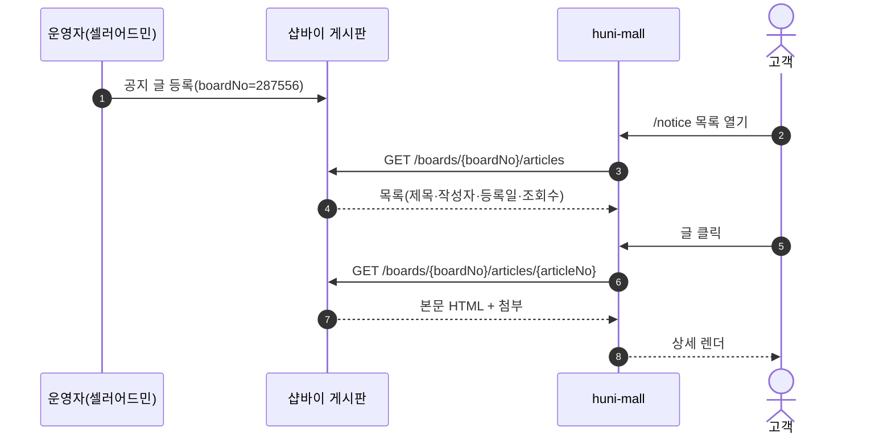
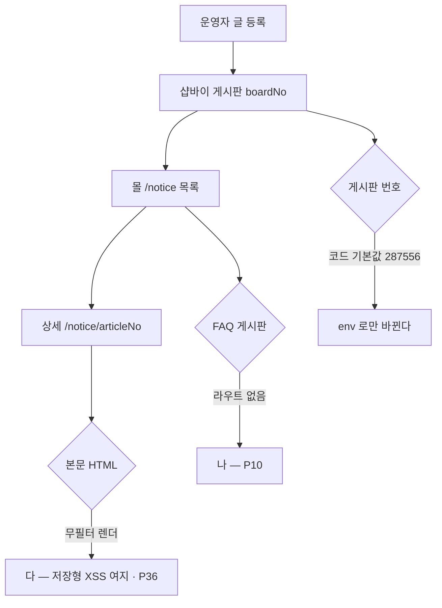

# P09 공지사항 등록·열람

> 카드 `t65` · 대분류 **정보·콘텐츠** · 중분류 공지 · 단계 3 · 빠진 곳 3

## 1. 한줄정의

운영자가 알리고 고객이 읽는 가장 기본 창구. 휴무·단가 변경·장애 공지가 여기로 나간다.

| | |
|---|---|
| **시작** | 운영자가 셀러어드민 게시판에 글을 올린다 |
| **끝** | 고객이 몰 공지사항 목록·상세에서 그 글을 읽는다 |
| **등장인물** | 운영자(셀러어드민) · 샵바이 게시판 · huni-mall · 고객 |

## 2. 흐름 — sequenceDiagram

## 3. 분기 — flowchart

## 4. 단계표

| # | 단계 | 시스템 | 담당자 | 원장 row_id | 상태 | 근거 |
|---:|---|---|---|---|---|---|
| 1 | 1. 공지사항 고객 화면(목록·상세) | huni-mall | 김동학+최숙진 | `STD-INF-005` | 부분 | https://shopby.huniprinting.co.kr/notice @ 2026-09-16 21:27 |
| 2 | 2. [구IA#64] 공지사항 관리(등록/수정/html생성) | 셀러어드민 | 최숙진 | `STD-INF-009` | 미실측 | IA No.64 공지사항 · webadmin 해당 없음 @ 2026-09-16 21:28 · 샵바이 게시판(R1d 미확인) |
| 3 | 3. 공지사항·FAQ 열람(고객 진입 경로) | huni-mall | 김동학 | `STD-CLM-018` | 부분 | huni-skin-shopby/src/app/(main)/notice/page.tsx:1-27 · src/lib/api/server/board.ts:1 (공지 done) — FAQ 라우트 부재(SB-056 absent) |

## 5. 빠진 곳

| id | 종류 | 내용 | 제안 담당 |
|---|---|---|---|
| `G-t65-025` | 다 — 코드는 있는데 연결 안 됨 | 공지 본문이 `notice/[articleNo]/page.tsx:69` 에서 필터 없이 렌더된다 — 운영자가 넣은 HTML 이 그대로 실행된다. 같은 문제가 상품설명(`configurator.tsx:77`)에도 있고 P36 에서 함께 다룬다. | 김동학 |
| `G-t65-026` | 다 — 코드는 있는데 연결 안 됨 | `STD-CLM-018`(공지사항·FAQ 열람) 중 공지 쪽만 동작하고 FAQ 쪽은 라우트가 없다. 원장 근거가 이미 「FAQ 라우트 부재」로 적혀 있다 — 한 행이 반만 충족된 상태다. | 김동학 |
| `G-t65-027` | 라 — 결정 미정 | 공지 게시판 번호가 코드 기본값 `287556`(`board.ts:14`)으로 박혀 있고 env 로만 덮인다. 게시판을 새로 파거나 몰을 바꾸면 조용히 빈 목록이 된다 — 환경변수 정합(P37)과 같은 뿌리다. | 김동학 |

## 6. 채우는 방법

1. **김동학** — 공지 본문에 sanitize 를 적용한다(P36 과 같은 작업 한 벌).
2. **최숙진** — 셀러어드민 게시판에 런칭 공지(휴무·배송 지연·단가 변경) 초기 글을 올린다.
3. **김동학** — 게시판 번호를 env 필수값으로 올리고 `.env.example` 에 적는다.

## 7. 확인 못 한 것

- 셀러어드민 게시판 관리 화면의 메뉴 이름·카테고리 설정을 확인하지 못했다.
- 공지 카테고리(`GET /boards/{boardNo}/categories`)를 쓸지 확인하지 못했다.
