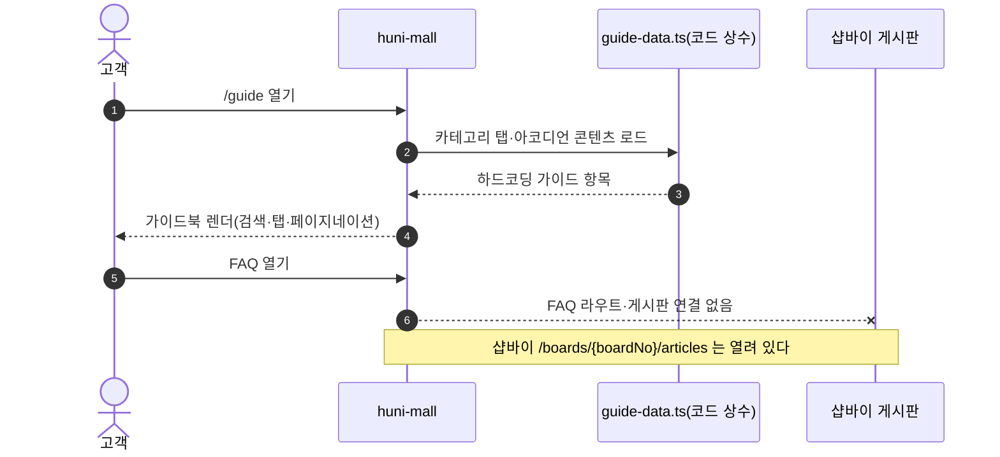
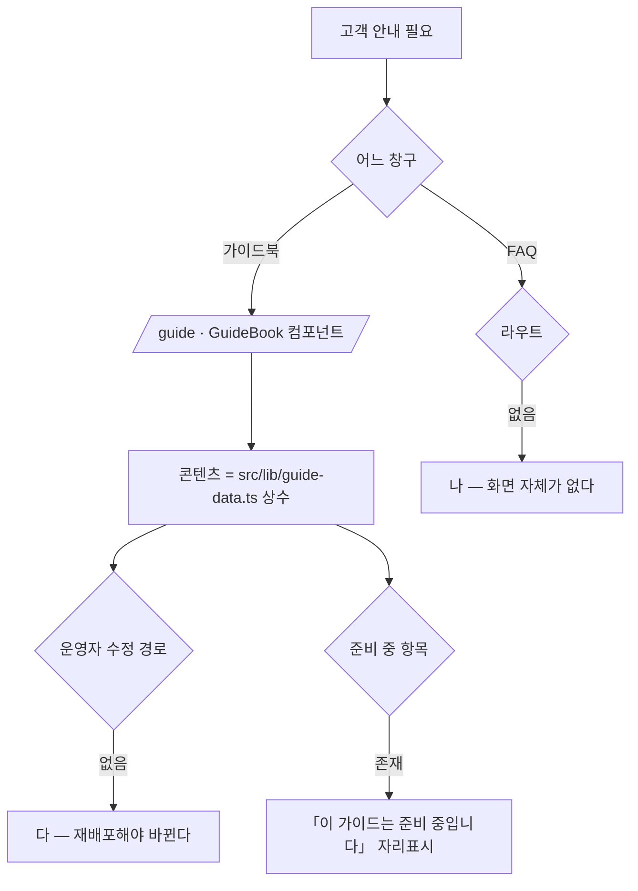

# P10 FAQ·가이드북 등록·열람

> 카드 `t65` · 대분류 **정보·콘텐츠** · 중분류 안내 · 단계 3 · 빠진 곳 3

## 1. 한줄정의

문의를 줄이는 두 축. 자주 묻는 질문과, 인쇄 주문에 필요한 작업 유의사항 가이드다.

| | |
|---|---|
| **시작** | 고객이 상단·하단 메뉴에서 가이드북 또는 FAQ 를 연다 |
| **끝** | 고객이 답을 찾아 문의 없이 주문으로 돌아간다 |
| **등장인물** | 고객 · huni-mall · 샵바이 게시판 · 운영자 |

## 2. 흐름 — sequenceDiagram

## 3. 분기 — flowchart

## 4. 단계표

| # | 단계 | 시스템 | 담당자 | 원장 row_id | 상태 | 근거 |
|---:|---|---|---|---|---|---|
| 1 | 1. 자주묻는질문(FAQ) 고객 화면 | huni-mall | 김동학 | `STD-INF-006` | 미착수 | https://shopby.huniprinting.co.kr/faq 404 @ 2026-09-16 21:27 |
| 2 | 2. 가이드북 고객 화면(작업 유의사항 11종) | huni-mall | 최숙진+김동학 | `STD-INF-007` | 부분 | https://shopby.huniprinting.co.kr/guide @ 2026-09-16 21:27 |
| 3 | 3. [구IA#65] 자주묻는질문 관리(운영자) | 셀러어드민 | 최숙진 | `STD-INF-010` | 미실측 | IA No.65 FAQ · webadmin 해당 없음 @ 2026-09-16 21:28 |

## 5. 빠진 곳

| id | 종류 | 내용 | 제안 담당 |
|---|---|---|---|
| `G-t65-028` | 나 — 행은 있는데 코드 0 | FAQ 고객 화면이 없다 — `src/app/(main)` 하위에 faq 라우트가 없다. 샵바이 게시판 API(`GET /boards/{boardNo}/articles`·`GET /boards/{boardNo}/categories`)는 공지와 같은 방식으로 열려 있어, 게시판 하나를 더 파고 공지 화면을 복제하면 된다. | 김동학 |
| `G-t65-029` | 다 — 코드는 있는데 연결 안 됨 | 가이드북은 화면이 다 만들어져 있는데 콘텐츠가 `src/lib/guide-data.ts` 상수다 — 운영자가 못 고친다. 게다가 일부 항목은 본문이 「이 가이드는 준비 중입니다. 곧 상세 내용이 업데이트됩니다.」 자리표시로 남아 있고, 「폰트 아웃라인 (Create Outlines) 미적용시 해결법」이 네 항목(outline-1~4)에 같은 제목으로 들어 있다. | 최숙진 |
| `G-t65-030` | 라 — 결정 미정 | FAQ 와 가이드북의 경계가 정해지지 않았다. 둘 다 「자주 묻는 것」을 담는데 하나는 게시판, 하나는 코드 상수라 같은 질문이 두 곳에 갈릴 수 있다. | 신우진 |

## 6. 채우는 방법

1. **최숙진** — 셀러어드민에 FAQ 게시판을 만들고 카테고리를 연다.
2. **김동학** — 공지 화면을 복제해 FAQ 목록·상세를 붙인다(같은 `board.ts` 재사용).
3. **최숙진** — 가이드북 「준비 중」 항목의 원고를 채우고 중복 제목 4건을 정리한다.
4. **신우진** — 가이드북 콘텐츠를 게시판으로 옮길지, 코드에 둘지 정한다.

## 7. 확인 못 한 것

- 가이드북 11종이 원장 행이 말하는 「작업 유의사항 11종」과 같은 목록인지 대조하지 못했다.
- 구 사이트 FAQ 의 문항 수·분류를 확인하지 못했다.
