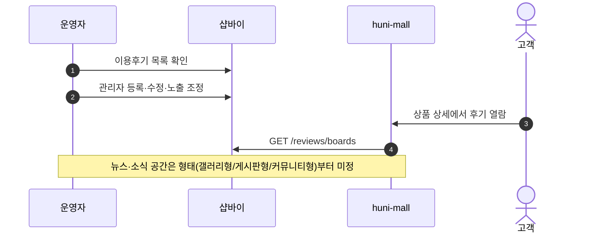
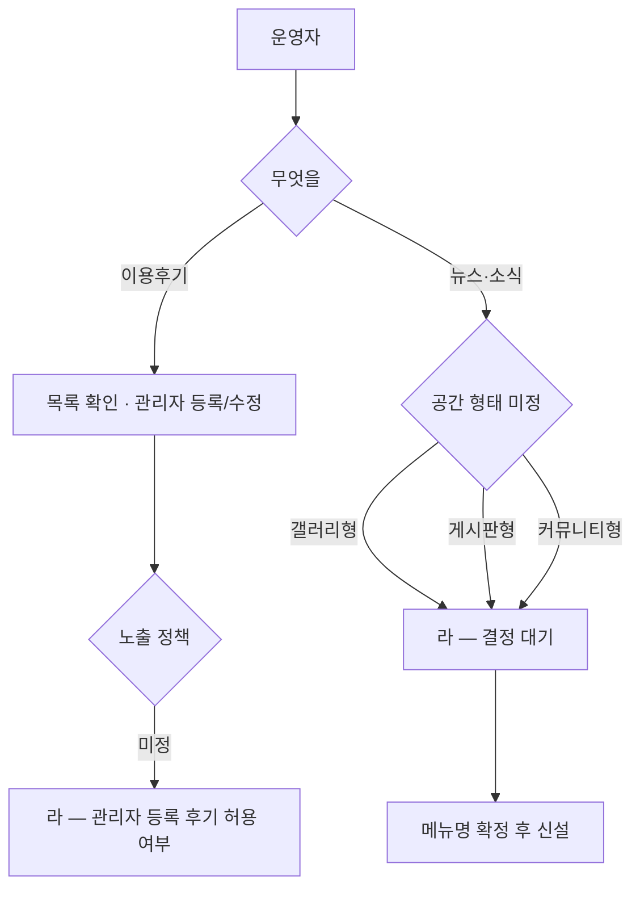

# P11 이용후기·뉴스 콘텐츠 운영

> 카드 `t65` · 대분류 **정보·콘텐츠** · 중분류 콘텐츠 · 단계 2 · 빠진 곳 3

## 1. 한줄정의

고객이 남긴 후기를 운영자가 관리하고, 회사 소식을 싣는 공간을 만드는 흐름. 후기는 t62 가 다루는 「고객이 쓰는 쪽」의 반대편, 운영자가 손대는 쪽이다.

| | |
|---|---|
| **시작** | 운영자가 후기 목록을 열거나 새 소식을 올리려 한다 |
| **끝** | 후기가 노출 상태로 정리되고, 소식 공간이 고객에게 보인다 |
| **등장인물** | 운영자(셀러어드민) · 샵바이 게시판 · huni-mall · 고객 |
| **가로지르는 카드** | t62 회원·혜택 카드 P14 — 고객이 쓰는 리뷰·보상 |

## 2. 흐름 — sequenceDiagram

## 3. 분기 — flowchart

## 4. 단계표

| # | 단계 | 시스템 | 담당자 | 원장 row_id | 상태 | 근거 |
|---:|---|---|---|---|---|---|
| 1 | 1. [구IA#72] 이용후기 관리(관리자 등록/수정) | 셀러어드민 | 최숙진 | `STD-INF-011` | 미실측 | IA No.72 이용후기 · 샵바이 상품후기(R1d 미확인) |
| 2 | 2. 뉴스·소식 공간 신설(형태·메뉴명 결정) | 결정(PM) | 김동학 | `STD-INF-012` | 미착수 | 후니-오픈잔여작업-실무진안내_260909.html §항목 5 · ④ 완료 기준 |

## 5. 빠진 곳

| id | 종류 | 내용 | 제안 담당 |
|---|---|---|---|
| `G-t65-031` | 라 — 결정 미정 | 뉴스·소식 공간의 **형태와 메뉴 이름**이 정해지지 않았다(갤러리형/게시판형/커뮤니티형 중 택1). 형태에 따라 게시판 하나로 끝날 수도, 새 화면을 만들어야 할 수도 있다. | 신우진 |
| `G-t65-032` | 라 — 결정 미정 | 관리자가 직접 등록한 후기를 허용할지 정해지지 않았다. 허용하면 표시 규칙(작성자 표기·구매 인증 배지)이 함께 필요하다. | 최숙진 |
| `G-t65-033` | 나 — 행은 있는데 코드 0 | 뉴스·소식 화면이 몰에 없다 — 형태가 정해지면 공지(P09)와 같은 게시판 배선으로 만들 수 있다. | 김동학 |

## 6. 채우는 방법

1. **신우진** — 뉴스·소식의 형태와 메뉴명을 정한다. 게시판형이면 P09 배선 재사용으로 끝난다.
2. **최숙진** — 관리자 등록 후기 허용 여부와 표시 규칙을 정한다.
3. **김동학** — 결정 뒤 화면을 붙인다.

## 7. 확인 못 한 것

- 셀러어드민 이용후기 관리 화면을 열어보지 못했다(원장도 「미실측」).
- 구 사이트에 뉴스·소식 공간이 있었는지 확인하지 못했다.
