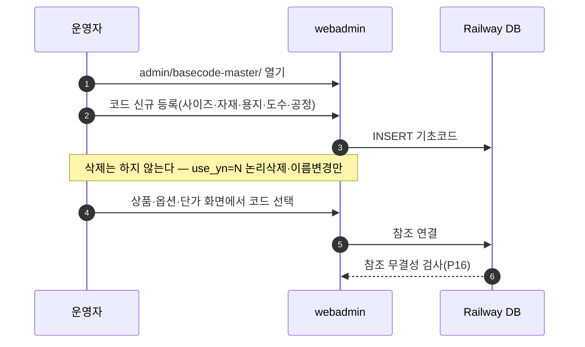
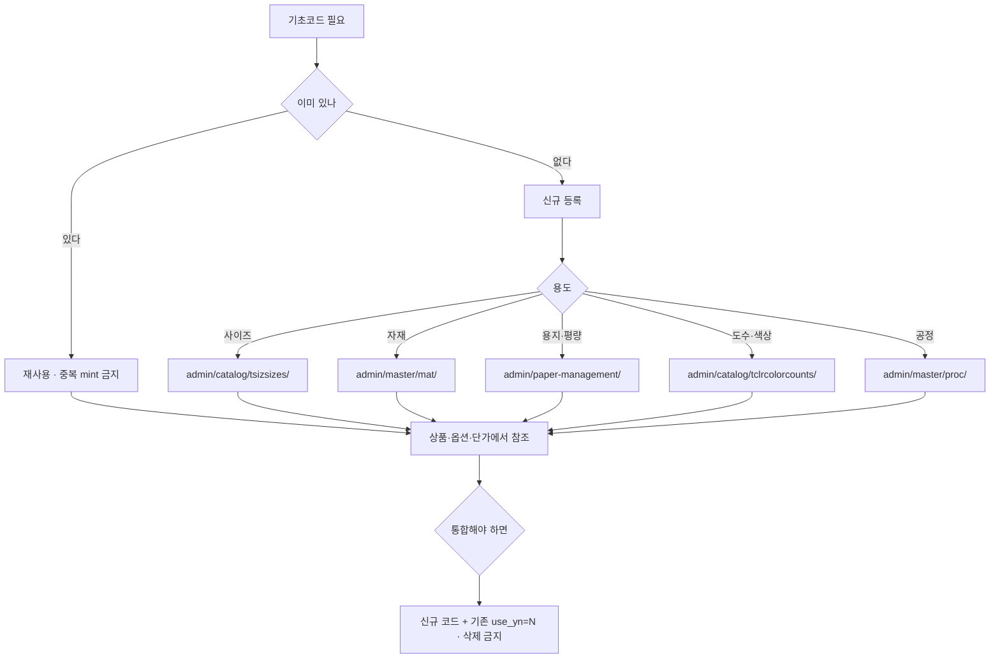

# P12 기초데이터 마스터 등록·관리

> 카드 `t65` · 대분류 **운영자·상품가격** · 중분류 기초데이터 · 단계 6 · 빠진 곳 2

## 1. 한줄정의

모든 상품·가격이 딛고 서는 바닥. 사이즈·자재·용지·도수·공정 코드를 먼저 세워야 그 위에 상품과 단가를 올릴 수 있다.

| | |
|---|---|
| **시작** | 운영자가 webadmin 기초코드 화면을 연다 |
| **끝** | 새 코드가 상품·옵션·단가에서 골라 쓸 수 있는 상태가 된다 |
| **등장인물** | 운영자(서희항) · webadmin · Railway DB |

## 2. 흐름 — sequenceDiagram

## 3. 분기 — flowchart

## 4. 단계표

| # | 단계 | 시스템 | 담당자 | 원장 row_id | 상태 | 근거 |
|---:|---|---|---|---|---|---|
| 1 | 1. 사이즈 마스터 등록·관리 | webadmin | 서희항 | `STD-ADP-001` | 작동 | https://huni-admin.printly.co.kr/admin/catalog/tsizsizes/@2026-09-16 21:28 |
| 2 | 2. 소재(자재) 마스터 등록·관리 | webadmin | 서희항 | `STD-ADP-002` | 작동 | https://huni-admin.printly.co.kr/admin/master/mat/@2026-09-16 21:28 |
| 3 | 3. 용지·평량 마스터 관리 | webadmin | 서희항 | `STD-ADP-003` | 작동 | https://huni-admin.printly.co.kr/admin/paper-management/@2026-09-16 21:28 |
| 4 | 4. 도수/색상 코드 관리 | webadmin | 서희항 | `STD-ADP-004` | 작동 | https://huni-admin.printly.co.kr/admin/catalog/tclrcolorcounts/@2026-09-16 21:28 |
| 5 | 5. 공정(후가공) 마스터 관리 | webadmin | 서희항 | `STD-ADP-005` | 작동 | https://huni-admin.printly.co.kr/admin/master/proc/@2026-09-16 21:33 |
| 6 | 6. 기초코드 논리삭제·이름변경 정책 적용 | webadmin | 서희항 | `STD-ADP-009` | 작동 | https://huni-admin.printly.co.kr/admin/basecode-master/@2026-09-16 21:28 |

## 5. 빠진 곳

| id | 종류 | 내용 | 제안 담당 |
|---|---|---|---|
| `G-t65-034` | 라 — 결정 미정 | 기초코드를 새로 만들 권한과 절차가 사람 규칙으로만 있다. 화면은 누구나 등록할 수 있어 중복 코드가 생기면 단가행이 갈라진다 — 이미 표시중복 정리 하네스가 따로 돌 만큼 쌓인 문제다. | 서희항 |
| `G-t65-035` | 다 — 코드는 있는데 연결 안 됨 | 여섯 화면이 각자 살아 있어 「이 코드를 쓰는 상품이 몇 건인가」를 한 화면에서 못 본다. 사용처 조회는 가격 구성요소 쪽에만 있다(`price-viewer/comp/{comp_cd}/usage/`). | 서희항 |

## 6. 채우는 방법

1. **서희항** — 기초코드 신설 승인 절차를 한 줄로 정한다(누가 승인하고 어디에 적는가).
2. **서희항** — 코드별 사용처 조회를 기초코드 화면에도 붙여 삭제 대신 통합을 유도한다.

## 7. 확인 못 한 것

- 여섯 화면 모두 원장 근거가 라이브 URL 방문 기록(@2026-09-16)이다 — 이번 카드에서 다시 열어보지 않았다.
- 기초코드 등록 권한이 계정별로 나뉘어 있는지 확인하지 못했다(P26 권한과 연결).
