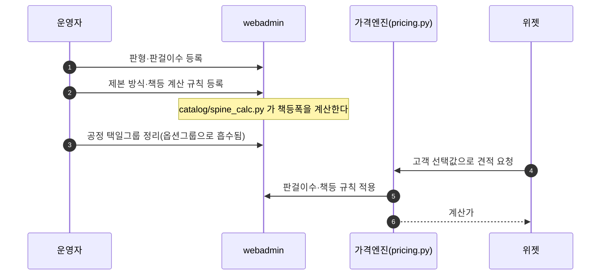
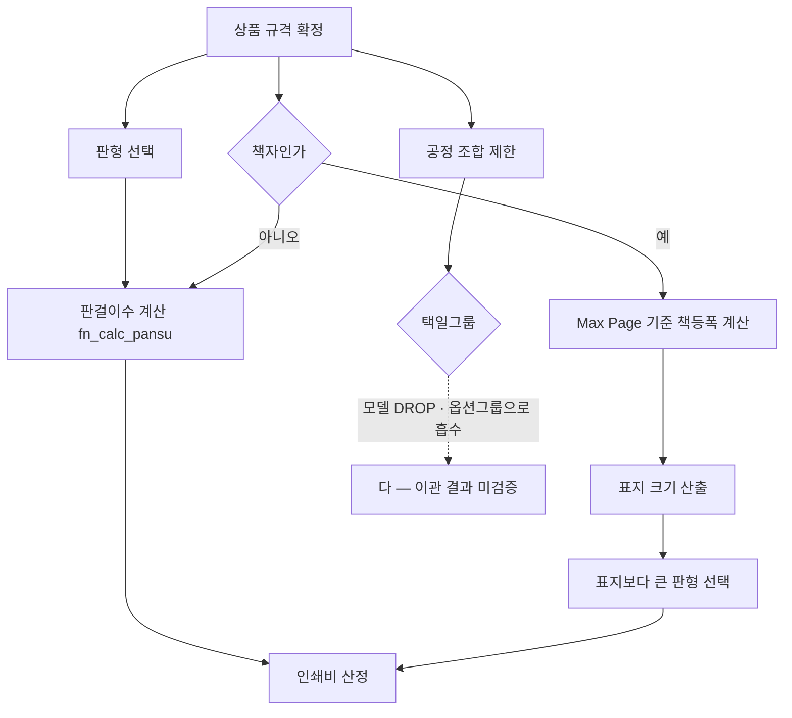

# P13 판형·제본·공정 규칙 관리

> 카드 `t65` · 대분류 **운영자·상품가격** · 중분류 기초데이터 · 단계 3 · 빠진 곳 3

## 1. 한줄정의

인쇄 고유의 규칙이 사는 곳. 원지에 몇 개를 앉힐 수 있는지(판걸이수), 책등이 몇 mm 인지, 어떤 공정을 함께 고를 수 없는지를 정한다.

| | |
|---|---|
| **시작** | 운영자가 판형·제본 규칙을 등록하거나 고친다 |
| **끝** | 위젯이 그 규칙대로 선택지를 좁히고 가격을 계산한다 |
| **등장인물** | 운영자(서희항) · webadmin · 위젯 · 가격엔진 |

## 2. 흐름 — sequenceDiagram

## 3. 분기 — flowchart

## 4. 단계표

| # | 단계 | 시스템 | 담당자 | 원장 row_id | 상태 | 근거 |
|---:|---|---|---|---|---|---|
| 1 | 1. 판형(출력판형)·판걸이수 관리 | webadmin | 서희항 | `STD-ADP-007` | 작동 | https://huni-admin.printly.co.kr/admin/product-viewer/?prd=PRD_000069@2026-09-16 21:30 |
| 2 | 2. 제본 방식 마스터·책등 계산 규칙 | webadmin | 서희항 | `STD-ADP-008` | 구현-미검증 | raw/webadmin/webadmin/config/urls.py:320-330 책등(spine) 계산 규칙 · raw/webadmin/webadmin/catalog/spine_calc.py:1 |
| 3 | 3. 공정 택일그룹 관리(옵션그룹 흡수분) | webadmin | 서희항 | `STD-ADP-006` | 구현-미검증 | raw/webadmin/webadmin/catalog/admin.py:1595 '(제거됨 — Phase 7/07-08) 공정 택일그룹 모델: 옵션그룹으로 흡수·DROP' · raw/webadmin/webadmin/config/urls.py:356-360 옵션그룹 CRUD |

## 5. 빠진 곳

| id | 종류 | 내용 | 제안 담당 |
|---|---|---|---|
| `G-t65-036` | 다 — 코드는 있는데 연결 안 됨 | 공정 택일그룹 모델이 제거되고 옵션그룹으로 흡수됐는데(`catalog/admin.py:1595` 「(제거됨 — Phase 7/07-08) 공정 택일그룹 모델: 옵션그룹으로 흡수·DROP」), 흡수 뒤 기존 택일 제약이 옵션그룹에서 같은 효과를 내는지 실화면으로 확인된 기록을 찾지 못했다. 원장 상태도 「구현-미검증」이다. | 서희항 |
| `G-t65-037` | 다 — 코드는 있는데 연결 안 됨 | 책등 계산(`catalog/spine_calc.py`)이 구현돼 있으나 「구현-미검증」이다. 책등폭 → 표지 크기 → 그보다 큰 판형 선택이라는 규칙이 실제 상품에서 재현되는지 확인이 남았다. | 서희항 |
| `G-t65-038` | 라 — 결정 미정 | 판걸이수 계산의 권위가 가격표 「판걸이수」 시트인데, 시트와 DB 등록값이 어긋날 때 어느 쪽을 고칠지 절차가 없다. | 서희항 |

## 6. 채우는 방법

1. **서희항** — 책자 상품 한 건으로 책등→표지→판형 경로를 가격시뮬레이터에서 실화면 재현한다.
2. **서희항** — 택일그룹이 옵션그룹으로 흡수된 뒤의 제약 동작을 제약규칙 시뮬레이션(P17)으로 확인한다.
3. **서희항** — 판걸이수 불일치 시 교정 방향(시트→DB)을 규칙으로 못 박는다.

## 7. 확인 못 한 것

- `spine_calc.py` 의 계산식과 가격표 시트의 책등 규칙이 같은지 대조하지 못했다.
- 택일그룹 DROP 전후의 제약 건수를 비교하지 못했다.
