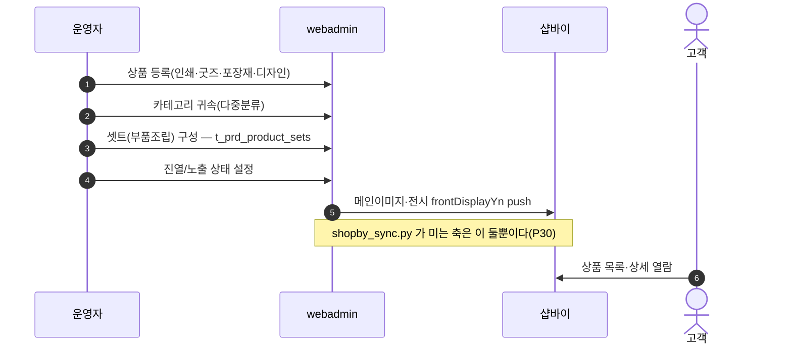
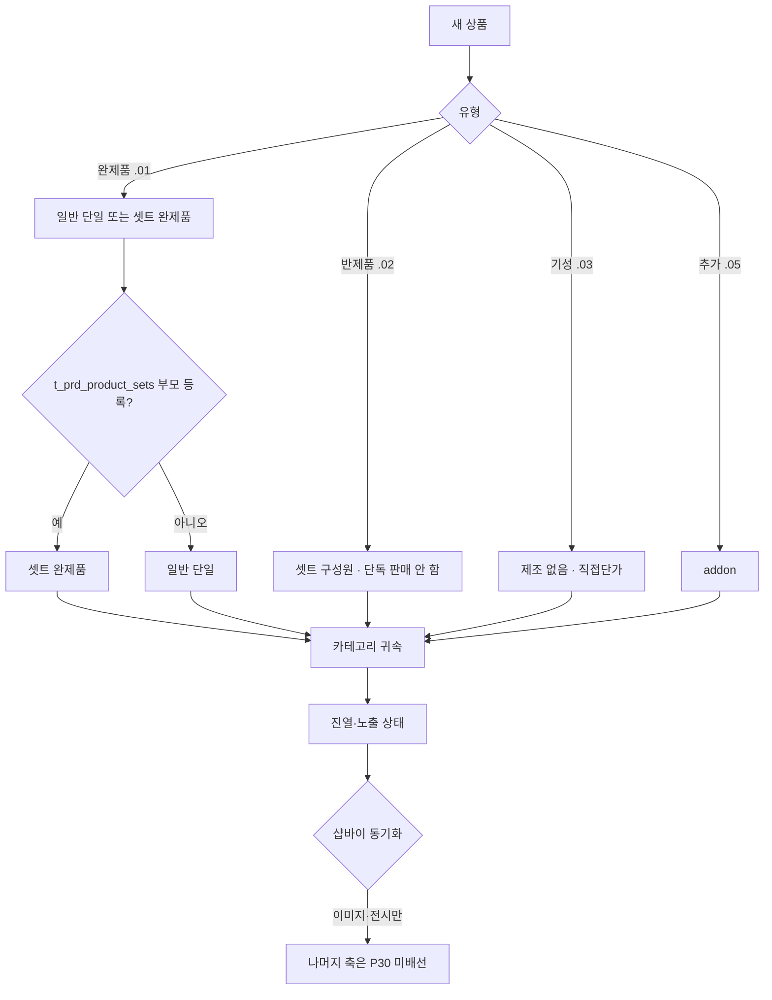

# P14 상품 등록·진열·셋트 구성

> 카드 `t65` · 대분류 **운영자·상품가격** · 중분류 상품 · 단계 9 · 빠진 곳 3

## 1. 한줄정의

팔 물건을 만드는 흐름. 인쇄·굿즈·포장재·디자인·수작 상품을 등록하고, 카테고리에 걸고, 셋트로 묶고, 노출 상태를 정한다.

| | |
|---|---|
| **시작** | 운영자가 새 상품을 webadmin 에 등록한다 |
| **끝** | 상품이 카테고리에 걸리고 진열 상태가 되어 고객에게 보인다 |
| **등장인물** | 운영자(서희항) · webadmin · 샵바이 · 고객 |
| **가로지르는 카드** | 상품·카탈로그(STD-CAT) 카드 — 고객이 보는 카탈로그·검색 |

## 2. 흐름 — sequenceDiagram

## 3. 분기 — flowchart

## 4. 단계표

| # | 단계 | 시스템 | 담당자 | 원장 row_id | 상태 | 근거 |
|---:|---|---|---|---|---|---|
| 1 | 1. 인쇄/제본 상품 등록 | webadmin | 서희항 | `STD-ADP-010` | 작동 | https://huni-admin.printly.co.kr/admin/product-viewer/@2026-09-16 21:28 |
| 2 | 2. 굿즈 상품 등록 | webadmin | 서희항 | `STD-ADP-011` | 작동 | https://huni-admin.printly.co.kr/admin/product-viewer/?prd=PRD_000146@2026-09-16 21:30 |
| 3 | 3. 포장재 상품 등록 | webadmin | 서희항 | `STD-ADP-012` | 작동 | https://huni-admin.printly.co.kr/admin/sku-catalog/@2026-09-16 21:28 |
| 4 | 4. 디자인 상품 등록 | webadmin | 서희항 | `STD-ADP-035` | 작동 | https://huni-admin.printly.co.kr/admin/design-md/@2026-09-16 21:33 |
| 5 | 5. 수작 상품 등록 | 미확인 | 서희항·최숙진 | `STD-ADP-034` | 미실측 | L3/legacy-normalized.json#F-111,IA-111,SCOPE-111 · _workspace/huni-launch-scope/02_gap/fit-gap-matrix.csv:112 · docs/huni/후니프린팅_통합IA_일정_역할분담_260616.xlsx#02_IA마스터!A112:K112 \|\| P1판정(260902): 수작 상품 등록은 셀러어드민 상품 등록 화면 소관 — 접속 보류로 확인 불가 |
| 6 | 6. 셋트(부품조립) 상품 구성 관리 | webadmin | 서희항 | `STD-ADP-016` | 작동 | https://huni-admin.printly.co.kr/admin/set-products/@2026-09-16 21:28 |
| 7 | 7. 상품-카테고리 귀속(다중분류) | webadmin | 서희항 | `STD-ADP-013` | 작동 | https://huni-admin.printly.co.kr/admin/catalog/tprdproducts/@2026-09-16 21:32 |
| 8 | 8. [구IA#59] 굿즈 카테고리 관리 | webadmin | 서희항 | `STD-ADP-036` | 작동 | https://huni-admin.printly.co.kr/admin/category-master/@2026-09-16 21:28 |
| 9 | 9. 상품 진열/노출 상태 관리 | webadmin | 서희항 | `STD-ADP-014` | 작동 | https://huni-admin.printly.co.kr/admin/catalog/tprdproducts/@2026-09-16 21:32 |

## 5. 빠진 곳

| id | 종류 | 내용 | 제안 담당 |
|---|---|---|---|
| `G-t65-039` | 라 — 결정 미정 | 수작 상품이 **어느 시스템에 사는지** 확정되지 않았다(원장 「미실측」·담당 「서희항·최숙진」 공동). webadmin 상품인지 셀러어드민 상품인지에 따라 가격·옵션·주문 경로가 통째로 달라진다. | 신우진 |
| `G-t65-040` | 다 — 코드는 있는데 연결 안 됨 | 상품을 등록해도 샵바이로 넘어가는 축이 메인이미지와 전시 여부 둘뿐이다(`shopby_sync.py:118`·`:315`). 시작가·옵션은 스킨이 webadmin 을 당겨 가는 pull 이라 「등록했는데 몰에서 안 보인다」가 여기서 갈린다 — P30 에서 이어진다. | 서희항 |
| `G-t65-041` | 라 — 결정 미정 | 상품 유형 5종(완제품·반제품·기성·디자인·추가) 중 디자인상품(.04)은 폐기·재분류 대상인데 `admin/design-md/` 화면이 살아 있다. 두 정본이 공존한다. | 서희항 |

## 6. 채우는 방법

1. **신우진** — 수작 상품이 사는 시스템을 정한다. 이 하나가 안 정해지면 등록도 가격도 못 건다.
2. **서희항** — `admin/design-md/` 가 남긴 디자인상품(.04) 행을 분류 SOT 에 맞춰 재분류한다.
3. **서희항** — 상품 등록 후 몰에 보이기까지의 체크리스트(동기화 축 포함)를 한 장으로 만든다.

## 7. 확인 못 한 것

- 수작 상품의 현재 등록 건수를 확인하지 못했다.
- 진열 상태와 샵바이 전시 여부가 어긋난 상품이 있는지 대조하지 못했다.
