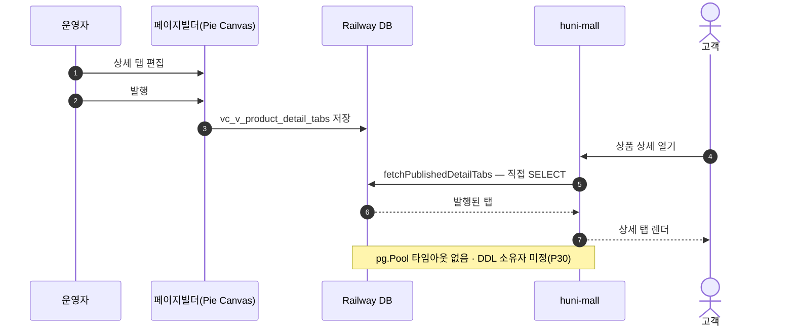
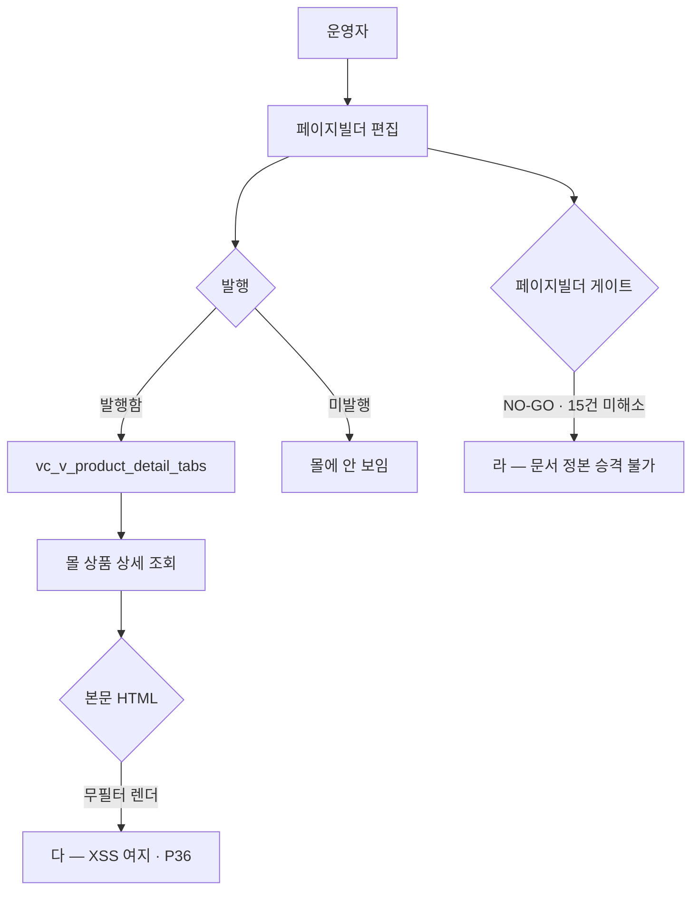

# P15 상품 상세페이지 콘텐츠 편집·발행

> 카드 `t65` · 대분류 **운영자·상품가격** · 중분류 상품 · 단계 2 · 빠진 곳 3

## 1. 한줄정의

상품 아래 붙는 설명 탭을 운영자가 만들어 발행하고, 몰이 그것을 읽어 보여주는 흐름. 편집은 페이지빌더(Pie Canvas), 조회는 몰이다.

| | |
|---|---|
| **시작** | 운영자가 페이지빌더에서 상세 탭을 편집한다 |
| **끝** | 발행된 탭이 몰 상품 상세에 보인다 |
| **등장인물** | 운영자 · 페이지빌더(Pie Canvas) · Railway DB · huni-mall · 고객 |
| **가로지르는 카드** | 시스템·플랫폼 — 페이지 빌더 트랙(STD-SYS-021) |

## 2. 흐름 — sequenceDiagram

## 3. 분기 — flowchart

## 4. 단계표

| # | 단계 | 시스템 | 담당자 | 원장 row_id | 상태 | 근거 |
|---:|---|---|---|---|---|---|
| 1 | 1. 상품 상세페이지 콘텐츠 편집 | 페이지빌더 | 김동학 | `STD-ADP-015` | 부분 | huni-skin-shopby/src/app/(main)/product/[slug]/page.tsx:51-56 Pie Canvas 발행 상세탭 조회 |
| 2 | 2. 페이지 빌더(운영자 화면 편집) 구축 | 페이지빌더 | 김동학 | `STD-SYS-021` | 미착수 | print-quote/04_design/ia.md §2.3 빌더 트랙 · L4 사유: 페이지빌더 게이트 NO-GO — 문서 정본 승격 불가. 15건 전부 미해소. |

## 5. 빠진 곳

| id | 종류 | 내용 | 제안 담당 |
|---|---|---|---|
| `G-t65-042` | 라 — 결정 미정 | 페이지빌더 게이트가 NO-GO 이고 미해소 15건이 남아 있어 설계 문서가 정본으로 올라가지 못했다. 그 상태에서 몰은 이미 발행 결과를 읽고 있다 — 읽는 쪽이 쓰는 쪽보다 먼저 서 있다. | 신우진 |
| `G-t65-043` | 다 — 코드는 있는데 연결 안 됨 | 몰이 Railway 뷰 `vc_v_product_detail_tabs` 를 직접 SELECT 하는데 `publications.ts:48-56` 의 `pg.Pool` 에 타임아웃 옵션이 없다. DB 가 느려지면 상품 상세가 통째로 멈춘다. 이 뷰의 DDL 소유자도 정해져 있지 않다. | 김동학 |
| `G-t65-044` | 라 — 결정 미정 | 상세 탭을 상품마다 만들지, 상품군 공통으로 만들지가 정해지지 않았다. 상품 수만큼 탭을 만들면 운영 부담이 그대로 곱해진다. | 신우진 |

## 6. 채우는 방법

1. **신우진** — 페이지빌더 게이트 미해소 15건을 닫거나, 1차 런칭에서 뺄 범위를 정한다.
2. **김동학** — `pg.Pool` 에 연결·질의 타임아웃을 넣는다(포크에 이미 적용된 변경이 있다).
3. **신우진** — 상세 탭의 공통/개별 경계를 정한다.

## 7. 확인 못 한 것

- 페이지빌더(Pie Canvas) 저장소를 이번 카드에서 열어보지 않았다 — 편집 화면의 실제 버튼 라벨을 적지 않았다.
- 현재 발행된 상세 탭이 몇 개 상품에 붙어 있는지 세지 못했다.
