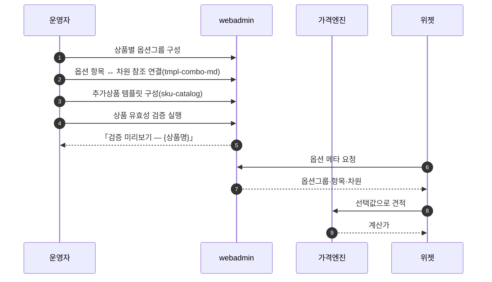
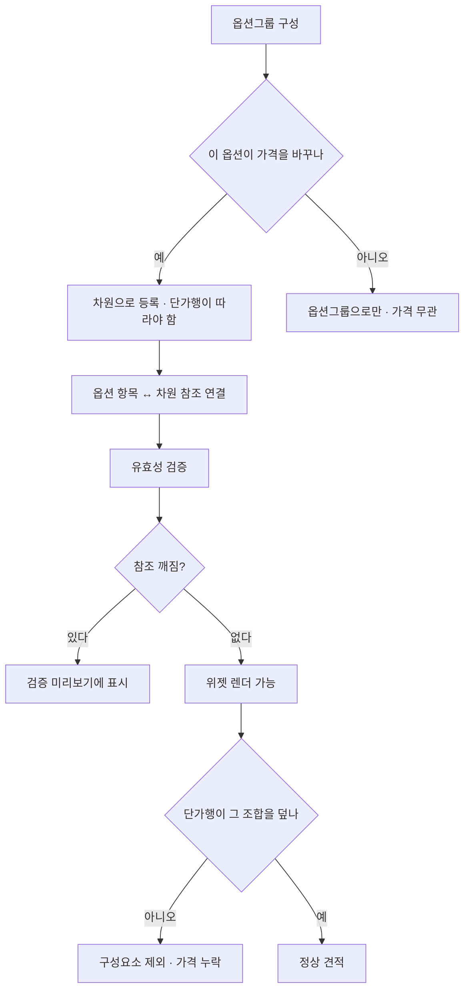

# P16 옵션그룹 구성·차원 연결·무결성 검증

> 카드 `t65` · 대분류 **운영자·상품가격** · 중분류 옵션 · 단계 4 · 빠진 곳 3

## 1. 한줄정의

고객이 위젯에서 고르는 것들을 만드는 흐름. 옵션그룹을 짜고, 각 항목을 가격 차원(사이즈·용지·도수 같은 가격축)에 연결하고, 연결이 성한지 검사한다.

| | |
|---|---|
| **시작** | 운영자가 상품에 옵션그룹을 붙인다 |
| **끝** | 위젯이 그 옵션으로 화면을 그리고 가격이 계산된다 |
| **등장인물** | 운영자(서희항) · webadmin · 위젯 · 가격엔진 |

## 2. 흐름 — sequenceDiagram

## 3. 분기 — flowchart

## 4. 단계표

| # | 단계 | 시스템 | 담당자 | 원장 row_id | 상태 | 근거 |
|---:|---|---|---|---|---|---|
| 1 | 1. 상품별 옵션그룹 구성 | webadmin | 서희항 | `STD-ADP-017` | 구현-미검증 | raw/webadmin/webadmin/config/urls.py:356-360 옵션그룹/옵션/항목 CRUD |
| 2 | 2. 옵션 항목 ↔ 차원 참조 연결 | webadmin | 서희항 | `STD-ADP-018` | 작동 | https://huni-admin.printly.co.kr/admin/tmpl-combo-md/@2026-09-16 21:28 |
| 3 | 3. 추가상품 템플릿 구성 | webadmin | 서희항 | `STD-ADP-020` | 작동 | https://huni-admin.printly.co.kr/admin/sku-catalog/@2026-09-16 21:28 |
| 4 | 4. 옵션 참조 무결성 검증 | webadmin | 서희항 | `STD-ADP-019` | 구현-미검증 | raw/webadmin/webadmin/config/urls.py:373 상품 유효성 검증(validate) |

## 5. 빠진 곳

| id | 종류 | 내용 | 제안 담당 |
|---|---|---|---|
| `G-t65-045` | 다 — 코드는 있는데 연결 안 됨 | 옵션그룹 CRUD(`config/urls.py:356-360`)와 유효성 검증(`:373`)이 구현돼 있으나 둘 다 원장 상태가 「구현-미검증」이다. 검증이 무엇을 잡고 무엇을 놓치는지 실화면 기록을 찾지 못했다. | 서희항 |
| `G-t65-046` | 라 — 결정 미정 | 옵션(가격 무관)과 차원(가격축)의 경계가 화면에서 구분되지 않아 운영자가 가격에 영향 없는 것을 차원으로 올리거나 그 반대를 하기 쉽다. 적재 거버넌스 하네스가 따로 도는 이유이기도 하다. | 서희항 |
| `G-t65-047` | 나 — 행은 있는데 코드 0 | 유효성 검증 결과를 정기적으로 돌려 보는 절차가 없다. 지금은 사람이 생각날 때 누른다. | 서희항 |

## 6. 채우는 방법

1. **서희항** — 유효성 검증을 상품 전수로 한 번 돌려 결과를 원장화한다.
2. **서희항** — 옵션 vs 차원 판정 기준을 화면 도움말로 붙인다.
3. **서희항** — 검증을 배치로 돌려 실패 목록을 「상품별 기본사양가」처럼 목록 화면으로 남긴다.

## 7. 확인 못 한 것

- 「검증 미리보기」가 검사하는 규칙 목록을 코드에서 끝까지 따라가지 않았다.
- 추가상품 템플릿이 실제로 몇 상품에 붙어 있는지 세지 못했다.
