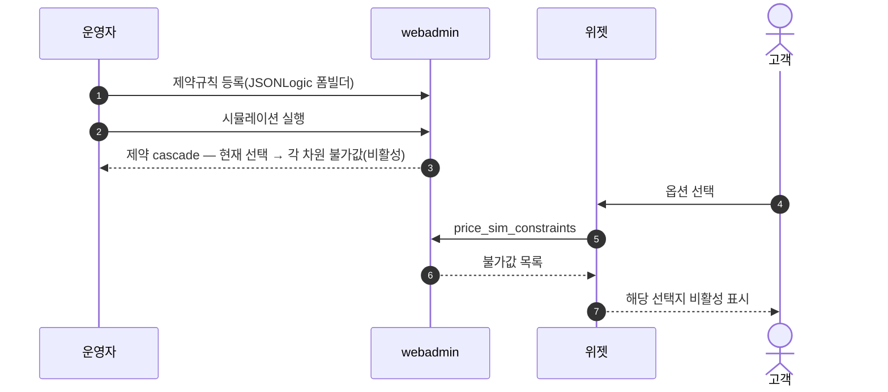
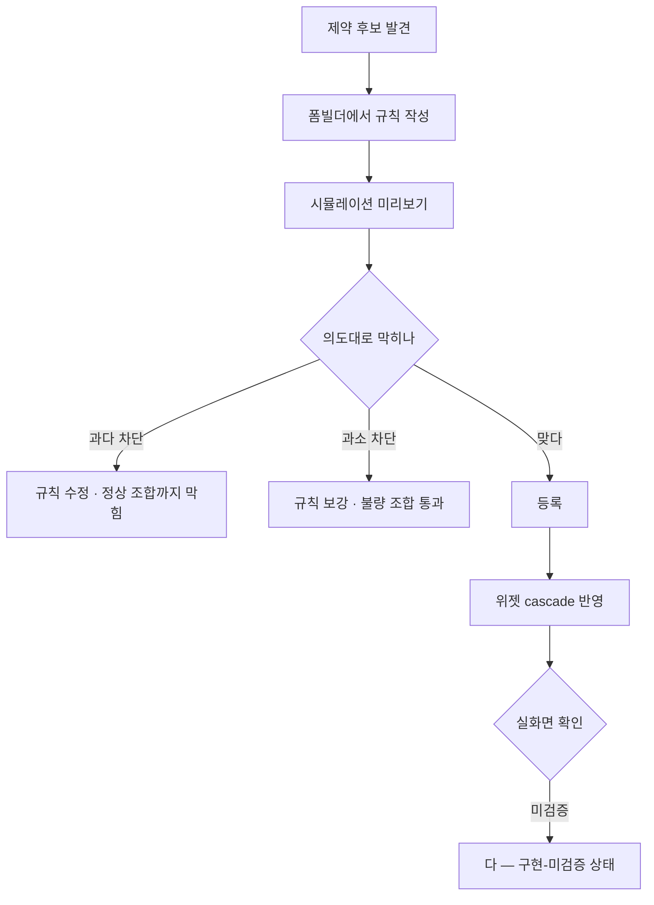

# P17 제약규칙 등록·시뮬레이션

> 카드 `t65` · 대분류 **운영자·상품가격** · 중분류 제약 · 단계 2 · 빠진 곳 3

## 1. 한줄정의

「이건 저것과 같이 못 고른다」를 시스템에 넣는 흐름. 인쇄에서는 잘못된 조합이 곧 불량이라 고르기 전에 막아야 한다.

| | |
|---|---|
| **시작** | 운영자가 제약규칙 폼빌더에서 규칙을 만든다 |
| **끝** | 위젯에서 불가능한 조합이 비활성으로 보인다 |
| **등장인물** | 운영자(서희항) · webadmin · 위젯 · 고객 |

## 2. 흐름 — sequenceDiagram

## 3. 분기 — flowchart

## 4. 단계표

| # | 단계 | 시스템 | 담당자 | 원장 row_id | 상태 | 근거 |
|---:|---|---|---|---|---|---|
| 1 | 1. 제약규칙 등록(UI 폼빌더) | webadmin | 서희항 | `STD-ADP-021` | 구현-미검증 | raw/webadmin/webadmin/config/urls.py:371 제약규칙(JSONLogic) 관리 · raw/webadmin/webadmin/catalog/models.py:801 제약 모델 |
| 2 | 2. 제약규칙 시뮬레이션·미리보기 | webadmin | 서희항 | `STD-ADP-022` | 구현-미검증 | raw/webadmin/webadmin/config/urls.py:169 price_sim_constraints — '제약 cascade: 현재 선택 → 각 차원 불가값(비활성)' |

## 5. 빠진 곳

| id | 종류 | 내용 | 제안 담당 |
|---|---|---|---|
| `G-t65-048` | 다 — 코드는 있는데 연결 안 됨 | 제약규칙 관리(`config/urls.py:371` JSONLogic)와 모델(`catalog/models.py:801`), 시뮬레이션(`config/urls.py:169` `price_sim_constraints` — 「제약 cascade: 현재 선택 → 각 차원 불가값(비활성)」)이 다 구현돼 있는데 둘 다 「구현-미검증」이다. 만든 규칙이 위젯에서 같은 결과를 내는지 실화면 기록이 없다. | 서희항 |
| `G-t65-049` | 라 — 결정 미정 | 과다 차단(정상 조합까지 막힘)을 어떻게 잡아낼지 절차가 없다. 제약은 틀려도 화면이 조용해서 매출이 조용히 새는 쪽이다. | 서희항 |
| `G-t65-050` | 나 — 행은 있는데 코드 0 | 제약규칙 전수 목록과 그 규칙이 붙은 상품 수를 한 화면에서 보는 곳이 없다. | 서희항 |

## 6. 채우는 방법

1. **서희항** — 제약이 걸린 상품 1건을 골라 폼빌더 → 시뮬레이션 → 위젯 실화면까지 한 줄로 재현한다.
2. **서희항** — 과다 차단 점검을 위해 「정상이어야 하는 조합」 목록을 먼저 만들고 그것이 안 막히는지 본다.
3. **서희항** — 제약규칙 전수 목록 화면을 붙인다.

## 7. 확인 못 한 것

- 현재 등록된 제약규칙 건수를 확인하지 못했다.
- 폼빌더 화면의 실제 버튼 라벨을 확인하지 못했다(`constraint_builder.html` 의 제목이 변수 `{{ title }}` 이다).
