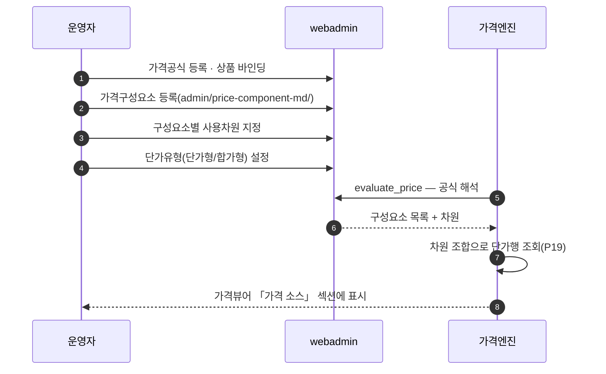
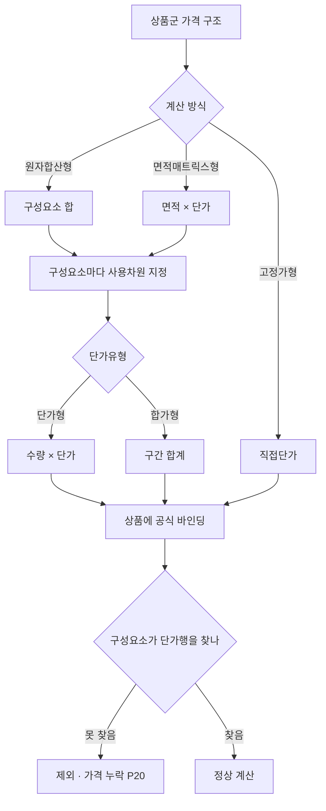

# P18 가격공식·구성요소 설계·바인딩

> 카드 `t65` · 대분류 **운영자·상품가격** · 중분류 가격 · 단계 3 · 빠진 곳 3

## 1. 한줄정의

가격이 어떤 항목의 합으로 이뤄지는지를 정하는 흐름. 공식을 만들고, 구성요소를 만들고, 구성요소마다 어떤 차원으로 단가를 찾을지 지정해 상품에 건다.

| | |
|---|---|
| **시작** | 운영자가 상품군의 가격 구조를 설계한다 |
| **끝** | 상품에 공식이 바인딩되고 구성요소가 단가를 찾을 준비가 된다 |
| **등장인물** | 운영자(서희항) · webadmin · 가격엔진(pricing.py) |

## 2. 흐름 — sequenceDiagram

## 3. 분기 — flowchart

## 4. 단계표

| # | 단계 | 시스템 | 담당자 | 원장 row_id | 상태 | 근거 |
|---:|---|---|---|---|---|---|
| 1 | 1. 가격공식 등록·상품 바인딩 | webadmin | 서희항 | `STD-ADP-023` | 작동 | https://huni-admin.printly.co.kr/admin/price-viewer/?prd=PRD_000069@2026-09-16 21:30 |
| 2 | 2. 가격구성요소 등록·차원 지정 | webadmin | 서희항 | `STD-ADP-024` | 작동 | https://huni-admin.printly.co.kr/admin/price-component-md/@2026-09-16 21:28 |
| 3 | 3. 단가유형(단가형/합가형) 설정 | webadmin | 서희항 | `STD-ADP-026` | 구현-미검증 | raw/webadmin/webadmin/catalog/admin.py:2816 'Phase 11: 사용차원 순서지정 위젯 + 단가유형 그룹제한(basecodes prc_typ_cd)' |

## 5. 빠진 곳

| id | 종류 | 내용 | 제안 담당 |
|---|---|---|---|
| `G-t65-051` | 다 — 코드는 있는데 연결 안 됨 | 단가유형 설정이 「구현-미검증」이다 — `catalog/admin.py:2816` 이 「Phase 11: 사용차원 순서지정 위젯 + 단가유형 그룹제한(basecodes prc_typ_cd)」 으로 기록돼 있으나 실제 계산에서 단가형/합가형이 갈리는 것을 확인한 기록을 찾지 못했다. | 서희항 |
| `G-t65-052` | 라 — 결정 미정 | 가격공식의 권위가 상품마스터 「계산공식집초안」 시트인데, 시트와 등록 공식이 어긋날 때 누가 어느 쪽을 고치는지 절차가 없다. | 서희항 |
| `G-t65-053` | 나 — 행은 있는데 코드 0 | 구성요소가 어떤 상품군에 유효한지(배선 유효성)를 검사하는 장치가 없다. 엉뚱한 상품군에 구성요소가 붙어도 화면은 조용하다. | 서희항 |

## 6. 채우는 방법

1. **서희항** — 단가형/합가형이 갈리는 상품 각 1건으로 가격시뮬레이터 결과를 비교한다.
2. **서희항** — 「계산공식집초안」 시트와 등록 공식의 대조표를 만들고 불일치를 목록화한다.
3. **서희항** — 구성요소↔상품군 유효성 검사를 유효성 검증(P16)에 얹는다.

## 7. 확인 못 한 것

- 등록된 가격공식 수와 바인딩된 상품 수를 세지 못했다.
- `prc_typ_cd` 기초코드의 실제 값 목록을 확인하지 못했다.
