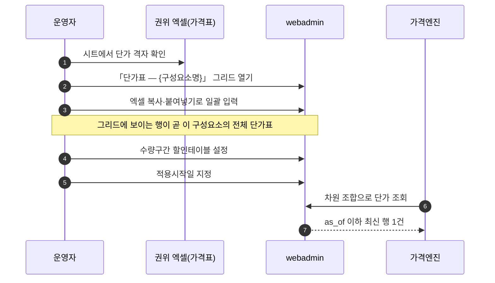
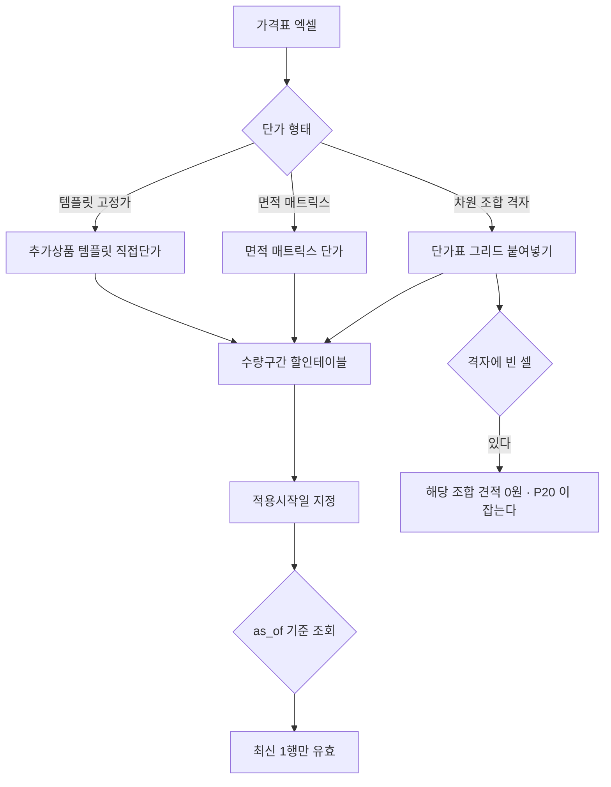

# P19 단가행 적재·할인·이력 관리

> 카드 `t65` · 대분류 **운영자·상품가격** · 중분류 가격 · 단계 5 · 빠진 곳 3

## 1. 한줄정의

숫자가 실제로 들어가는 구간. 구성요소마다 차원 조합별 단가를 넣고, 수량 구간 할인을 걸고, 언제부터 적용할지 날짜를 붙인다.

| | |
|---|---|
| **시작** | 운영자가 가격표 엑셀을 들고 단가표 화면을 연다 |
| **끝** | 적용시작일이 지난 단가로 견적이 계산된다 |
| **등장인물** | 운영자(서희항) · webadmin · 권위 엑셀(가격표) · 가격엔진 |

## 2. 흐름 — sequenceDiagram

## 3. 분기 — flowchart

## 4. 단계표

| # | 단계 | 시스템 | 담당자 | 원장 row_id | 상태 | 근거 |
|---:|---|---|---|---|---|---|
| 1 | 1. 단가행 일괄 등록(엑셀 복사·붙여넣기) | webadmin | 서희항 | `STD-ADP-025` | 구현-미검증 | raw/webadmin/webadmin/catalog/price_views.py:1650 '그리드에 보이는 행이 곧 이 구성요소의 전체 단가표(엑셀처럼)' · raw/webadmin/webadmin/catalog/templates/catalog/comp_price_grid_page.html:142-145 엑셀 복사·붙여넣기 |
| 2 | 2. 면적 매트릭스 단가 관리 | webadmin | 서희항 | `STD-ADP-028` | 구현-미검증 | raw/webadmin/webadmin/config/urls.py:144-148 단가 그리드(차원 조합 행) · raw/webadmin/webadmin/catalog/pricing.py:1 evaluate_price |
| 3 | 3. 템플릿 직접단가 관리 | webadmin | 서희항 | `STD-ADP-029` | 작동 | https://huni-admin.printly.co.kr/admin/price-viewer/?prd=PRD_000146@2026-09-16 21:30 |
| 4 | 4. 수량구간 할인테이블 관리 | webadmin | 서희항 | `STD-ADP-027` | 작동 | https://huni-admin.printly.co.kr/admin/discount-table-md/@2026-09-16 21:28 |
| 5 | 5. 가격 적용시작일 기반 이력 관리 | webadmin | 서희항 | `STD-ADP-030` | 작동 | https://huni-admin.printly.co.kr/admin/price-viewer/?prd=PRD_000069@2026-09-16 21:30 |

## 5. 빠진 곳

| id | 종류 | 내용 | 제안 담당 |
|---|---|---|---|
| `G-t65-054` | 다 — 코드는 있는데 연결 안 됨 | 단가행 일괄 등록과 면적 매트릭스가 둘 다 「구현-미검증」이다. `price_views.py:1650` 이 「그리드에 보이는 행이 곧 이 구성요소의 전체 단가표(엑셀처럼)」 라고 적어 둔 대로 동작하는지, 붙여넣기 실패가 조용히 넘어가지 않는지 확인 기록을 찾지 못했다. | 서희항 |
| `G-t65-055` | 나 — 행은 있는데 코드 0 | 적재된 격자에 **빈 셀이 남았는지** 한 화면에서 보는 장치가 없다. 빈 셀은 계산에서 그 조합만 조용히 빠지므로 「가격이 이상하다」가 뒤늦게 발견된다. 가격테이블 무결성 하네스가 따로 도는 이유다. | 서희항 |
| `G-t65-056` | 라 — 결정 미정 | 가격표 엑셀 최신본 판정 절차가 사람 기억에 걸려 있다. 파일명 날짜를 믿었다가 구본을 적재한 전례가 있다. | 서희항 |

## 6. 채우는 방법

1. **서희항** — 구성요소 1건으로 엑셀 붙여넣기 → 저장 → 가격시뮬레이터 재계산까지 실화면으로 한 줄 재현한다.
2. **서희항** — 격자 빈 셀 수를 구성요소별로 세는 화면(또는 배치)을 붙인다.
3. **서희항** — 적재 전 「권위 엑셀 최신본 확인」을 절차의 첫 칸으로 못 박는다.

## 7. 확인 못 한 것

- 현재 등록된 단가행 총 건수와 빈 셀 비율을 세지 못했다.
- 붙여넣기 시 행 수가 시트와 다르면 어떻게 되는지 확인하지 못했다.
