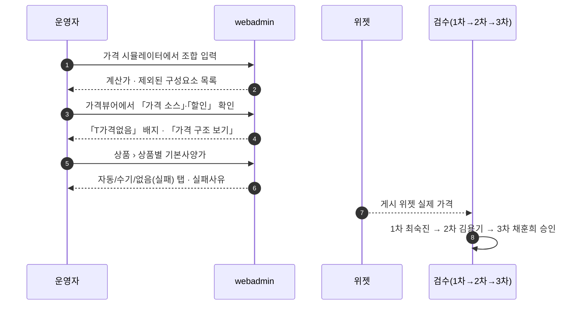
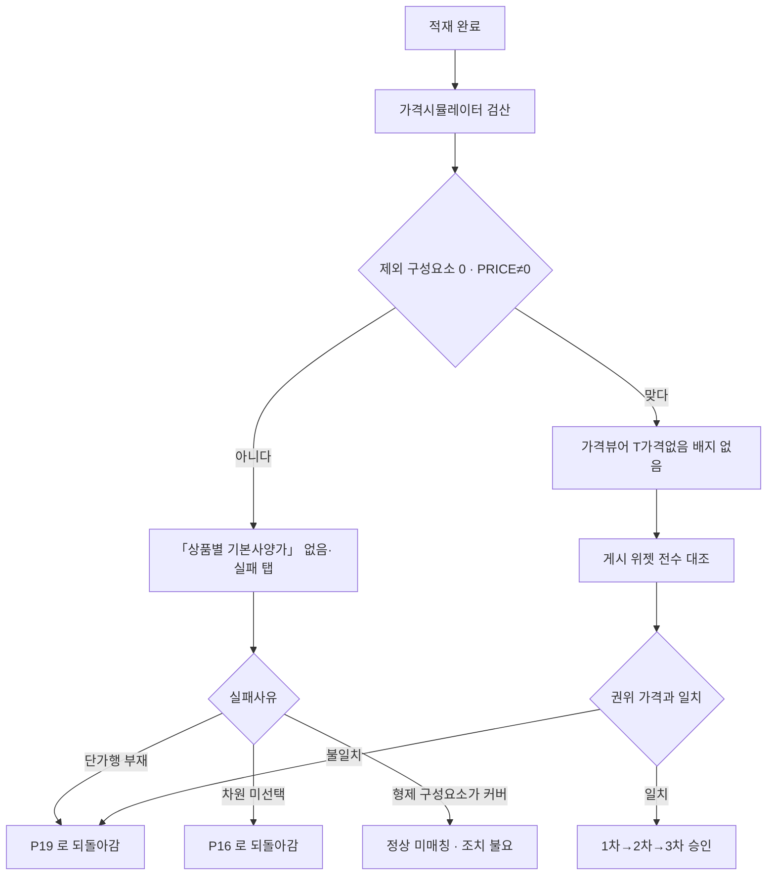

# P20 가격 검산·기본사양가 진단·게시 위젯 전수 대조

> 카드 `t65` · 대분류 **운영자·상품가격** · 중분류 가격 · 단계 4 · 빠진 곳 3

## 1. 한줄정의

넣은 숫자가 맞는지 되짚는 흐름. 운영자가 손으로 검산하고, 0원으로 떨어지는 상품을 목록으로 잡고, 게시된 위젯 전수를 권위 가격과 대조한다.

| | |
|---|---|
| **시작** | 단가 적재가 끝나고 「이 값이 맞나」를 확인해야 하는 순간 |
| **끝** | 게시 위젯 가격이 권위 가격과 일치한다는 3차 승인까지 끝난다 |
| **등장인물** | 운영자(서희항) · webadmin · 위젯 · 검수자(최숙진·김용기·채훈희) |
| **가로지르는 카드** | 위젯(STD-OPT 견적) — 고객이 실제로 보는 가격 |

## 2. 흐름 — sequenceDiagram

## 3. 분기 — flowchart

## 4. 단계표

| # | 단계 | 시스템 | 담당자 | 원장 row_id | 상태 | 근거 |
|---:|---|---|---|---|---|---|
| 1 | 1. 가격 시뮬레이터(운영자 검산) | webadmin | 서희항 | `STD-ADP-031` | 작동 | https://huni-admin.printly.co.kr/admin/price-simulator/@2026-09-16 21:28 |
| 2 | 2. 가격뷰어(계산 결과 조회) | webadmin | 서희항 | `STD-ADP-032` | 작동 | https://huni-admin.printly.co.kr/admin/price-viewer/@2026-09-16 21:28 |
| 3 | 3. 가격 미산출(0원) 진단 — 「상품 › 상품별 기본사양가」 없음(실패) 탭 | webadmin | 서희항 | `STD-ADP-033` | 작동 | https://huni-admin.printly.co.kr/admin/start-price/@2026-09-16 21:29 |
| 4 | 4. 게시 위젯 가격 전수 대조(1차→2차→3차 승인) | 위젯 | 서희항 | `STD-ADP-037` | 부분 | 후니정기미팅 정리260915.html §가격·템플릿 데이터 · 미결 1 / 후니-오픈잔여작업-실무진안내_260909.html §항목 1 · ④ 완료 기준 |

## 5. 빠진 곳

| id | 종류 | 내용 | 제안 담당 |
|---|---|---|---|
| `G-t65-057` | 다 — 코드는 있는데 연결 안 됨 | 원장 행 이름은 「가격 미산출(0원) 상품 진단 리포트」인데 그 근거가 가리키는 `admin/start-price/` 화면의 실제 이름은 **「상품 › 상품별 기본사양가」** 다(운영자 매뉴얼 `tools/manual_content.py:696`·화면 title `catalog/start_price_views.py:57`). 이 화면은 진단 리포트가 아니라 **자사몰 목록에 나갈 대표가를 관리하는 화면**이고, 자동/수기/없음(실패) 탭과 실패사유 열이 0원 진단 구실을 겸한다. 매뉴얼은 기본사양가가 「예전 이름 시작가 · API 필드 `start_price` · 최저가가 아니다」 라고 못 박아 두었다(`manual_content.py:77`) — 원장 행 이름으로는 이 화면을 찾을 수 없다. | 서희항 |
| `G-t65-058` | 나 — 행은 있는데 코드 0 | 게시 위젯 전수 대조가 아직 「부분」이다. 대조 결과를 담는 원장이 없어 어디까지 봤는지가 사람 기억에 남는다. 3차 승인 체계만 정해져 있다. | 서희항 |
| `G-t65-059` | 라 — 결정 미정 | 제외된 구성요소가 「진짜 결함」인지 「형제 구성요소가 이미 커버하는 정상 미매칭」인지 자동으로 갈리지 않아 사람이 매번 판정한다. 판정 기준이 문서로 없다. | 서희항 |

## 6. 채우는 방법

1. **서희항** — 원장 행 이름(「가격 미산출(0원) 상품 진단 리포트」)을 실제 화면명
   「상품 › 상품별 기본사양가」로 맞추거나, 0원 진단을 별도 화면으로 떼어낸다.
2. **서희항** — 전수 대조 결과를 상품별 원장(대조일·권위값·계산값·판정)으로 남긴다.
3. **최숙진·김용기·채훈희** — 1차→2차→3차 승인 순서를 원장의 판정 열로 기록한다.

## 7. 확인 못 한 것

- 「상품 › 상품별 기본사양가」의 없음(실패) 탭에 현재 몇 건이 잡히는지 세지 못했다 — 라이브 화면을 열지 않았다.
- 전수 대조의 분모(게시 위젯 수)를 이번 카드에서 다시 세지 않았다.
- 매뉴얼이 적어 둔 「기본사양가는 최저가가 아니다」가 자사몰 목록 표기(「~부터」 사용 여부)에서 지켜지는지 확인하지 못했다.
