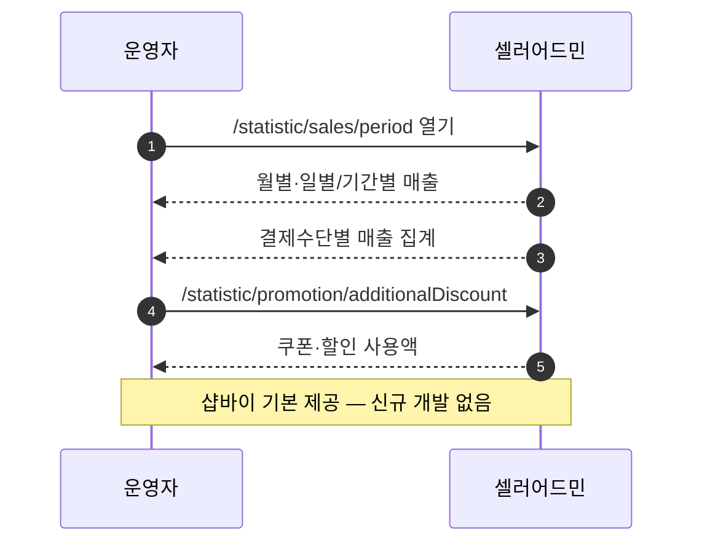
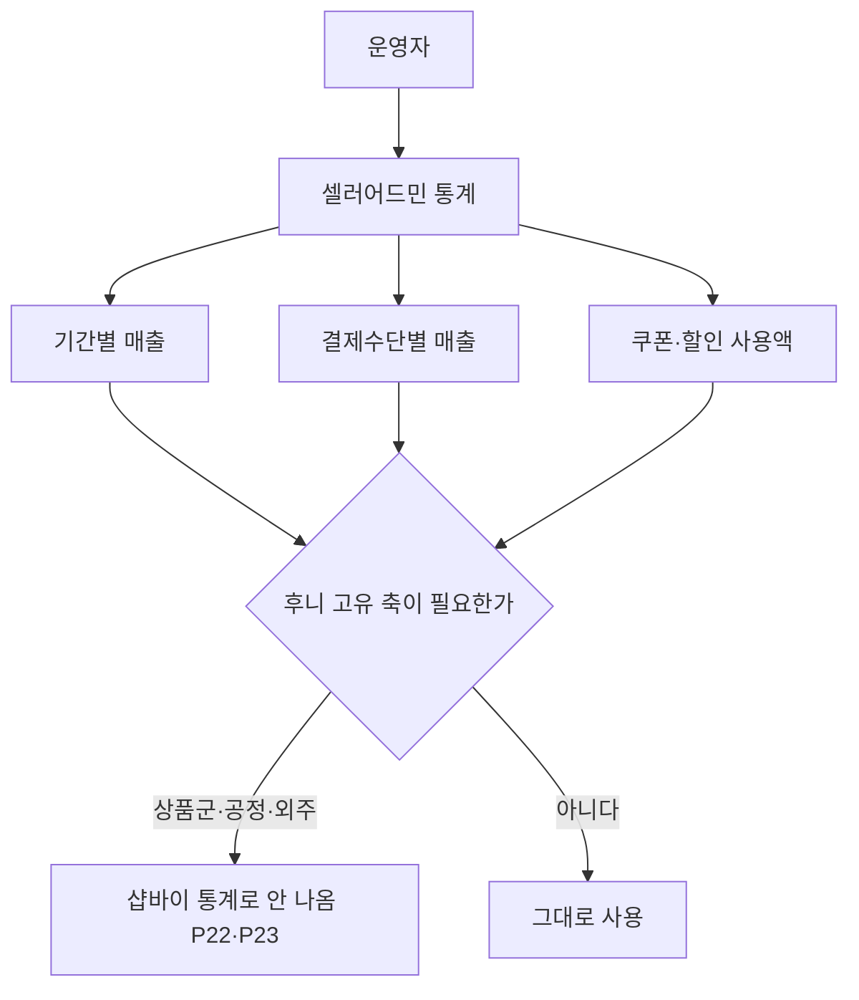

# P21 매출·결제수단·할인 집계

> 카드 `t65` · 대분류 **정산·통계** · 중분류 매출 · 단계 4 · 빠진 곳 2

## 1. 한줄정의

"어제 얼마 팔렸나"를 보는 흐름. 이 카드에서 유일하게 이미 작동하는 덩어리이고, 개발이 아니라 확인·설정 일이다.

| | |
|---|---|
| **시작** | 운영자가 셀러어드민 통계 메뉴를 연다 |
| **끝** | 기간·결제수단·할인별 매출 숫자를 읽는다 |
| **등장인물** | 운영자(최숙진) · 셀러어드민 |

## 2. 흐름 — sequenceDiagram

## 3. 분기 — flowchart

## 4. 단계표

| # | 단계 | 시스템 | 담당자 | 원장 row_id | 상태 | 근거 |
|---:|---|---|---|---|---|---|
| 1 | 1. 월별 매출 통계 | 셀러어드민 | 최숙진 | `STD-FIN-001` | 작동 | https://service.shopby.co.kr/statistic/sales/period@2026-09-16 21:33 |
| 2 | 2. 일별/기간별 매출 조회 | 셀러어드민 | 최숙진 | `STD-FIN-002` | 작동 | https://service.shopby.co.kr/statistic/sales/period@2026-09-16 21:33 |
| 3 | 3. 결제수단별 매출 집계 | 셀러어드민 | 최숙진 | `STD-FIN-003` | 작동 | https://service.shopby.co.kr/statistic/sales/period@2026-09-16 21:33 |
| 4 | 4. 쿠폰/할인 사용액 집계 | 셀러어드민 | 최숙진 | `STD-FIN-011` | 작동 | https://service.shopby.co.kr/statistic/promotion/additionalDiscount@2026-09-16 |

## 5. 빠진 곳

| id | 종류 | 내용 | 제안 담당 |
|---|---|---|---|
| `G-t65-060` | 라 — 결정 미정 | 네 행이 모두 셀러어드민 `/statistic/sales/period` 한 화면 하나를 근거로 「작동·provided」로 판정돼 있다. 그 한 화면이 네 질문에 다 답하는지 항목 단위로 대조한 기록은 찾지 못했다 — 특히 결제수단별 집계가 무통장·가상계좌를 따로 세는지가 1차 런칭에서 중요하다. | 최숙진 |
| `G-t65-061` | 라 — 결정 미정 | 매출의 권위가 샵바이 주문 라인인지 후니 계산가인지 정해져 있지 않다(원장 `X-SETTLE-AUTH` 미관측). 위젯 계산가가 카트에 주입되는 구조(P31)라 두 값이 갈리면 매출 숫자 자체가 갈린다. | 신우진 |

## 6. 채우는 방법

1. **최숙진** — `/statistic/sales/period` 화면의 항목을 원장 4행과 1:1 로 대조해 빈 항목을 찾는다.
2. **신우진** — 매출 권위를 샵바이 주문 라인으로 못 박고, 위젯 계산가는 그 라인을 만드는 입력임을 명시한다.

## 7. 확인 못 한 것

- 셀러어드민 통계 화면을 이번 카드에서 열어보지 않았다 — 원장 URL 방문 기록(@2026-09-16)을 그대로 쓴다.
- 통계의 집계 기준시각(주문일 vs 결제일 vs 출고일)을 확인하지 못했다.
