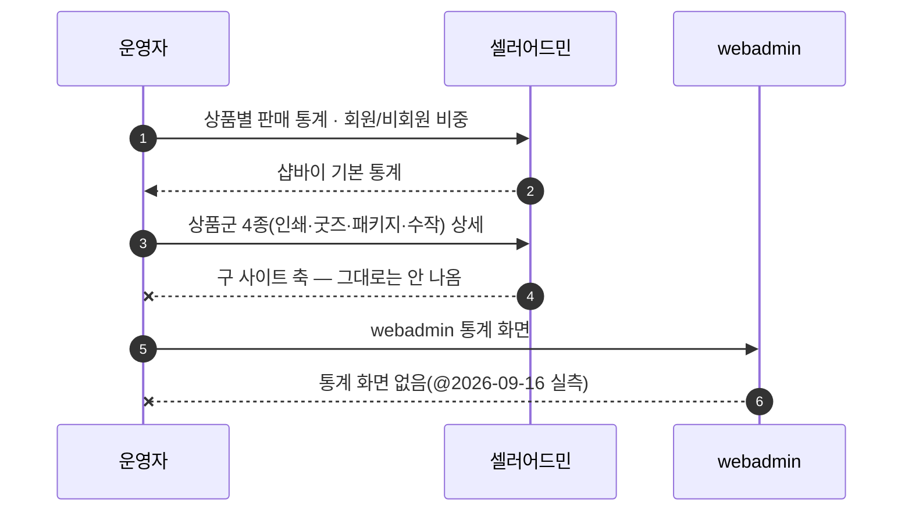
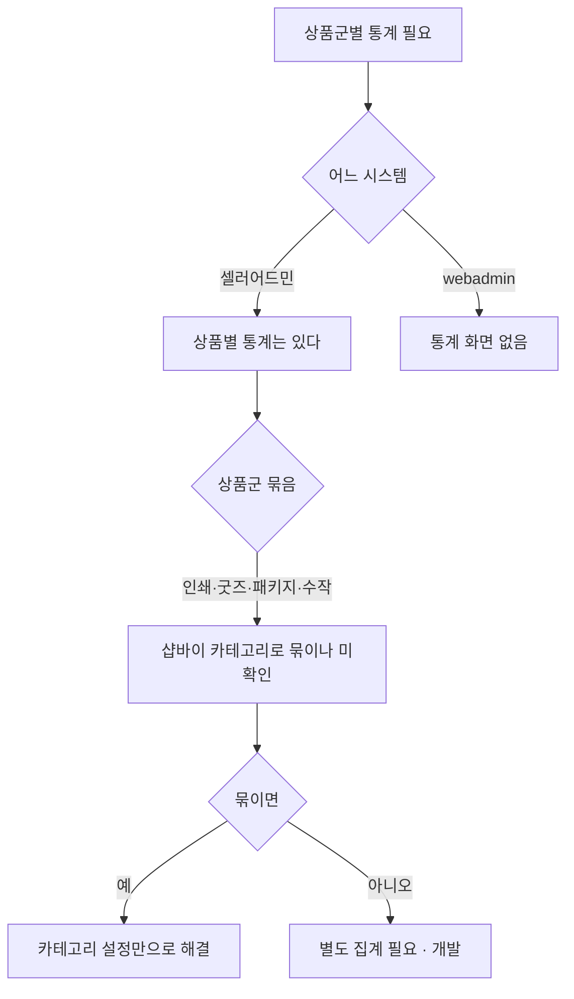

# P22 고객군·상품군 판매 통계

> 카드 `t65` · 대분류 **정산·통계** · 중분류 상품·고객 · 단계 7 · 빠진 곳 3

## 1. 한줄정의

"무엇이 누구에게 팔리나"를 보는 흐름. 상품군(인쇄/굿즈/패키지/수작)별 상세 통계는 구 사이트에 있던 축이라 샵바이 기본 통계로 그대로 나오지 않는다.

| | |
|---|---|
| **시작** | 운영자가 상품군별·회원군별 판매 현황을 보려 한다 |
| **끝** | 상품군 4종과 회원/비회원 비중을 읽는다 |
| **등장인물** | 운영자(최숙진) · 셀러어드민 · webadmin |

## 2. 흐름 — sequenceDiagram

## 3. 분기 — flowchart

## 4. 단계표

| # | 단계 | 시스템 | 담당자 | 원장 row_id | 상태 | 근거 |
|---:|---|---|---|---|---|---|
| 1 | 1. 상품별 판매 통계 | 셀러어드민 | 최숙진 | `STD-FIN-004` | 작동 | https://service.shopby.co.kr/statistic/sales/period@2026-09-16 21:33 |
| 2 | 2. 상품군별 매출 비중 | 셀러어드민 | 최숙진 | `STD-FIN-005` | 작동 | https://service.shopby.co.kr/statistic/sales/period@2026-09-16 21:33 |
| 3 | 3. 회원/비회원 주문 비중 | 셀러어드민 | 최숙진 | `STD-FIN-006` | 작동 | https://service.shopby.co.kr/statistic/sales/period@2026-09-16 21:33 |
| 4 | 4. [구IA#79] 인쇄/제본 상품통계(상세보기) | 셀러어드민 | 최숙진 | `STD-FIN-015` | 미실측 | IA No.79 인쇄/제본 상품통계 · webadmin 통계 화면 없음 @ 2026-09-16 21:28 · 샵바이 통계(R1d) |
| 5 | 5. [구IA#80] 굿즈 상품통계(상세보기) | 셀러어드민 | 최숙진 | `STD-FIN-016` | 미실측 | IA No.80 굿즈 상품통계 · 동 79 |
| 6 | 6. [구IA#81] 패키지 상품통계(상세보기) | 셀러어드민 | 최숙진 | `STD-FIN-017` | 미실측 | IA No.81 패키지 상품통계 · 동 79 |
| 7 | 7. [구IA#82] 수작 상품통계(상세보기) | 셀러어드민 | 최숙진 | `STD-FIN-018` | 미실측 | IA No.82 수작 상품통계 · 동 79 |

## 5. 빠진 곳

| id | 종류 | 내용 | 제안 담당 |
|---|---|---|---|
| `G-t65-062` | 라 — 결정 미정 | 구 사이트 상품군 통계 4종(인쇄/제본·굿즈·패키지·수작)이 샵바이 카테고리 묶음으로 재현되는지가 미정이다. webadmin 에는 통계 화면이 없다(@2026-09-16 실측). 재현되면 카테고리 설정만으로 끝나고, 안 되면 개발 항목이 4개 생긴다. | 최숙진 |
| `G-t65-063` | 나 — 행은 있는데 코드 0 | 상품군 통계 4행이 모두 「미실측」이다 — 셀러어드민 통계 메뉴를 열어 대체 가능 여부를 판정한 사람이 아직 없다. | 최숙진 |
| `G-t65-064` | 라 — 결정 미정 | 수작 상품이 어느 시스템에 사는지 미정(P14)이라 수작 통계는 분모부터 정해지지 않는다. | 신우진 |

## 6. 채우는 방법

1. **최숙진** — 셀러어드민 통계에서 상품군 4종을 카테고리로 묶어 볼 수 있는지 한 번 확인한다. 이 한 번이 4행을 한꺼번에 닫는다.
2. **서희항** — 통계에 쓰일 카테고리 귀속을 P14 에서 정리한다.
3. **신우진** — 수작 상품 결정으로 수작 통계 분모를 연다.

## 7. 확인 못 한 것

- 구 사이트 상품군 통계의 실제 항목(무엇을 세었는지)을 확인하지 못했다.
- 샵바이 통계가 카테고리 단위 집계를 지원하는지 확인하지 못했다.
