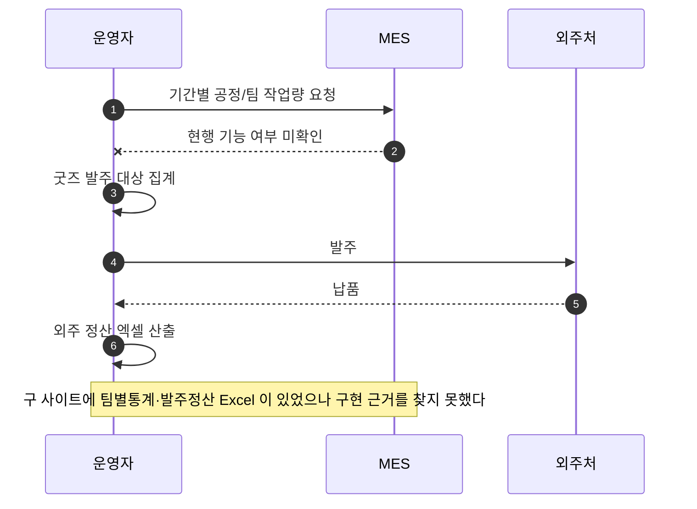
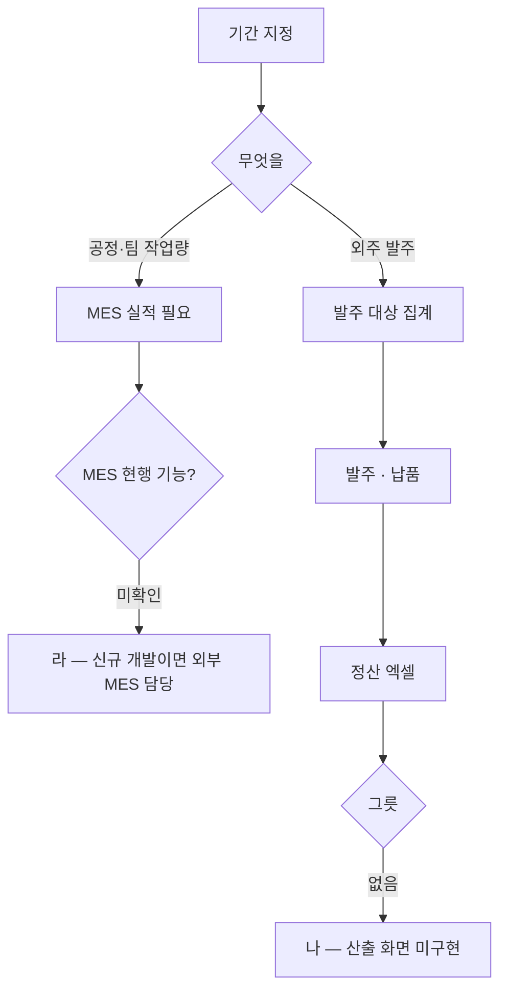

# P23 생산·외주 작업량·발주정산

> 카드 `t65` · 대분류 **정산·통계** · 중분류 생산·정산 · 단계 3 · 빠진 곳 3

## 1. 한줄정의

현장이 얼마나 일했고 외주에 얼마를 줄지를 세는 흐름. 커머스 바깥(MES·외주)의 숫자라 샵바이가 답해 주지 않는다.

| | |
|---|---|
| **시작** | 운영자가 기간을 정해 작업량·외주 발주 내역을 뽑으려 한다 |
| **끝** | 공정별·팀별 작업량과 외주 발주·정산 엑셀이 나온다 |
| **등장인물** | 운영자(최숙진) · MES · 외주처 · webadmin |
| **가로지르는 카드** | t64 생산·출고 카드 — MES 공정 실적 |

## 2. 흐름 — sequenceDiagram

## 3. 분기 — flowchart

## 4. 단계표

| # | 단계 | 시스템 | 담당자 | 원장 row_id | 상태 | 근거 |
|---:|---|---|---|---|---|---|
| 1 | 1. 공정/팀별 작업량 통계 | MES | 최숙진 | `STD-FIN-007` | 미착수 | print-kb/wiki/policy/custom-dev.md#CST-09 · L4 사유: 제작상품 팀별통계(Excel)가 legacy 에 있으나 구현 근거 없음 |
| 2 | 2. 외주 발주/정산 엑셀 산출 | 미확인 | 최숙진 | `STD-FIN-010` | 미착수 | print-quote/04_design/ia.md §2.3 SM-A-55 · L4 사유: 굿즈 발주/정산 Excel 이 legacy 에 있으나 구현 근거 없음 |
| 3 | 3. [구IA#84] 굿즈 발주/정산(Excel 다운) | 미확인 | 최숙진 | `STD-FIN-019` | 미착수 | IA No.84 굿즈 발주/정산 Excel · MES 현행(auto-vs-human §2.7) · webadmin 없음 @ 2026-09-16 21:28 |

## 5. 빠진 곳

| id | 종류 | 내용 | 제안 담당 |
|---|---|---|---|
| `G-t65-065` | 라 — 결정 미정 | 공정/팀별 작업량이 MES 현행 기능인지, 신규 개발인지가 갈리지 않았다. 신규면 담당이 사내 4인 밖(MES 담당)으로 나간다 — 범위 결정이 선행이다. | 신우진 |
| `G-t65-066` | 나 — 행은 있는데 코드 0 | 외주 발주/정산 엑셀과 굿즈 발주/정산이 구 사이트에 있었으나 새 시스템에 그릇이 없다. 두 행 모두 「사는 시스템 미확인」이다. | 최숙진 |
| `G-t65-067` | 라 — 결정 미정 | 굿즈 외주 발주를 커머스(샵바이 주문)에서 뽑을지 생산(MES)에서 뽑을지 정해지지 않았다. | 신우진 |

## 6. 채우는 방법

1. **신우진** — 작업량 통계와 외주 발주가 어느 시스템에 사는지 정한다(커머스 / 생산 / 별도).
2. **최숙진** — 현재 외주 발주를 어떤 엑셀로 돌리고 있는지 실물을 모아 요건으로 만든다.
3. **최숙진** — 1차 런칭에 넣을지 뺄지를 판단해 범위(P38)에 올린다.

## 7. 확인 못 한 것

- MES 에 공정·팀별 실적 화면이 있는지 확인하지 못했다.
- 현재 외주 발주가 몇 건·어떤 주기로 도는지 확인하지 못했다.
