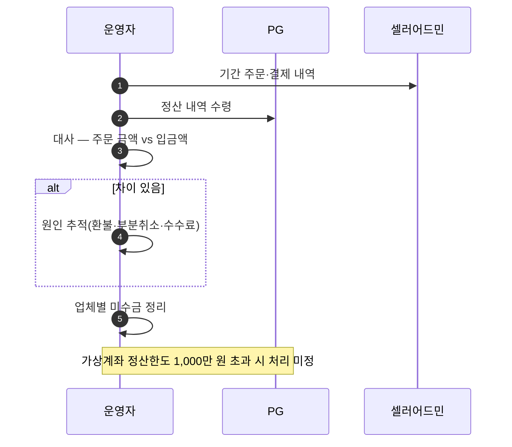
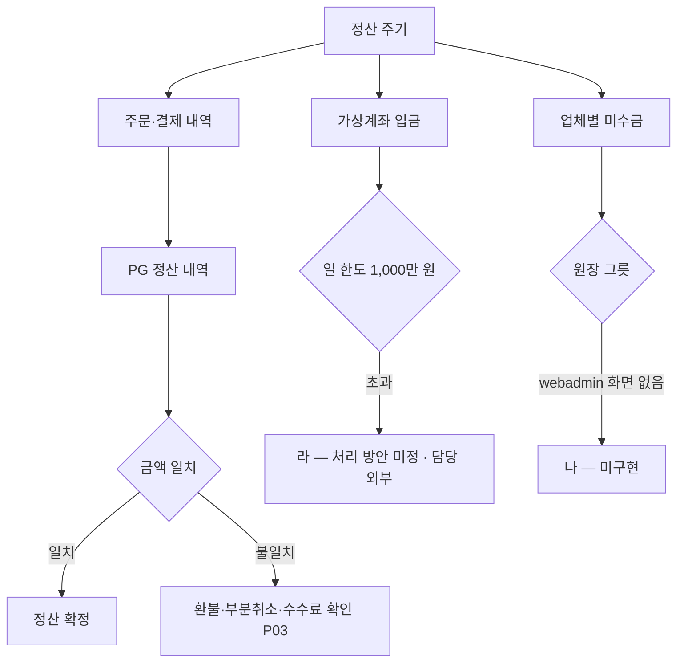

# P24 PG 정산 대사·계좌·미수금

> 카드 `t65` · 대분류 **정산·통계** · 중분류 정산 · 단계 4 · 빠진 곳 3

## 1. 한줄정의

돈이 실제로 들어왔는지 맞춰 보는 흐름. 주문 금액과 PG 입금액, 가상계좌 입금과 업체별 미수금을 대조한다.

| | |
|---|---|
| **시작** | 정산 주기가 돌아와 입금 내역과 주문 내역을 맞춰야 하는 순간 |
| **끝** | 차이 없음이 확인되거나, 차이 목록이 남는다 |
| **등장인물** | 운영자(최숙진) · PG(토스페이먼츠) · 셀러어드민 · webadmin |

## 2. 흐름 — sequenceDiagram

## 3. 분기 — flowchart

## 4. 단계표

| # | 단계 | 시스템 | 담당자 | 원장 row_id | 상태 | 근거 |
|---:|---|---|---|---|---|---|
| 1 | 1. PG 정산 대사 | 미확인 | 최숙진 | `STD-FIN-008` | 미착수 | print-kb/wiki/policy/order-payment.md#PAY-02 · L4 사유: 샵바이 정산이 라인 salePrice/addPrice 를 권위로 쓰는지 미관측(X-SETTLE-AUTH) — 대사 설계 이전 단계 |
| 2 | 2. [구IA#47] 계좌관리(원장용 계좌 등록) | 미확인 | 최숙진 | `STD-FIN-013` | 미착수 | docs/huni/후니정기미팅 정리260915.html 「프린팅머니 원장 — 후니 웹어드민이 잔액·원장 보유 · 배치 미정」 |
| 3 | 3. [구IA#49] 업체별 미수금 | 미확인 | 최숙진 | `STD-FIN-014` | 미착수 | IA No.49 업체별 미수금 · 9/15 회의 원장 배치 미정 · webadmin 해당 화면 없음 @ 2026-09-16 21:28 |
| 4 | 4. 가상계좌 정산한도 1,000만 원 초과 시 처리 방안 | 결정(PM) | 외부(토스페이먼츠) | `STD-FIN-020` | 미착수 | 후니정기미팅 정리260915.html §프린팅머니 · 미결 4 |

## 5. 빠진 곳

| id | 종류 | 내용 | 제안 담당 |
|---|---|---|---|
| `G-t65-068` | 라 — 결정 미정 | 샵바이 정산이 주문 라인의 `salePrice`/`addPrice` 를 권위로 쓰는지가 관측되지 않았다(원장 `X-SETTLE-AUTH`). 위젯이 계산한 값을 카트에 주입하는 구조(P31)에서 이 질문에 답하지 못하면 대사 설계 자체를 시작할 수 없다. | 최숙진 |
| `G-t65-069` | 라 — 결정 미정 | 가상계좌 정산한도 1,000만 원 초과 처리가 미정이고 담당이 외부(토스페이먼츠)다. 무통장·가상계좌가 현재 유일하게 동작하는 결제 수단이라(P29) 런칭 초기에 바로 걸린다. | 신우진 |
| `G-t65-070` | 나 — 행은 있는데 코드 0 | 계좌관리·업체별 미수금 화면이 webadmin 에 없다(@2026-09-16 실측). 프린팅머니 원장 배치가 미정(9/15 회의)이라 그릇 위치부터 정해지지 않았다. | 최숙진 |

## 6. 채우는 방법

1. **최숙진** — 샵바이 주문 라인의 금액 필드가 정산의 권위인지 한 건으로 관측한다. 이 관측이 P21·P24 를 함께 연다.
2. **신우진** — 가상계좌 한도 초과 대응을 토스페이먼츠와 확인해 결정으로 닫는다.
3. **최숙진** — 미수금·계좌 원장을 어디에 둘지 t62 프린팅머니 결정과 한 번에 정한다.

## 7. 확인 못 한 것

- 토스페이먼츠 정산 리포트의 실제 형식을 보지 못했다.
- 현재 미수금이 있는 거래처가 몇 곳인지 확인하지 못했다.
