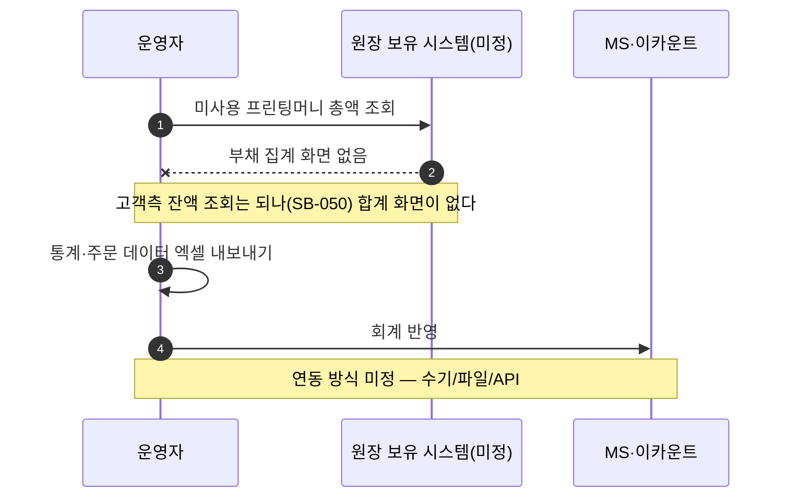
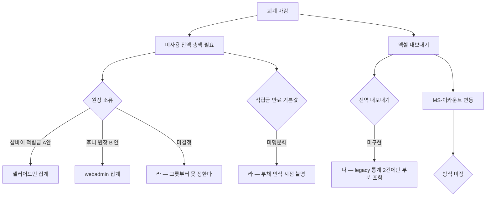

# P25 프린팅머니 부채 집계·내보내기·외부회계 연동

> 카드 `t65` · 대분류 **정산·통계** · 중분류 정산 · 단계 3 · 빠진 곳 3

## 1. 한줄정의

고객이 미리 낸 돈(프린팅머니)은 회사 입장에서 빚이다. 그 빚을 세고, 회계 시스템으로 넘기고, 필요한 숫자를 엑셀로 뽑는 흐름이다.

| | |
|---|---|
| **시작** | 회계 마감이 돌아와 미사용 잔액 총액이 필요해진다 |
| **끝** | 부채 총액이 집계되고 MS·이카운트로 넘어간다 |
| **등장인물** | 운영자(최숙진) · webadmin 또는 샵바이 · MS·이카운트 |
| **가로지르는 카드** | t62 회원·혜택 카드 P10~P12 — 프린팅머니 충전·사용 |

## 2. 흐름 — sequenceDiagram

## 3. 분기 — flowchart

## 4. 단계표

| # | 단계 | 시스템 | 담당자 | 원장 row_id | 상태 | 근거 |
|---:|---|---|---|---|---|---|
| 1 | 1. 적립금(프린팅머니) 부채 집계 | 미확인 | 최숙진 | `STD-FIN-009` | 미착수 | print-kb/wiki/policy/mypage.md#MYP-02 · L4 사유: 고객측 포인트 잔액 조회는 done(SB-050)이나 부채 집계 화면 없음. 적립금 만료 기본값도 미명문화(X-MIG-EXPIRY) |
| 2 | 2. 통계·주문 데이터 엑셀 내보내기 | 미확인 | 최숙진 | `STD-FIN-012` | 미착수 | print-quote/04_design/ia.md §2.3 SM-A-56 팀별통계 Excel · L4 사유: 엑셀 내보내기는 legacy 통계 2건에 부분 포함(1:N) — 전역 내보내기 기능으로는 미구현 |
| 3 | 3. 적립금·증빙 데이터의 MS·이카운트 연동 방식 | 결정(PM) | 최숙진 | `STD-FIN-021` | 미착수 | 후니정기미팅 정리260915.html §증빙서류 · 미결 3 / 후니-오픈잔여작업-실무진안내_260909.html §항목 4 · 결정 필요 — 증빙서류, 이카운트 연동 방안 |

## 5. 빠진 곳

| id | 종류 | 내용 | 제안 담당 |
|---|---|---|---|
| `G-t65-071` | 라 — 결정 미정 | 프린팅머니 원장을 샵바이 적립금(A안)으로 둘지 후니 원장(B′안)으로 둘지가 아직 결정되지 않았다(t62 `STD-MYP-051`). 부채 집계는 원장이 있는 쪽에서만 만들 수 있어 이 결정이 열리기 전에는 착수 자체가 막힌다. | 신우진 |
| `G-t65-072` | 라 — 결정 미정 | 적립금 만료 기본값이 명문화돼 있지 않다(원장 `X-MIG-EXPIRY`). 만료 정책이 곧 부채가 언제 사라지는지이므로 회계 숫자가 이 하나에 매인다. | 최숙진 |
| `G-t65-073` | 나 — 행은 있는데 코드 0 | 전역 엑셀 내보내기가 없다 — 구 사이트 통계 2건에 부분적으로만 붙어 있었다. MS·이카운트 연동 방식(수기/파일/API)도 정해지지 않았다. | 최숙진 |

## 6. 채우는 방법

1. **신우진** — 프린팅머니 원장 소유를 결정한다. t62 가 이미 「이 하나가 6건의 선행」이라고 적어 둔 결정이고, 여기서 3건이 더 걸린다.
2. **최숙진** — 만료 정책을 문장으로 확정한다(몇 개월·소멸 고지 방법).
3. **최숙진** — MS·이카운트에 넘길 항목 목록을 먼저 만든다. 방식(API/파일)은 그다음이다.

## 7. 확인 못 한 것

- MS·이카운트 중 어느 쪽이 정본 회계 시스템인지 확인하지 못했다.
- 구 사이트의 미사용 프린팅머니 총액을 확인하지 못했다.
