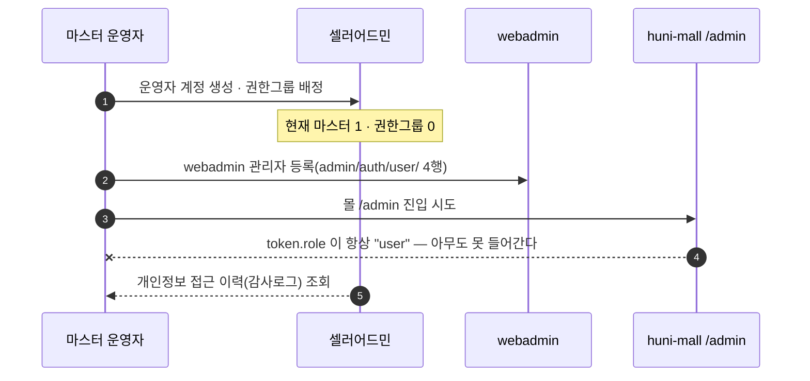
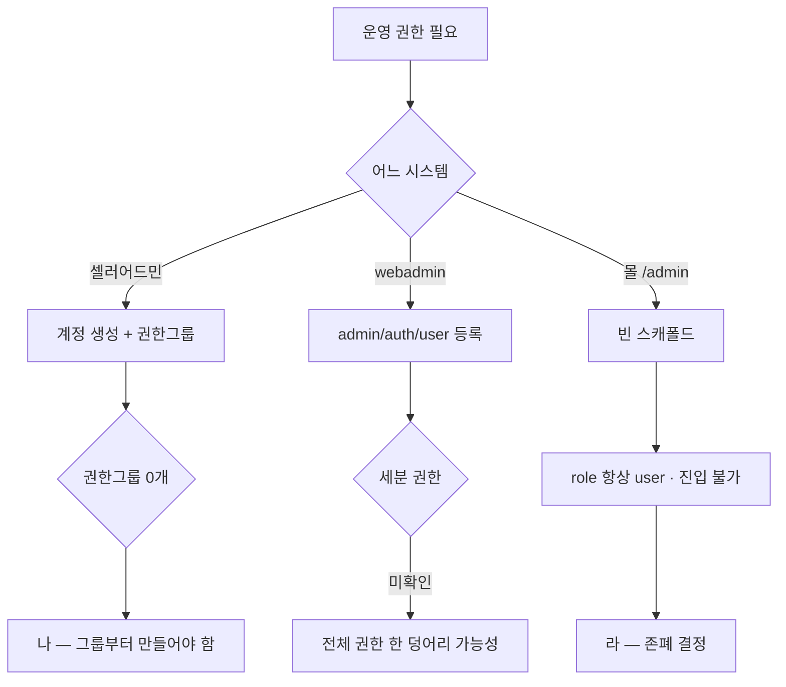

# P26 관리자 계정·권한·감사로그

> 카드 `t65` · 대분류 **시스템·플랫폼** · 중분류 권한 · 단계 6 · 빠진 곳 3

## 1. 한줄정의

운영자가 시스템에 들어오는 문. 지금은 문이 세 개(셀러어드민·webadmin·몰 /admin)이고 그중 하나는 아무도 못 들어간다.

| | |
|---|---|
| **시작** | 새 실무진에게 운영 권한을 준다 |
| **끝** | 그 사람이 자기 일에 필요한 화면만 열 수 있고, 한 일이 로그에 남는다 |
| **등장인물** | 운영자 · 셀러어드민 · webadmin · huni-mall |

## 2. 흐름 — sequenceDiagram

## 3. 분기 — flowchart

## 4. 단계표

| # | 단계 | 시스템 | 담당자 | 원장 row_id | 상태 | 근거 |
|---:|---|---|---|---|---|---|
| 1 | 1. 실무진 운영자 계정 생성 + 권한그룹(셀러어드민) | 셀러어드민 | 최숙진 | `STD-SYS-038` | 미착수 | https://service.shopby.co.kr/admin/list·/authorityGroup/list @ 2026-09-16 21:33 (R/R1d/evidence/52-admin-list.txt·53-authority-group.txt) |
| 2 | 2. 관리자 계정 등록·관리 | 몰·webadmin | 김동학 | `STD-SYS-001` | 부분 | SB-059 stub — huni-skin-shopby/src/app/(admin)/admin/page.tsx:1-8 (자리표시) · WA-058 partial — raw/webadmin/webadmin/catalog/admin.py:2242-2310 |
| 3 | 3. [구IA#44] 관리자 등록/관리(webadmin) | webadmin | 서희항 | `STD-SYS-025` | 부분 | https://huni-admin.printly.co.kr/admin/auth/user/ 4행 @ 2026-09-16 21:28 (webadmin 관리자) · 샵바이 운영자 등록은 셀러어드민(R1d) |
| 4 | 4. 역할 기반 세분 권한 제어 | huni-mall | 김동학 | `STD-SYS-002` | 부분 | SB-060 partial — huni-skin-shopby/src/proxy.ts:21-23 (ADMIN 검사 미활성 주석) · src/lib/api/hooks/use-admins.ts:20 |
| 5 | 5. 관리자 대시보드(/admin) 존폐 결정 | 결정(PM) | 신우진 | `STD-SYS-042` | 미착수 | huni-skin-shopby/src/app/(admin)/admin/page.tsx:2-8 스캐폴드 · src/lib/auth/auth.ts:161 `token.role = "user"` 무조건 · src/app/(admin)/layout.tsx:19 admin 아니면 / · SPEC-TAKEOVER-001 U-16 |
| 6 | 6. 관리자 작업 감사로그 | 셀러어드민 | 최숙진 | `STD-SYS-003` | 작동 | https://service.shopby.co.kr/PrivacyAccessHistories@2026-09-16 |

## 5. 빠진 곳

| id | 종류 | 내용 | 제안 담당 |
|---|---|---|---|
| `G-t65-074` | 나 — 행은 있는데 코드 0 | 셀러어드민에 권한그룹이 0개다(마스터 1명뿐). 실무진이 각자 계정으로 들어가려면 그룹부터 만들어야 하는데, 지금은 한 계정을 나눠 쓰는 상태로 보인다 — 그러면 감사로그가 누가 했는지 구분하지 못한다. | 최숙진 |
| `G-t65-075` | 라 — 결정 미정 | 몰 `/admin` 이 빈 스캐폴드이고 `auth.ts:161` 이 `token.role = "user"` 를 무조건 넣어 `(admin)/layout.tsx:19` 에서 항상 튕겨낸다. 쓸 것이 아니면 지우고, 쓸 것이면 역할을 실제로 발급해야 한다 — 존폐 결정이 선행이다. | 신우진 |
| `G-t65-076` | 다 — 코드는 있는데 연결 안 됨 | `proxy.ts:21-23` 에 ADMIN 검사가 주석으로 비활성돼 있고 `use-admins.ts:20` 이 그 위에 서 있다. 역할 기반 권한이 코드에는 있는데 꺼져 있다. | 김동학 |

## 6. 채우는 방법

1. **최숙진** — 셀러어드민 권한그룹을 실무 역할대로 만들고 계정을 1인 1계정으로 바꾼다. 감사로그가 의미를 가지려면 이게 먼저다.
2. **신우진** — 몰 `/admin` 존폐를 정한다.
3. **김동학** — 남기기로 하면 role 발급과 ADMIN 검사를 켠다. 지우기로 하면 스캐폴드와 프록시 분기를 함께 제거한다.

## 7. 확인 못 한 것

- webadmin 의 세분 권한(화면별 접근 제어)이 있는지 확인하지 못했다 — 등록된 4계정의 권한 구성을 보지 못했다.
- 셀러어드민 감사로그가 무엇을 기록하는지(조회만인지 변경까지인지) 확인하지 못했다.
