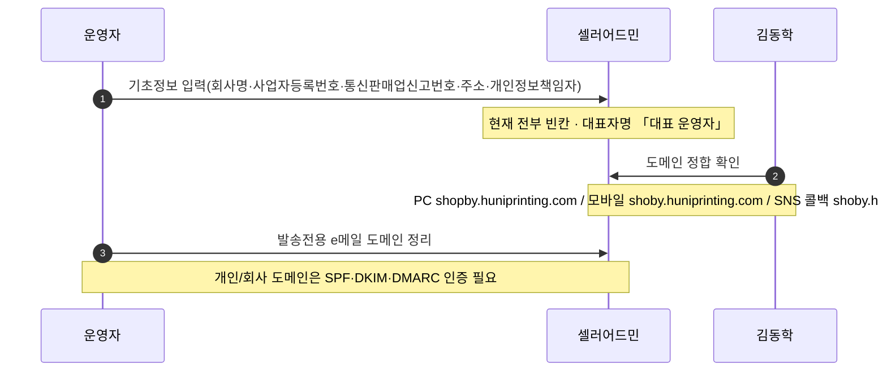
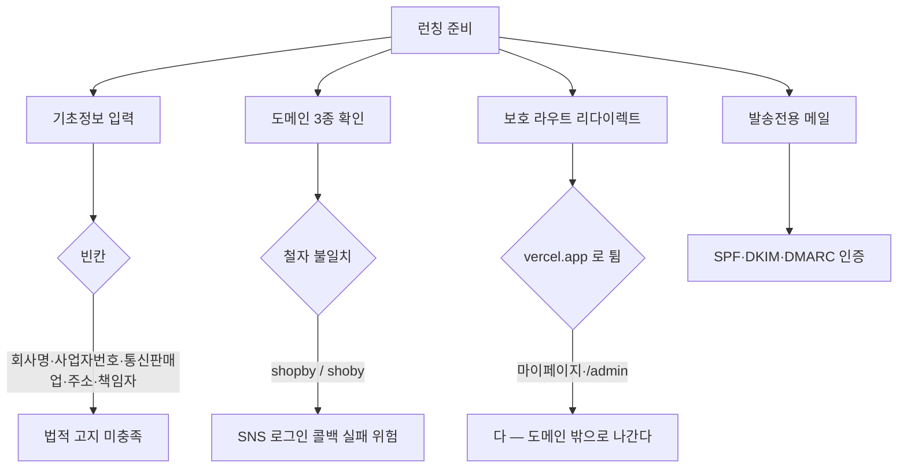

# P27 몰 기초정보·도메인·발송메일 설정

> 카드 `t65` · 대분류 **시스템·플랫폼** · 중분류 설정 · 단계 4 · 빠진 곳 3

## 1. 한줄정의

몰이 법적으로·기술적으로 "제대로 선" 상태를 만드는 흐름. 사업자 정보를 채우고, 도메인을 하나로 맞추고, 보내는 메일이 스팸으로 안 가게 한다.

| | |
|---|---|
| **시작** | 런칭 전 셀러어드민 기초정보 화면을 연다 |
| **끝** | 사업자 정보가 채워지고 도메인·콜백·메일이 한 벌로 맞는다 |
| **등장인물** | 운영자(최숙진) · 셀러어드민 · 김동학 · DNS·메일 |

## 2. 흐름 — sequenceDiagram

## 3. 분기 — flowchart

## 4. 단계표

| # | 단계 | 시스템 | 담당자 | 원장 row_id | 상태 | 근거 |
|---:|---|---|---|---|---|---|
| 1 | 1. 기초정보 사업자 정보 입력 | 셀러어드민 | 최숙진 | `STD-SYS-037` | 미착수 | https://service.shopby.co.kr/service @ 2026-09-16 21:33 — 회사명·사업자등록번호·통신판매업 신고번호·주소·업종/업태·개인정보보호책임자 빈칸 · 대표자명 「대표 운영자」 · API serviceBasicInfo companyName="" (R/R1d/evidence/72-service-basic.txt) |
| 2 | 2. 쇼핑몰 도메인·SNS 콜백 URL 정합 | 셀러어드민 | 김동학 | `STD-SYS-036` | 미착수 | https://service.shopby.co.kr/mall/modification/81683 @ 2026-09-16 21:31 — PC 웹 도메인 https://shopby.huniprinting.com/ · 모바일 웹 https://shoby.huniprinting.com · SNS 콜백 PC https://shoby.huniprinting.co.kr/callback/auth-callback · 실제 신규몰(p1)=https://shopby.huniprinting.co.kr/ (R/R1d/evidence/20-mall-list.txt·24-mall-modification.txt) |
| 3 | 3. 보호 라우트 리다이렉트가 vercel.app 으로 튀는 문제 | huni-mall | 김동학 | `STD-SYS-024` | 미착수 | https://shopby.huniprinting.co.kr/mypage → https://huni-skin-shopby.vercel.app/login?callbackUrl=%2Fmypage @ 2026-09-16 21:27 |
| 4 | 4. 발송전용 e-mail 도메인 정리·메일 도메인 인증 | 셀러어드민 | 최숙진 | `STD-SYS-040` | 미착수 | https://service.shopby.co.kr/mall/modification/81683 @ 2026-09-16 21:31 — 고객센터/발송전용 e메일 [연락처 마스킹] · 화면 안내 「개인/회사 소유 도메인은 SPF/DKIM/DMARC 인증 필요」 · /mail/dispatch 발송 메일 동일 (R/R1d/evidence/24-mall-modification.txt·32-mail-dispatch.txt) |

## 5. 빠진 곳

| id | 종류 | 내용 | 제안 담당 |
|---|---|---|---|
| `G-t65-077` | 나 — 행은 있는데 코드 0 | 사업자 정보가 통째로 빈칸이다 — 회사명·사업자등록번호·통신판매업 신고번호·주소·업종/업태·개인정보보호책임자가 모두 비어 있고 대표자명이 「대표 운영자」로 남아 있다. API `serviceBasicInfo` 의 `companyName` 도 빈 문자열이다. 법적 표기 의무라 런칭 차단 사유다. | 최숙진 |
| `G-t65-078` | 다 — 코드는 있는데 연결 안 됨 | 도메인이 세 갈래다 — PC 웹 `shopby.huniprinting.com`, 모바일 웹 `shoby.huniprinting.com`, SNS 콜백 PC `shoby.huniprinting.co.kr`. `shopby` 와 `shoby` 철자가 갈려 있어 SNS 로그인 콜백이 어느 쪽으로 돌아오는지 불안정하다. | 김동학 |
| `G-t65-079` | 다 — 코드는 있는데 연결 안 됨 | `https://shopby.huniprinting.co.kr/mypage` 로 들어가면 `https://huni-skin-shopby.vercel.app/login?callbackUrl=%2Fmypage` 로 튄다. 고객이 로그인하다가 배포 플랫폼 도메인을 보게 된다. | 김동학 |

## 6. 채우는 방법

1. **최숙진** — 사업자 정보를 채운다. 결정도 개발도 필요 없는, 가장 값싼 런칭 차단 해소다.
2. **김동학** — 도메인을 하나로 확정하고(`shopby` vs `shoby`) 콜백·리다이렉트 기준 URL 을 그 하나로 맞춘다.
3. **최숙진** — 발송전용 메일 도메인을 정하고 SPF·DKIM·DMARC 를 건다.

## 7. 확인 못 한 것

- 세 도메인 중 최종적으로 쓸 것이 무엇인지 결정된 기록을 찾지 못했다.
- 현재 메일이 실제로 스팸 처리되는지 확인하지 못했다.
