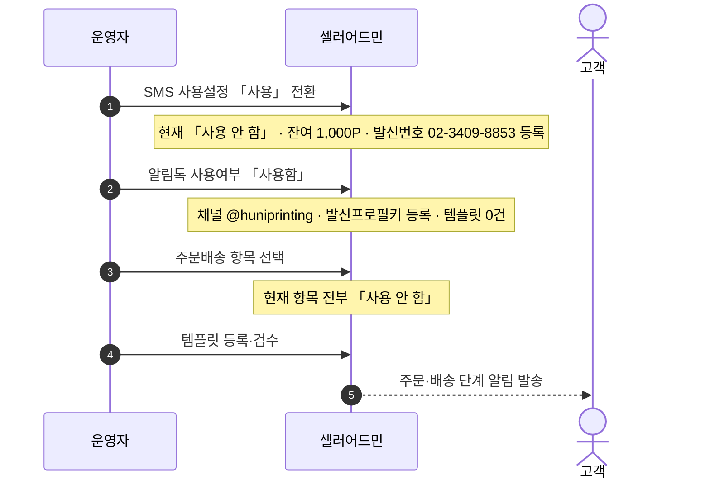
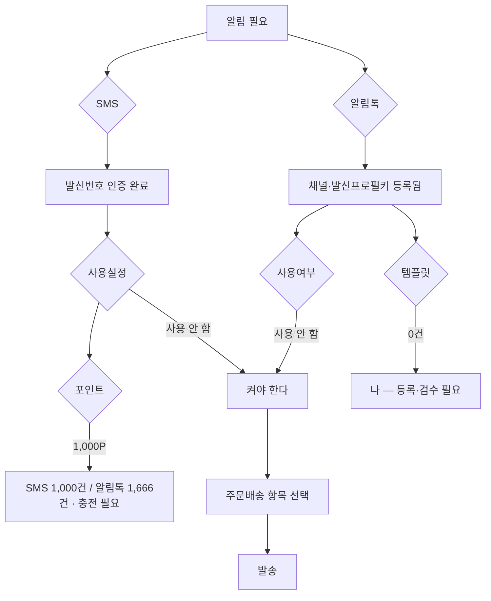

# P28 알림(SMS·알림톡) 설정·발송

> 카드 `t65` · 대분류 **시스템·플랫폼** · 중분류 설정 · 단계 5 · 빠진 곳 3

## 1. 한줄정의

고객에게 소식을 보내는 길. 지금은 발신번호도 채널도 등록돼 있는데 스위치가 「사용 안 함」으로 꺼져 있다.

| | |
|---|---|
| **시작** | 운영자가 셀러어드민 알림 설정을 연다 |
| **끝** | 주문·배송 단계마다 고객에게 알림이 나간다 |
| **등장인물** | 운영자(최숙진) · 셀러어드민 · 고객 |
| **가로지르는 카드** | 주문·결제 카드 — 주문 단계별 알림 시점 |

## 2. 흐름 — sequenceDiagram

## 3. 분기 — flowchart

## 4. 단계표

| # | 단계 | 시스템 | 담당자 | 원장 row_id | 상태 | 근거 |
|---:|---|---|---|---|---|---|
| 1 | 1. SMS 발신번호 인증 완료 | 셀러어드민 | 최숙진 | `STD-SYS-029` | 구현-미검증 | 후니정기미팅 정리260915.html §회원·로그인·인증 · 확정 3 |
| 2 | 2. 테스트용 SMS 충전 완료 여부 확인 | 셀러어드민 | 최숙진 | `STD-SYS-030` | 미착수 | 후니정기미팅 정리260915.html §회원·로그인·인증 · 미결 2 |
| 3 | 3. SMS 사용설정 「사용」 전환 + 포인트 충전 | 셀러어드민 | 최숙진 | `STD-SYS-034` | 미착수 | https://service.shopby.co.kr/pro/premium/sms/main/config @ 2026-09-16 21:31 — SMS 사용설정 「사용 안 함」·잔여 1,000P(SMS 1,000건/알림톡 1,666건)·발신번호 02-3409-8853 등록·부족알림 사용(100P) (R/R1d/evidence/30-sms-config.png) |
| 4 | 4. 알림톡 사용여부 「사용함」 + 주문배송 항목 선택 + 템플릿 검수 | 셀러어드민 | 최숙진 | `STD-SYS-035` | 미착수 | https://service.shopby.co.kr/pro/premium/kakao/notification/config @ 2026-09-16 21:31~21:34 — 채널 @huniprinting·발신프로필키 등록·알림톡 사용여부 「사용 안 함」·주문배송 항목 전부 「사용 안 함」·템플릿 관리 0건 (R/R1d/evidence/31-kakao-alimtalk.png·33-alimtalk-order-delivery.png·35-alimtalk-template-list.txt) |
| 5 | 5. 알림(SMS/알림톡/이메일) 템플릿 설정 | 셀러어드민 | 최숙진 | `STD-SYS-006` | 미착수 | print-kb/wiki/policy/order-mgmt.md#OMG-03 · L4 사유: 알림 템플릿 관리 L2 무근거. 계약 선행. |

## 5. 빠진 곳

| id | 종류 | 내용 | 제안 담당 |
|---|---|---|---|
| `G-t65-080` | 나 — 행은 있는데 코드 0 | 알림톡 템플릿이 0건이다. 채널(@huniprinting)과 발신프로필키는 등록돼 있는데 보낼 내용이 없다. 템플릿은 카카오 검수를 거치므로 리드타임이 있다 — 늦게 시작하면 런칭을 민다. | 최숙진 |
| `G-t65-081` | 나 — 행은 있는데 코드 0 | SMS·알림톡 사용설정이 둘 다 「사용 안 함」이고, 주문배송 항목도 전부 「사용 안 함」이다. 스위치만 켜면 되는 일과 템플릿을 만들어야 하는 일이 섞여 있다. | 최숙진 |
| `G-t65-082` | 라 — 결정 미정 | 어느 시점에 무엇을 보낼지(주문접수·입금확인·제작시작·출고·클레임 접수·답변 등록)가 목록으로 정해지지 않았다. P01~P07 의 모든 흐름이 이 목록을 기다린다. | 신우진 |

## 6. 채우는 방법

1. **신우진** — 알림 시점 목록을 한 장으로 만든다(단계 × 채널 × 대상).
2. **최숙진** — 그 목록대로 템플릿을 써서 카카오 검수에 먼저 올린다. 검수가 길어 가장 먼저 시작해야 한다.
3. **최숙진** — SMS·알림톡 사용설정을 켜고 포인트를 충전한다.

## 7. 확인 못 한 것

- 이메일 알림이 샵바이 기본으로 나가는지, 별도 설정이 필요한지 확인하지 못했다.
- 알림톡 템플릿 검수 소요 기간을 확인하지 못했다.
