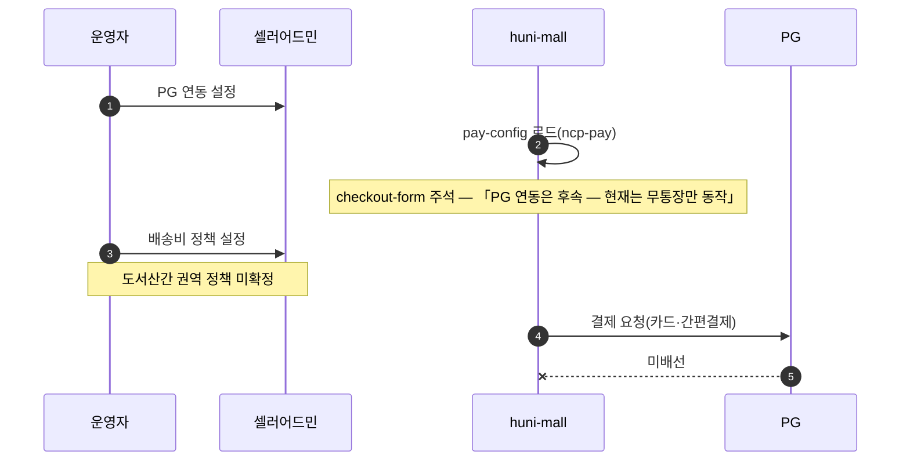
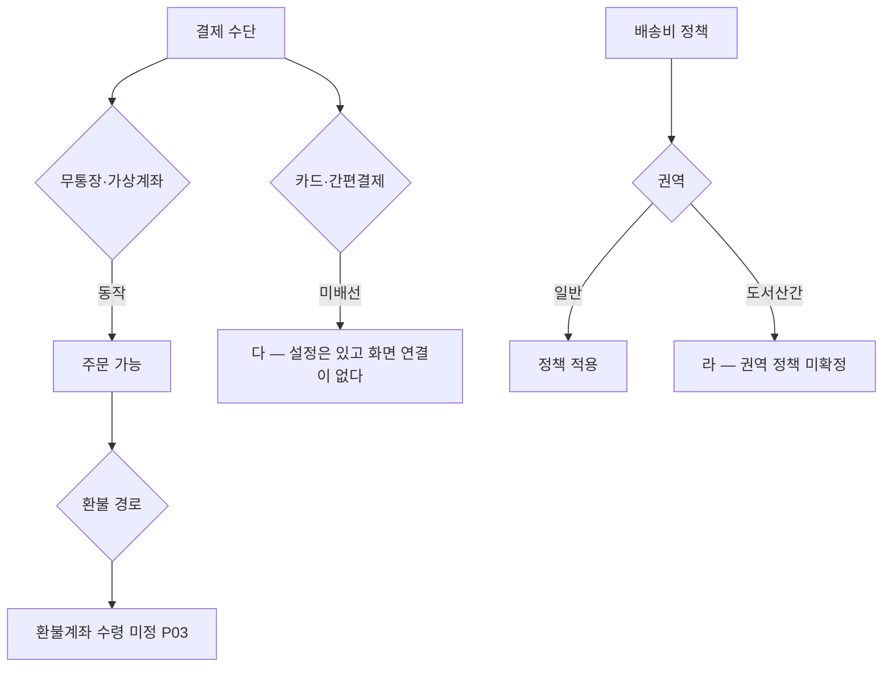

# P29 결제(PG)·배송비 정책 설정

> 카드 `t65` · 대분류 **시스템·플랫폼** · 중분류 설정 · 단계 2 · 빠진 곳 3

## 1. 한줄정의

돈을 받는 방법과 배송비를 정하는 흐름. 지금 실제로 동작하는 결제 수단은 무통장 하나뿐이다.

| | |
|---|---|
| **시작** | 운영자가 결제 수단과 배송비 정책을 설정한다 |
| **끝** | 고객이 주문서에서 그 수단으로 결제하고 그 배송비를 낸다 |
| **등장인물** | 운영자(최숙진) · 셀러어드민 · huni-mall · PG |
| **가로지르는 카드** | 결제(STD-PAY)·배송(STD-SHP) 카드 — 고객이 겪는 결제·배송 화면 |

## 2. 흐름 — sequenceDiagram

## 3. 분기 — flowchart

## 4. 단계표

| # | 단계 | 시스템 | 담당자 | 원장 row_id | 상태 | 근거 |
|---:|---|---|---|---|---|---|
| 1 | 1. PG 연동 설정 | 셀러어드민 | 최숙진 | `STD-SYS-004` | 부분 | SB-033 done — huni-skin-shopby/src/lib/payments/ncp-pay.ts:47-70 · src/app/api/pay-config/route.ts:8 / SB-032 absent — src/components/checkout/checkout-form.tsx:8-9 ('PG 연동은 후속 — 현재는 무통장만 동작') |
| 2 | 2. 배송비 정책 설정 | 셀러어드민 | 최숙진 | `STD-SYS-005` | 부분 | print-kb/wiki/policy/shipping.md#SHIP-02 · L4 사유: 도서산간 권역 정책 미확정(1차 W7-9). |

## 5. 빠진 곳

| id | 종류 | 내용 | 제안 담당 |
|---|---|---|---|
| `G-t65-083` | 다 — 코드는 있는데 연결 안 됨 | PG 설정 쪽 코드는 있다 — `src/lib/payments/ncp-pay.ts:47-70` 과 `src/app/api/pay-config/route.ts:8` 이 동작한다. 그런데 주문서(`checkout-form.tsx:8-9`)에 「PG 연동은 후속 — 현재는 무통장만 동작」 이라고 적혀 있다. 설정과 화면이 이어져 있지 않다. | 최숙진 |
| `G-t65-084` | 라 — 결정 미정 | 도서산간 권역 배송비 정책이 확정되지 않았다(1차 런칭 W7-9 로 밀려 있다). 권역 정의가 없으면 주문서에서 배송비가 틀리게 나온다. | 최숙진 |
| `G-t65-085` | 라 — 결정 미정 | 1차 런칭을 무통장·가상계좌만으로 열지, 카드까지 열지가 정해지지 않았다. 이 결정이 P03 환불 경로와 P24 정산 대사를 동시에 바꾼다. | 신우진 |

## 6. 채우는 방법

1. **신우진** — 1차 런칭 결제 수단 범위를 정한다. 환불(P03)·정산(P24)이 이 결정에 매달려 있다.
2. **김동학** — 카드까지 열기로 하면 주문서에 PG 결제 분기를 붙인다.
3. **최숙진** — 도서산간 권역 표를 확정해 배송비 정책에 넣는다.

## 7. 확인 못 한 것

- 토스페이먼츠 계약 상태(어느 수단까지 열려 있는지)를 확인하지 못했다.
- 셀러어드민 배송비 정책 화면의 권역 설정 방식을 확인하지 못했다.
