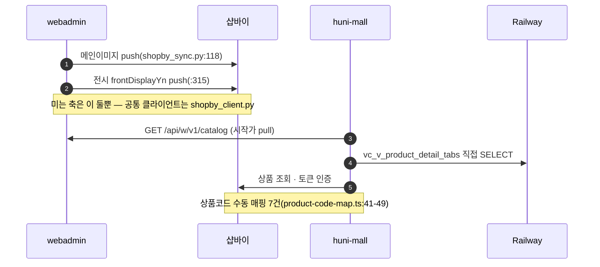
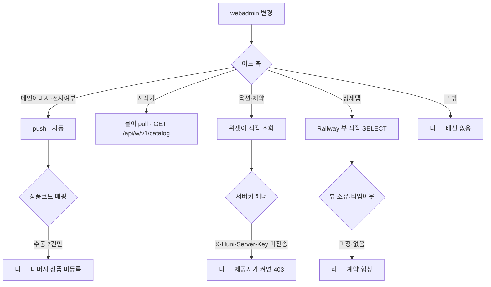

# P30 상품·가격 데이터 동기화(webadmin ↔ 샵바이)

> 카드 `t65` · 대분류 **시스템·플랫폼** · 중분류 연동 · 단계 6 · 빠진 곳 4

## 1. 한줄정의

후니의 인쇄 도메인 DB 와 커머스 플랫폼을 잇는 다리. 어느 축이 밀리고 어느 축이 당겨지는지가 「등록했는데 몰에 안 보인다」의 답이다.

| | |
|---|---|
| **시작** | 운영자가 webadmin 에서 상품·가격을 고친다 |
| **끝** | 몰에서 고객이 바뀐 내용을 본다 |
| **등장인물** | webadmin · 샵바이 · huni-mall · Railway DB |
| **가로지르는 카드** | 상품·카탈로그(STD-CAT) 카드 — 고객이 보는 상품 목록·시작가 |

## 2. 흐름 — sequenceDiagram

## 3. 분기 — flowchart

## 4. 단계표

| # | 단계 | 시스템 | 담당자 | 원장 row_id | 상태 | 근거 |
|---:|---|---|---|---|---|---|
| 1 | 1. 커머스 플랫폼 API 인증·토큰 관리 | huni-mall | 김동학 | `STD-SYS-007` | 작동 | https://shopby.huniprinting.co.kr/product/136578124@2026-09-16 21:29 |
| 2 | 2. 인쇄 도메인 DB ↔ 커머스 상품 동기화 | webadmin | 서희항 | `STD-SYS-008` | 부분 | WA-045 done — raw/webadmin/webadmin/catalog/shopby_sync.py:1-30 · WA-046 done — catalog/shopby_client.py:1-50 · SB-015 partial — huni-skin-shopby/src/lib/printly/product-code-map.ts:41-49 (수동 7건만 등록) |
| 3 | 3. 상품 텍스트옵션 라벨 huni_token 미등록 확정 → 담기 구현 정합 | 몰·샵바이 | 김동학+신우진 | `STD-SYS-041` | 미착수 | API GET /products/136578130 mallProductInputs=[huni_order, huni_item] (huni_token 없음) @ 2026-09-16 21:31 (R/R1d/evidence/api-server-product-sample.json) · Q0 label-check 226건 참조 |
| 4 | 4. 후니 위젯 서버키 헤더(X-Huni-Server-Key) 전송 배선 | 몰·webadmin | 김동학+서희항 | `STD-SYS-045` | 미착수 | huni-skin-shopby/src grep `X-Huni-Server-Key` 0곳 · huni-skin-next/src/lib/printly/server-key.ts(포크 구현·commit 6231dc4) · SPEC-TAKEOVER-001 spec.md:43·D-4 |
| 5 | 5. Railway 상세탭 뷰 직접 SELECT — 타임아웃·DDL 소유 | huni-mall | 김동학 | `STD-SYS-049` | 미착수 | huni-skin-shopby/src/lib/printly/publications.ts:48-56 Pool 옵션 없음·84-85 SELECT · SPEC-TAKEOVER-001 D-2 · 포크 M5(commit 5366dac) 타임아웃 적용 |
| 6 | 6. 웹훅 등록 화면 위치 확인 및 등록 여부 | 셀러어드민 | 최숙진 | `STD-SYS-039` | 미착수 | https://service.shopby.co.kr 전체메뉴 98링크 중 webhook 0 · 앱 상세(Huni Admin) 항목=설치정보·API 권한 8종만 · Server API GET /webhooks 404·/webhooks/failed 400 (R/R1d/evidence/01-fullmenu-links.txt·42-app-huni-admin-detail.txt·api-get-log.txt) |

## 5. 빠진 곳

| id | 종류 | 내용 | 제안 담당 |
|---|---|---|---|
| `G-t65-086` | 다 — 코드는 있는데 연결 안 됨 | 동기화가 미는 축이 메인이미지와 전시 여부 둘뿐이고, 상품코드 매핑은 `product-code-map.ts:41-49` 에 **수동 7건**만 등록돼 있다. 상품이 수백 건인데 다리 위에 7건만 올라가 있다. | 서희항 |
| `G-t65-087` | 나 — 행은 있는데 코드 0 | 위젯 재견적 요청에 `X-Huni-Server-Key` 헤더를 싣는 코드가 몰에 0곳이다. 제공자가 `WAPI_SERVER_KEY_REQUIRED` 를 켜는 순간 재견적이 403 으로 죽는다. 포크(`huni-skin-next/src/lib/printly/server-key.ts`)에는 구현이 있다. | 김동학 |
| `G-t65-088` | 라 — 결정 미정 | 상세탭 뷰의 DDL 소유자가 정해져 있지 않다(계약 협상). 몰이 남의 DB 뷰를 직접 읽고 있는데 그 뷰를 누가 바꿀 수 있는지가 없다. | 신우진 |
| `G-t65-089` | 나 — 행은 있는데 코드 0 | 웹훅 등록 화면을 셀러어드민에서 찾지 못했다 — 전체메뉴 98링크 중 webhook 0건, Server API `GET /webhooks` 는 404, `/webhooks/failed` 는 400 이다. 주문 발생을 밀어서 받는 길이 없으면 폴링으로 가야 한다. | 최숙진 |

## 6. 채우는 방법

1. **서희항** — 상품코드 매핑을 수동 7건에서 전수 자동으로 바꾼다. 이게 안 되면 상품이 늘 때마다 사람이 따라붙어야 한다.
2. **김동학** — 서버키 헤더를 전송하도록 배선한다(포크 구현 이식).
3. **신우진** — 상세탭 뷰의 소유·변경 절차를 계약으로 정한다.
4. **최숙진** — 샵바이에 웹훅 지원 여부를 확인받는다. 없으면 폴링 주기를 정해야 한다.

## 7. 확인 못 한 것

- `GET /api/w/v1/catalog` 가 시작가 말고 무엇을 더 주는지 응답을 보지 못했다.
- 상품코드 매핑 7건이 어느 상품인지 대조하지 못했다.
