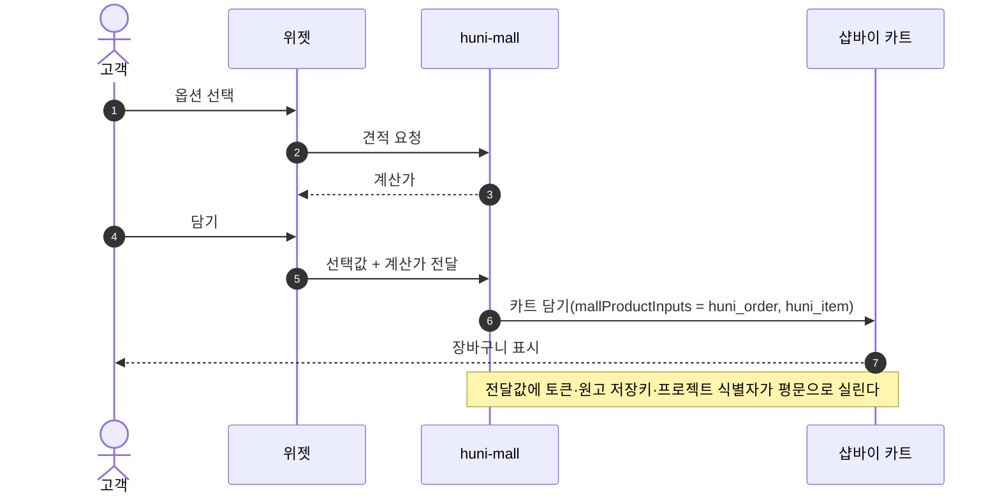
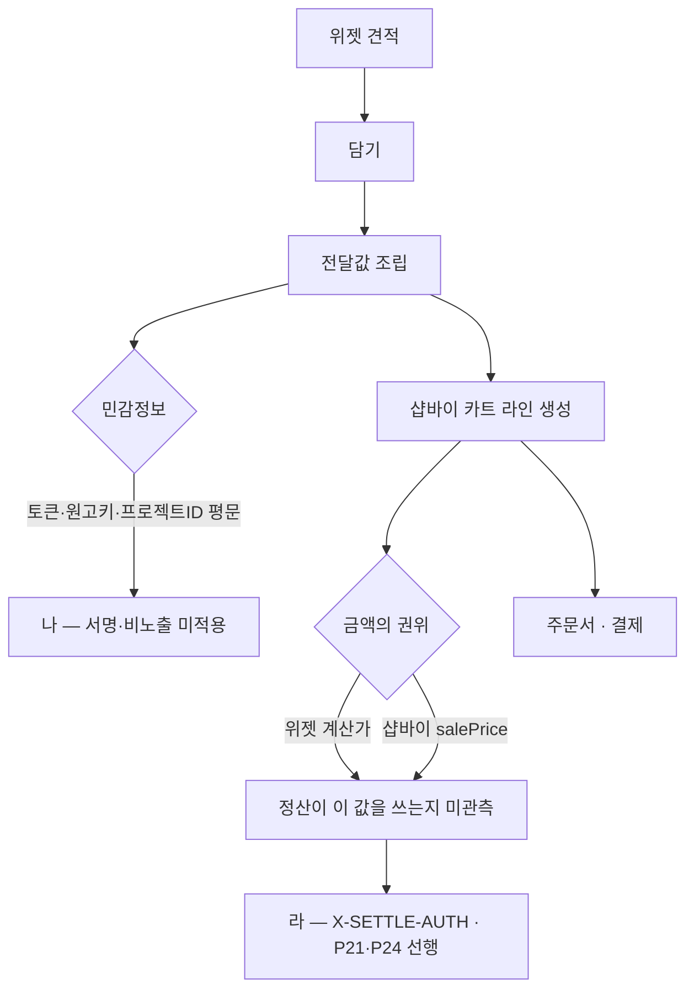

# P31 가격 계산 결과 카트 주입 브리지

> 카드 `t65` · 대분류 **시스템·플랫폼** · 중분류 연동 · 단계 2 · 빠진 곳 3

## 1. 한줄정의

이 몰의 심장. 위젯이 계산한 값이 장바구니 한 줄이 되는 지점이고, 그 값이 곧 매출·정산의 출발점이다.

| | |
|---|---|
| **시작** | 고객이 위젯에서 견적을 받고 「담기」를 누른다 |
| **끝** | 장바구니에 계산된 금액으로 한 줄이 생긴다 |
| **등장인물** | 고객 · 위젯 · huni-mall · 샵바이 카트 |
| **가로지르는 카드** | 장바구니·주문(STD-ORD) 카드 — 담기 이후 흐름 |

## 2. 흐름 — sequenceDiagram

## 3. 분기 — flowchart

## 4. 단계표

| # | 단계 | 시스템 | 담당자 | 원장 row_id | 상태 | 근거 |
|---:|---|---|---|---|---|---|
| 1 | 1. 가격 계산 결과 카트 주입 브리지 | huni-mall | 김동학 | `STD-SYS-009` | 작동 | https://shopby.huniprinting.co.kr/cart@2026-09-16 21:27 |
| 2 | 2. 담기 전달값의 민감정보 비노출·서명 검증 | huni-mall | 김동학 | `STD-SYS-023` | 미착수 | L0/N3/ARCHITECTURE-v2.md §10 A-13 (토큰·원고 저장키·프로젝트 식별자 평문 노출) · §3.2 · §8 I-2 |

## 5. 빠진 곳

| id | 종류 | 내용 | 제안 담당 |
|---|---|---|---|
| `G-t65-090` | 나 — 행은 있는데 코드 0 | 담기 전달값에 토큰·원고 저장키·프로젝트 식별자가 평문으로 실린다(`ARCHITECTURE-v2.md` §10 A-13·§3.2·§8 I-2). 서명 검증도 없다 — 고객이 값을 바꿔 담으면 가격이 바뀔 수 있다는 뜻이다. | 김동학 |
| `G-t65-091` | 라 — 결정 미정 | 카트에 들어간 금액이 정산의 권위인지가 관측되지 않았다(`X-SETTLE-AUTH`). P21 매출·P24 대사가 모두 이 답을 기다린다. | 신우진 |
| `G-t65-092` | 다 — 코드는 있는데 연결 안 됨 | 전달값 라벨이 `huni_order`·`huni_item` 둘이고 `huni_token` 은 등록돼 있지 않다(`GET /products/136578130` 의 `mallProductInputs` 실측). 토큰을 쓰려면 상품 텍스트옵션에 라벨을 먼저 등록해야 한다 — P30 과 같은 뿌리다. | 김동학 |

## 6. 채우는 방법

1. **김동학** — 담기 전달값에 서명을 붙이고 민감값을 서버 보관으로 바꾼다. 가격이 걸린 구간이라 가장 먼저 닫아야 할 보안 항목이다.
2. **신우진** — 카트 금액의 권위를 관측으로 확정한다(주문 1건으로 충분하다).
3. **김동학·서희항** — `huni_token` 라벨 등록 여부를 정하고 담기 구현을 그에 맞춘다.

## 7. 확인 못 한 것

- 담기 전달값의 전체 필드 목록을 코드에서 끝까지 따라가지 않았다.
- 고객이 값을 조작했을 때 실제로 가격이 바뀌는지 시험하지 않았다(라이브 쓰기 금지).
