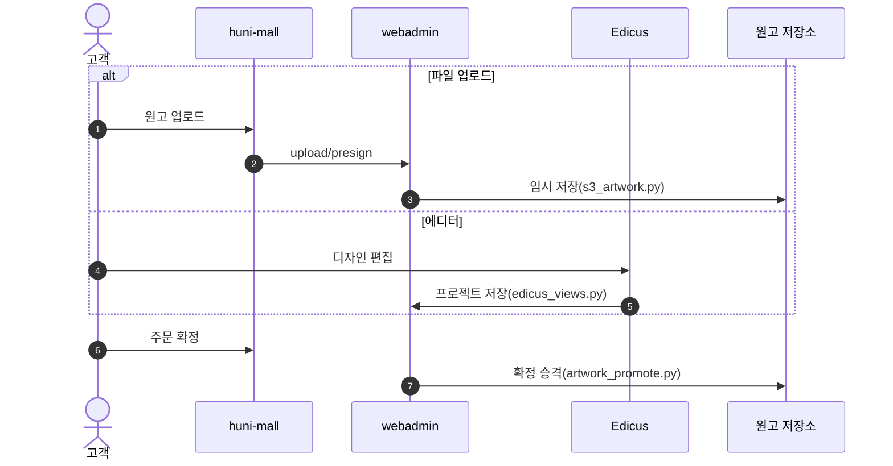
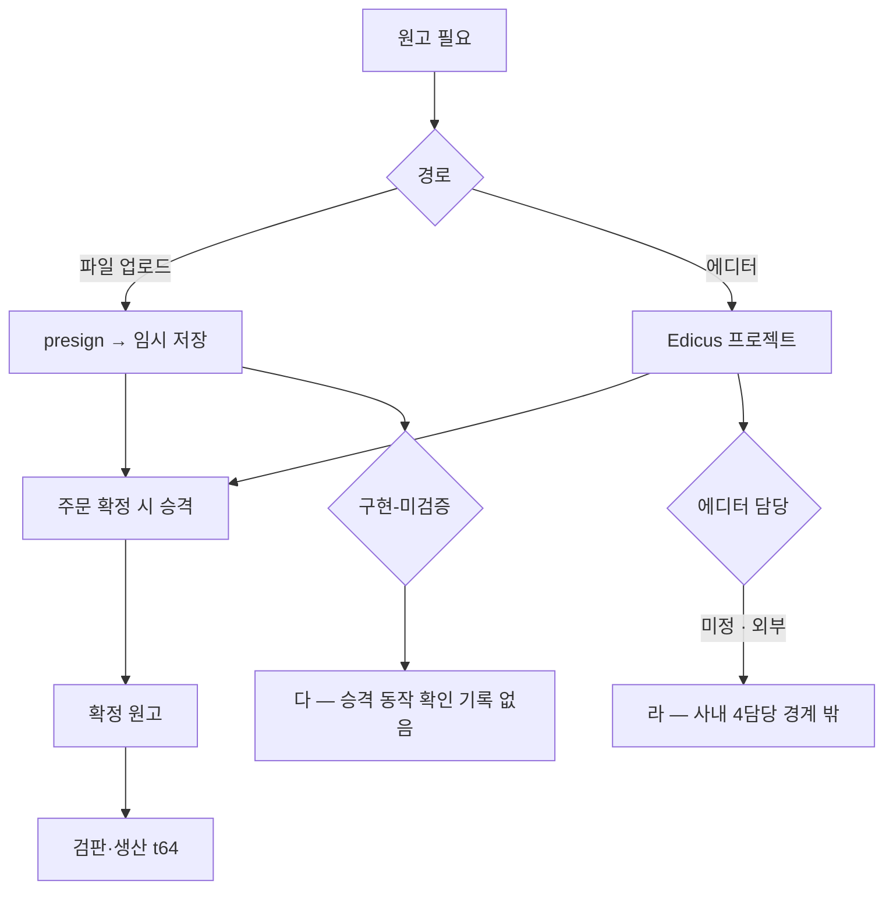

# P32 원고 저장소·디자인 에디터 연동

> 카드 `t65` · 대분류 **시스템·플랫폼** · 중분류 연동 · 단계 2 · 빠진 곳 3

## 1. 한줄정의

고객이 올린 파일과 에디터로 만든 디자인이 주문에 붙어 생산까지 가는 길의 앞쪽 절반.

| | |
|---|---|
| **시작** | 고객이 원고를 올리거나 에디터로 디자인을 만든다 |
| **끝** | 그 원고가 주문에 묶여 저장소에 확정 보관된다 |
| **등장인물** | 고객 · huni-mall · webadmin · Edicus · S3 |
| **가로지르는 카드** | t64 생산·출고 카드 — 원고 검판(PitStop)·생산 투입 |

## 2. 흐름 — sequenceDiagram

## 3. 분기 — flowchart

## 4. 단계표

| # | 단계 | 시스템 | 담당자 | 원장 row_id | 상태 | 근거 |
|---:|---|---|---|---|---|---|
| 1 | 1. 원고 저장소(스토리지) 연동 | webadmin | 서희항 | `STD-SYS-010` | 구현-미검증 | WA-037 raw/webadmin/webadmin/config/urls.py:251 upload/presign · catalog/s3_artwork.py:208-280 · WA-052 catalog/artwork_promote.py:1 |
| 2 | 2. 디자인 에디터 외부 서비스 연동 | 미정(외부) | 미정 | `STD-SYS-011` | 부분 | WA-041 done — raw/webadmin/webadmin/config/urls.py:274-275 · catalog/edicus_lookup.py:214-260 · WA-047 done — catalog/edicus_views.py:278-674 / SB-020 stub — huni-skin-shopby/src/components/product/configurator-actions.tsx:170-176 |

## 5. 빠진 곳

| id | 종류 | 내용 | 제안 담당 |
|---|---|---|---|
| `G-t65-093` | 다 — 코드는 있는데 연결 안 됨 | 업로드 presign(`config/urls.py:251`·`catalog/s3_artwork.py:208-280`)과 확정 승격(`catalog/artwork_promote.py:1`)이 구현돼 있으나 「구현-미검증」이다. 주문 확정 시 임시→확정 승격이 빠짐없이 도는지 확인 기록을 찾지 못했다. | 서희항 |
| `G-t65-094` | 라 — 결정 미정 | 에디터 연동의 담당이 「미정」이고 사내 4담당 경계 밖이다. webadmin 쪽 조회·뷰(`edicus_lookup.py:214-260`·`edicus_views.py:278-674`)는 done 인데 몰 쪽 진입점(`configurator-actions`)은 stub 이다 — 반쪽만 이어져 있다. | 신우진 |
| `G-t65-095` | 나 — 행은 있는데 코드 0 | 원고 보관 기간·용량 정책이 없다. 인쇄 원고는 크고 오래 남아 저장 비용이 계속 는다. | 서희항 |

## 6. 채우는 방법

1. **신우진** — 에디터 연동 담당과 1차 런칭 포함 여부를 정한다.
2. **서희항** — 업로드→승격 경로를 주문 1건으로 끝까지 따라가 확인한다.
3. **서희항** — 원고 보관 기간·용량 정책을 정한다.

## 7. 확인 못 한 것

- Edicus 쪽 계약·과금 조건을 확인하지 못했다.
- 몰의 에디터 진입 버튼이 현재 무엇을 하는지 라이브에서 눌러보지 못했다.
