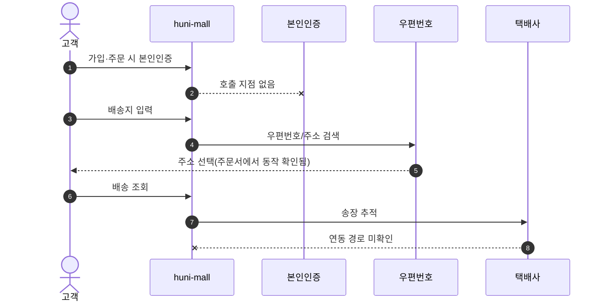
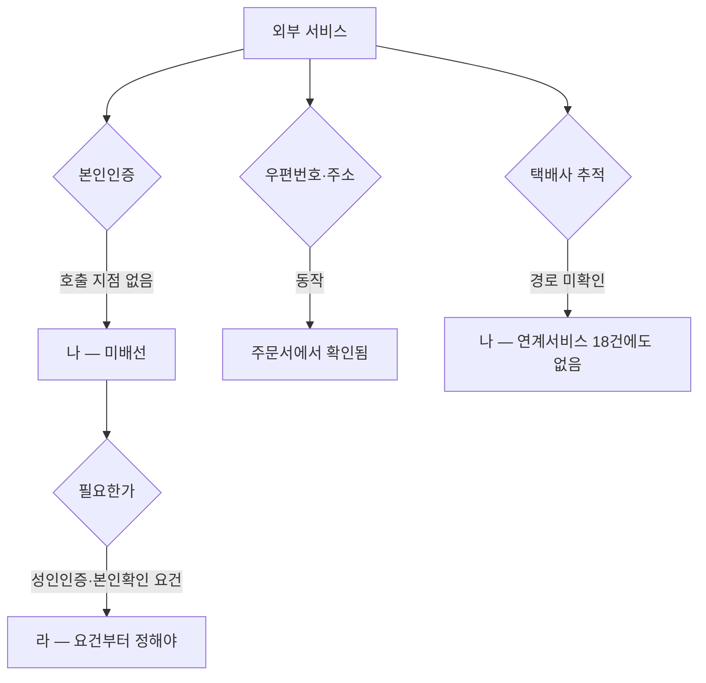

# P33 본인인증·주소검색·배송추적 외부 연동

> 카드 `t65` · 대분류 **시스템·플랫폼** · 중분류 연동 · 단계 3 · 빠진 곳 3

## 1. 한줄정의

외부 서비스 세 가지를 몰에 붙이는 흐름. 하나는 되고, 하나는 호출 지점이 없고, 하나는 경로를 찾지 못했다.

| | |
|---|---|
| **시작** | 고객이 가입·주문·배송조회에서 외부 서비스를 만난다 |
| **끝** | 인증·주소·송장 조회가 각각 끝난다 |
| **등장인물** | 고객 · huni-mall · 본인인증사 · 우편번호 서비스 · 택배사 |
| **가로지르는 카드** | 회원·인증(t62) · 배송(STD-SHP) 카드 |

## 2. 흐름 — sequenceDiagram

## 3. 분기 — flowchart

## 4. 단계표

| # | 단계 | 시스템 | 담당자 | 원장 row_id | 상태 | 근거 |
|---:|---|---|---|---|---|---|
| 1 | 1. 본인인증 서비스 연동 | huni-mall | 김동학 | `STD-SYS-012` | 부분 | SB-043 absent(grep 무결과) · L2 D-17 endpoint='(호출 지점 없음)' |
| 2 | 2. 우편번호/주소 검색 서비스 연동 | huni-mall | 김동학 | `STD-SYS-013` | 작동 | https://shopby.huniprinting.co.kr/checkout/202609160243938684@2026-09-16 21:33 |
| 3 | 3. 택배사 배송추적 연동 | huni-mall | 김동학 | `STD-SYS-014` | 부분 | huni-shopby/01_research/order-to-delivery-contract.md §2.1 deliveryCompanyType · L4 사유: 택배사 연동·송장·배송추적 경로 미확인. L2 연계서비스 18건에도 택배사 없음. |

## 5. 빠진 곳

| id | 종류 | 내용 | 제안 담당 |
|---|---|---|---|
| `G-t65-096` | 나 — 행은 있는데 코드 0 | 본인인증 호출 지점이 없다(grep 무결과 · L2 D-17 `endpoint='(호출 지점 없음)'`). 가입·주문 어디에서도 부르지 않는다. | 김동학 |
| `G-t65-097` | 나 — 행은 있는데 코드 0 | 택배사 연동·송장·배송추적 경로를 찾지 못했다. 샵바이 계약의 연계서비스 18건에도 택배사가 없다. 주문 계약서에 `deliveryCompanyType` 필드는 있다. | 김동학 |
| `G-t65-098` | 라 — 결정 미정 | 본인인증이 1차 런칭에 필요한지가 정해지지 않았다. 인쇄물 주문에 성인인증 요건이 있는 품목이 있는지부터 확인해야 한다. | 신우진 |

## 6. 채우는 방법

1. **신우진** — 본인인증 필요 여부를 요건으로 판단한다. 불필요하면 행을 닫는다.
2. **최숙진** — 택배사 계약 상태와 송장 발급 경로를 확인한다.
3. **김동학** — 확인된 경로로 배송추적을 붙인다.

## 7. 확인 못 한 것

- 현재 택배 발송을 어떤 방식으로 하는지(수기 송장·택배사 프로그램) 확인하지 못했다.
- 본인인증 서비스 계약이 있는지 확인하지 못했다.
