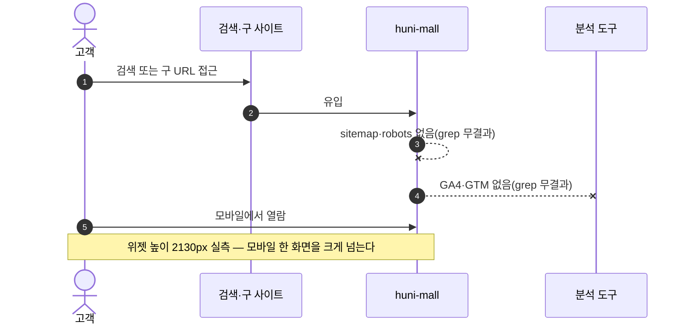
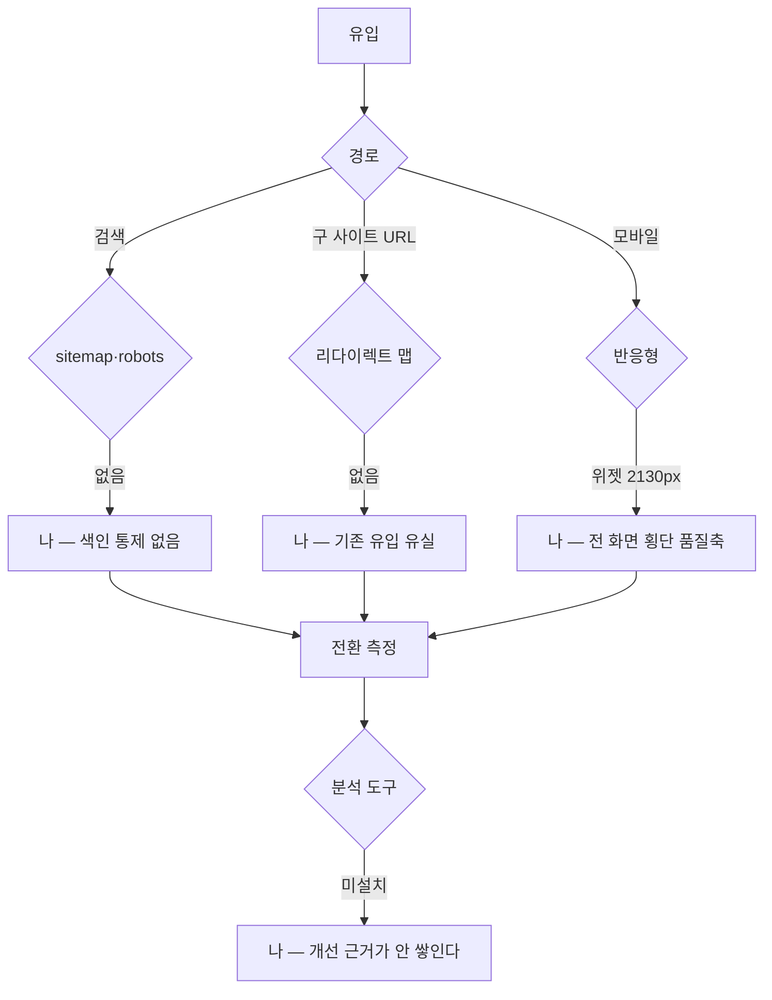

# P34 고객 유입·전환 품질(분석·SEO·반응형·리다이렉트)

> 카드 `t65` · 대분류 **시스템·플랫폼** · 중분류 품질 · 단계 4 · 빠진 곳 4

## 1. 한줄정의

고객이 들어와서 주문까지 가는 길의 품질. 구 사이트에서 오는 길, 검색으로 오는 길, 휴대폰으로 보는 화면, 그리고 그 길을 측정하는 도구다.

| | |
|---|---|
| **시작** | 고객이 검색·구 URL·모바일로 몰에 들어온다 |
| **끝** | 주문까지 도달하고, 그 경로가 측정된다 |
| **등장인물** | 고객 · huni-mall · 검색엔진 · 분석 도구 |

## 2. 흐름 — sequenceDiagram

## 3. 분기 — flowchart

## 4. 단계표

| # | 단계 | 시스템 | 담당자 | 원장 row_id | 상태 | 근거 |
|---:|---|---|---|---|---|---|
| 1 | 1. 웹 로그/전환 분석 도구 연동 | huni-mall | 김동학 | `STD-SYS-015` | 미착수 | [L4b보강] huni-skin-shopby/src 전역 gtag\|GA4\|googletagmanager\|analytics grep 무결과 |
| 2 | 2. SEO 메타·사이트맵 | huni-mall | 김동학 | `STD-SYS-020` | 미착수 | [L4b보강] huni-skin-shopby/src 전역 sitemap\|robots grep 무결과 |
| 3 | 3. 반응형/모바일 대응 | huni-mall | 김동학 | `STD-SYS-019` | 미착수 | print-story/02_capture/order-flow-steps.md §A 위젯 높이 2130px 실측 · L4 사유: new — 반응형은 전 화면 횡단 품질축이라 화면 단위 legacy 분모에 행이 없다. 근거 print-story 실측(오염 아님). L2 가 판정하지 않아 상태 미상. |
| 4 | 4. 구 사이트 → 신규 사이트 URL 리다이렉트 | huni-mall | 김동학 | `STD-SYS-022` | 미착수 | print-kb/wiki/policy/membership-auth.md#MEM-01 마이그레이션 파생 · L4 사유: 구 URL 리다이렉트 맵·이전 사이트 종료 계획 미확인. |

## 5. 빠진 곳

| id | 종류 | 내용 | 제안 담당 |
|---|---|---|---|
| `G-t65-099` | 나 — 행은 있는데 코드 0 | 분석 도구가 없다 — `src` 전역에서 `gtag\|GA4\|googletagmanager\|analytics` grep 이 한 건도 안 나온다. 오픈 뒤 무엇이 안 되는지 숫자로 말할 근거가 안 쌓인다. | 김동학 |
| `G-t65-100` | 나 — 행은 있는데 코드 0 | `sitemap\|robots` grep 도 무결과다. 검색 색인을 통제하지 못한다. | 김동학 |
| `G-t65-101` | 나 — 행은 있는데 코드 0 | 구 URL 리다이렉트 맵과 구 사이트 종료 계획이 없다. 구 사이트로 들어오던 고객이 어디로 갈지 정해지지 않았다. | 김동학 |
| `G-t65-102` | 라 — 결정 미정 | 반응형은 화면 단위 목록에 행이 없는 횡단 품질축이라 「어디까지 하면 끝인가」가 없다. 위젯 높이 2130px 실측이 유일한 근거다. | 김동학 |

## 6. 채우는 방법

1. **김동학** — 분석 도구와 sitemap/robots 를 붙인다. 결정이 필요 없고 런칭 전에 끝나야 측정이 시작된다.
2. **신우진** — 구 사이트 종료 시점을 정한다.
3. **김동학** — 구 URL → 신 URL 대응표를 만들어 리다이렉트를 건다.
4. **김동학** — 모바일 기준 화면 목록(주요 5화면)을 정하고 그것만 먼저 맞춘다.

## 7. 확인 못 한 것

- 구 사이트의 유입 상위 URL 목록을 확보하지 못했다.
- 모바일 트래픽 비중을 확인하지 못했다.
