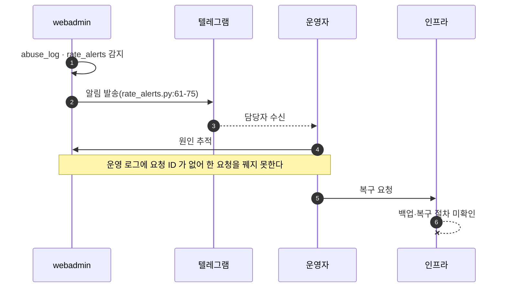
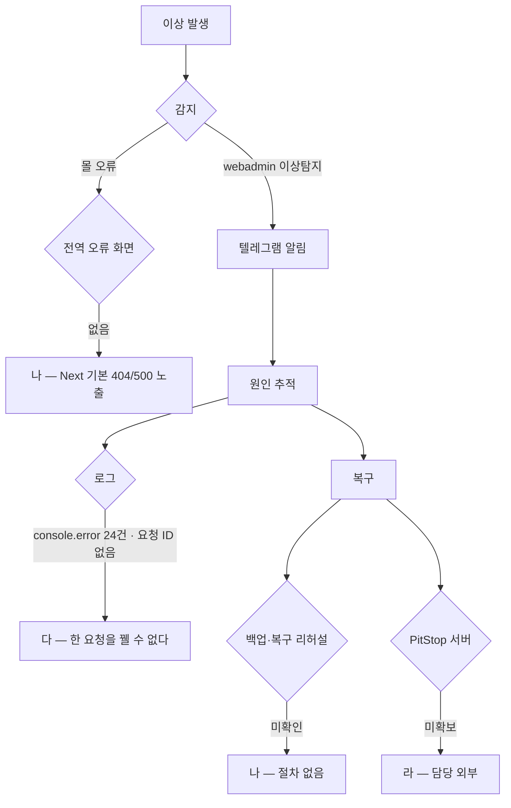

# P35 장애 모니터링·백업복구·서버 환경

> 카드 `t65` · 대분류 **시스템·플랫폼** · 중분류 품질 · 단계 5 · 빠진 곳 4

## 1. 한줄정의

무언가 잘못됐을 때 알아채고 되돌리는 흐름. 지금은 알아채는 장치가 일부 있고 되돌리는 절차가 없다.

| | |
|---|---|
| **시작** | 주문·결제 실패나 이상 트래픽이 생긴다 |
| **끝** | 담당자가 알아채고 원인을 추적해 복구한다 |
| **등장인물** | webadmin · 텔레그램 · 운영자 · 인프라 담당 |

## 2. 흐름 — sequenceDiagram

## 3. 분기 — flowchart

## 4. 단계표

| # | 단계 | 시스템 | 담당자 | 원장 row_id | 상태 | 근거 |
|---:|---|---|---|---|---|---|
| 1 | 1. 주문/결제 실패 모니터링·알림 | webadmin | 서희항 | `STD-SYS-016` | 부분 | WA-055 done — raw/webadmin/webadmin/catalog/abuse_log.py:1 · rate_alerts.py:61-75 (텔레그램 알림) |
| 2 | 2. 전역 오류 화면(error·not-found·global-error) 부재 | huni-mall | 김동학 | `STD-SYS-044` | 미착수 | `find huni-skin-shopby/src/app -maxdepth 2 -name error.tsx\|not-found.tsx\|global-error.tsx` 0개 · 포크 huni-skin-next/src/app/{error·global-error·not-found}.tsx 존재 |
| 3 | 3. 운영 로그 구조화·요청 ID | huni-mall | 김동학 | `STD-SYS-054` | 미착수 | `grep -rnE 'console\.(log\|error\|warn)' huni-skin-shopby/src` 24 · audit report.md:71 M2 · 포크 huni-skin-next/src/lib/observability/{logger·request-id}.ts(commit f692a43) |
| 4 | 4. 데이터 백업·복구 절차 | 인프라 | 서희항 | `STD-SYS-017` | 미착수 | print-kb/wiki/huni/load-path.md 적재 경로 안전장치 · L4 사유: DB 스냅샷·복구 리허설 미확인. |
| 5 | 5. PitStop 서버 환경 확보 | 미정(외부) | 미정 | `STD-SYS-031` | 미착수 | 후니정기미팅 정리260915.html §PDF 프리플라이트 · 미결 2 |

## 5. 빠진 곳

| id | 종류 | 내용 | 제안 담당 |
|---|---|---|---|
| `G-t65-103` | 나 — 행은 있는데 코드 0 | 몰에 전역 오류 화면이 없다 — `error.tsx`·`not-found.tsx`·`global-error.tsx` 가 0개다. 고객이 Next 기본 404/500 을 그대로 본다. 포크에는 세 파일이 다 있다. | 김동학 |
| `G-t65-104` | 다 — 코드는 있는데 연결 안 됨 | `console.error` 24건이 요청 ID 없이 흩어져 있어 한 고객의 한 요청을 꿰어 볼 수 없다. 포크에 구조화 로그·요청 ID 구현이 있다. | 김동학 |
| `G-t65-105` | 나 — 행은 있는데 코드 0 | DB 스냅샷·복구 리허설 기록이 없다. 백업이 돌고 있는지, 돌아도 되돌릴 수 있는지 확인된 적이 없다 — 「되돌릴 수 있다」는 해 본 적이 있어야 사실이다. | 서희항 |
| `G-t65-106` | 라 — 결정 미정 | PitStop 서버 환경(Windows·RAM 16GB·AWS 별도 인스턴스)이 미확보이고 담당이 외부다. 검판이 생산의 관문이라 t64 흐름 전체가 여기에 걸린다. | 신우진 |

## 6. 채우는 방법

1. **김동학** — 전역 오류 화면 3종과 구조화 로그·요청 ID 를 이식한다. 포크에 이미 있어 옮기는 일이다.
2. **서희항** — 백업에서 실제로 되돌리는 리허설을 한 번 한다. 기록이 남아야 절차가 된다.
3. **신우진** — PitStop 서버 조달을 결정으로 닫는다.

## 7. 확인 못 한 것

- 현재 Railway·Vercel 의 백업 주기를 확인하지 못했다.
- 텔레그램 알림을 누가 받고 있는지 확인하지 못했다.
